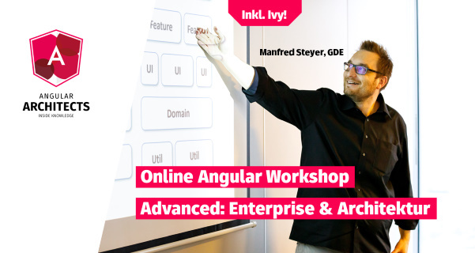

# Strategic Domain-Driven Design

Monorepos allow large enterprise applications to subdivide into small maintainable libraries. First, however, we need to define criteria to slice our application into individual parts. We must also establish rules for communication between them.

In this chapter, I present the techniques I use to subdivide large software systems: strategic design. It's part of the [domain driven design](https://www.amazon.de/Domain-Driven-Design-Tackling-Complexity-Software/dp/0321125215/ref=sr_1_3?ie=UTF8&qid=1551688461&sr=8-3&keywords=ddd) (DDD) approach. I also explain how to implement its ideas with an [Nx](https://nx.dev/)-based monorepo.

## What is Domain-Driven Design?

DDD describes an approach that bridges the gap between requirements for complex software systems and appropriate application design. Within DDD, we can look at the tactical design and the strategic design. The tactical design proposes concrete concepts and patterns for object-oriented design or architecture and has clear views on using OOP. As an alternative, there are approaches like [Functional Domain Modeling](https://pragprog.com/book/swdddf/domain-modeling-made-functional) that transfer the ideas behind it into the functional programming world.

By contrast, strategic design deals with the breakdown of an extensive system into individual (sub-) domains and their design. No matter if you like DDD's views or not, some ideas from strategic design have proven useful for subdividing a system into smaller, self-contained parts. It is these ideas that this chapter explores in the context of Angular. The remaining aspects of DDD, however, are irrelevant for this chapter.

## Finding Domains with Strategic Design

One goal of strategic design is to identify self-contained domains. Their vocabulary identifies these domains. Domain experts and developers must use this vocabulary to prevent misunderstandings. As the code uses this language, the application mirrors its domain and hence is more self-describing. DDD refers to this as the [ubiquitous language](https://martinfowler.com/bliki/UbiquitousLanguage.html).

Another characteristic of domains is that often only one or a few groups of experts primarily interact with them.

To recognise domains, it is worth taking a look at the processes in the system. For example, an e-Procurement system that handles the procurement of office supplies could support the following two processes:

{width=66%}

We can see that the process steps `` Approve Order``, `` Request Budget`` and `` Approve Budget`` primarily revolve around organisational hierarchies and the available budget. Managers are principally involved here. By contrast, the process step is fundamentally about employees and products.

Of course, we could argue that products are omnipresent in an e-Procurement system. However, a closer look reveals that the word ``product`` denotes different items in some of the process steps shown. For example, while a product description is very detailed in the catalogue, the approval process only needs a few key data:

We must distinguish between these two forms of a product in the ubiquitous language that prevails within each domain. We create different models that are as concrete and meaningful
 as possible.

This approach prevents the creation of a single confusing model that attempts to describe everything. These models also have too many interdependencies that make decoupling and subdividing impossible.

We can still relate personal views of the product at a logical level. If the same id on both sides expresses this, it works without technical dependencies.

Thus, each model is valid only within a specific scope. DDD calls this the [bounded context](https://martinfowler.com/bliki/BoundedContext.html). Ideally, each domain has its own bound context. As the next section shows, however, this goal cannot always be achieved when integrating third-party systems.

If we proceed with this analysis, we may find the following domains:

{width=66%}

If you like the process-oriented approach of identifying different domains alongside the vocabulary (entities) and groups of domain experts, you might love [Event Storming](https://www.eventstorming.com). At this workshop, domain experts analyse business domains.

## Context-Mapping

Although the individual domains are as self-contained as possible, they still have to interact occasionally. In our example, the ``ordering`` domain for sending orders could access both the ``catalogue `` domain and a connected ERP system:

{width=66%}

A context map determines how these domains interact. In principle, 
``Ordering`` and `` Booking`` could share the common model elements. In this case, however, we must ensure that modifying one does not cause inconsistencies.

One domain can easily use the other. In this case, however, it is unclear how much power each is entitled to. Can the consumer impose specific changes on the provider and insist on backward compatibility? Or must the consumer be satisfied with what it gets from the provider?

Strategic design defines further strategies for the relationship between consumers and providers. In our example, Catalog offers an API to prevent changes in the domain from forcibly affecting consumers. Since order has little impact on the ERP system, it uses an anti-corruption layer (ACR) for access. If something changes in the ERP system, it only needs an update.

An existing system, like the shown ERP system, usually does not follow the idea of the bounded context. Instead, it contains several logical and intermingled sub-domains.

Another strategy I want to stress here is ``Separate Ways``. Specific tasks, like calculating VAT, are separately implemented in several domains:

{width=66%}

At first sight, this seems awkward because it leads to code redundancies, breaking the DRY principle (don't repeat yourself). Nevertheless, it can come in handy because it prevents dependency on a shared library. Although preventing redundant code is important, limiting dependencies is vital because each dependency defines a contract, and contracts are hard to change. Hence, it's good first to evaluate whether an additional dependency is truly needed.

As mentioned, each domain should have a bounded context. Our example has an exception: If we have to respect an existing system like the ERP system, it might contain several bounded contexts not isolated from each other. 

## Conclusion

Strategic design is about identifying self-contained (sub-)domains. In each domain, we find ubiquitous language and concepts that only make sense within the domain's bounded context. A context map shows how those domains interact.

In the next chapter, we'll see we can implement those domains with Angular using an [Nx](https://nx.dev/)-based monorepo.

---

Learn more about this and further architecture topics regarding Angular and huge enterprise as well as industrial solution in our [advanced Online Workshop](https://www.angulararchitects.io/schulungen/advanced-angular-enterprise-anwendungen-und-architektur/):

Save your [ticket](https://www.angulararchitects.io/schulungen/advanced-angular-enterprise-anwendungen-und-architektur) now or [request a company workshop](https://www.angulararchitects.io/schulungen/advanced-angular-enterprise-anwendungen-und-architektur) for you and your team!

If you like our offer, keep in touch with us so that you don't miss anything.

For this, you can [subscribe to our newsletter](https://www.angulararchitects.io/subscribe/) and/ or follow the book's [author on Twitter](https://twitter.com/ManfredSteyer).

