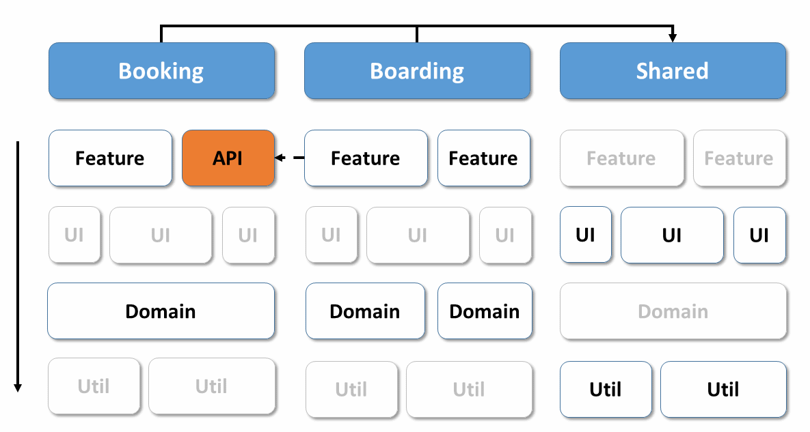

# Implementing Strategic Design with Nx Monorepos

In the previous chapter, I presented strategic design which allows to subdivide a software system into loosely coupled (sub-)domains. This chapter explores these domains' implementation with Angular and an [Nx](https://nx.dev/)-based monorepo.

The used architecture follows this architecture matrix:



As you see here, this matrix vertically cuts the application into sub domains. Also, it subdivides them horizontally into layers with different types of libraries. 

If you want to look at the underlying case study, you can find the source code [here](https://github.com/manfredsteyer/strategic-design)

## Implementation with Nx

We use an Nx-based workspace to implement the defined architecture. Nx is an extension for Angular CLI, which helps to break down a solution into different applications and libraries. 

By default, Nx puts all applications into an ``apps`` folder and the libraries into ``libs``:

{width=30%}


In our architecture, each domain is represented by a subfolder. For instance, within ``libs``, you see subfolders like ``catalog`` or ``ordering``. Everything that is shared across different folders goes into ``shared``. Besides this, we use prefixes to denote the layer a specific library is part of. For instance, the prefix ``feature-`` defines that the library is part of the feature layer. Hence, the matrix shown above translates into this folder structure by using subfolders for the columns and prefixes for the rows.

Because such a workspace manages several applications and libraries in a common source code repository, there is also talk of a monorepo. This pattern is used extensively by Google and Facebook, among others, and has been the standard for the development of .NET solutions in the Microsoft ecosystem for about 20 years.

It allows source code sharing between project participants in a particularly simple way and prevents version conflicts by having only one central ``node_modules`` folder with dependencies. This arrangement ensures that, e.g., each library uses the same Angular version.

To create a new Nx-based Angular CLI project -- a so-called workspace --, you can use the following command:

```bash
npm init nx-workspace e-proc
```

This command downloads a script which creates your workspace.

Within this workspace, you can use ``ng generate`` to add applications and libraries:

```bash
cd e-proc
ng generate app ui
ng generate lib feature-request-product --directory catalog
```

The ``--directory`` switch places the ``feature-request-product`` library in a folder ``catalog`` representing the sub domain with the same name. 


## Categories for Libraries

To reduce the cognitive load, the Nx team recommends to categorize libraries as follows:

- **feature**: Implements a use case with smart components 
-	**data-access**: Implements data accesses, e.g. via HTTP or WebSockets
- **ui**: Provides use case-agnostic and thus reusable components (dumb components) 
-	**util**: Provides helper functions

Please note the separation between smart and dumb components. Smart components within feature libraries are use case-specific. An example is a component which enables a product search.

On the contrary, dumb components do not know the current use case. They receive data via inputs, display it in a specific way, and issue events. Such presentational components "just" help to implement use cases and hence they are reusable. An example is a date-time picker, which is unaware of which use case it supports. Hence, it is available within all use cases dealing with dates.

In addition to this, I also use the following categories:

- **shell**: For an application that has multiple domains, a shell provides the entry point for a domain 
- **api**: Provides functionalities exposed to other domains 
- **domain**: Domain logic like calculating additional expenses (not used here), validations or facades for use cases and state management. I will come back to this in the next chapter. 

Each category defines a layer in our architecture matrix. Also, each libary gets a prefix telling us to which category and hence layer it belongs to. This helps to maintain an overview. 

## Public APIs for Libraries

Each library has a public API exposed via a generated ``index.ts`` through which it publishes individual components. They hide all other components. These can be changed as desired:

```typescript
export * from './lib/catalog-data-access.module';
export * from './lib/catalog-repository.service';
```

This structure is a fundamental aspect of good software design as it allows splitting into a public and a private part. Other libraries access the public part, so we have to avoid breaking changes as this would affect other parts of the system.

However, the private part can be changed at will, as long as the public part stays the same.

## Check Accesses Between libraries

Minimizing the dependencies between individual libraries helps maintainability. This goal can be checked graphically using Nx' ``dep-graph`` script. To make our live easier, first, we install the Nx CLI:

```
npm i -g @nrwl/cli
```

Then, we can get the dependency graph via the following commend:

```bash
nx dep-graph
```

If we concentrate on the ``Catalog`` domain in our case study, the result is:


## Access Restrictions for a Solid Architecture

Robust architecture requires limits to interactions between libraries. If there were no limits, we would have a heap of intermingled libraries where each change would affect all the other libraries, clearly negatively affecting maintainability.

Based on DDD, we have a few rules for communication between libraries to ensure consistent layering. For example, **each library may only access libraries from the same domain or shared libraries**.

Access to APIs such as ``catalog-api`` must be explicitly granted to individual domains.

We also define access restrictions on top of our layers shown in the matrix above. Each layer is only allowed to access layers below. For instance, a ``feature`` library can access ``ui``, ``domain`` and ``util`` libraries.

To define such restrictions, Nx allows us to assign tags to each library. Based on these tags, we can define linting rules.

### Tagging Libraries

In former Nx versions, the file ``nx.json`` defined the tags for our libraries:

```json
"projects": {
  "ui": {
    "tags": ["scope:app"]
  },
  "ui-e2e": {
    "tags": ["scope:e2e"]
  },
  "catalog-shell": {
    "tags": ["scope:catalog", "type:shell"]
  },
  "catalog-feature-request-product": {
    "tags": ["scope:catalog", "type:feature"]
  },
  "catalog-feature-browse-products": {
    "tags": ["scope:catalog", "type:feature"]
  },
  "catalog-api": {
    "tags": ["scope:catalog", "type:api", "name:catalog-api"]
  },
  "catalog-data-access": {
    "tags": ["scope:catalog", "type:data-access"]
  },
  "shared-util-auth": {
    "tags": ["scope:shared", "type:util"]
  }
}
```

In current versions, Nx puts the same information into the ``angular.json`` that already contains a section for each library and application. Alternatively, these tags can be specified when setting up the applications and libraries.

According to a suggestion from the Nx team, the domains get the prefix ``scope``, and the library types receive the prefix ``type``. Prefixes of this type are intended to improve readability and can be freely assigned.

### Defining Linting Rules Based Upon Tags

To enforce access restrictions, Nx comes with its own linting rules. As usual, we configure these rules within ``.eslintrc.json``:

```json
"@nrwl/nx/nx-enforce-module-boundaries": [
  "error",
  {
    "allow": [],
    "depConstraints": [
      { "sourceTag": "scope:app", 
        "onlyDependOnLibsWithTags": ["type:shell"] },
      { "sourceTag": "scope:catalog", 
        "onlyDependOnLibsWithTags": ["scope:catalog", "scope:shared"] },
      { "sourceTag": "scope:shared", 
        "onlyDependOnLibsWithTags": ["scope:shared"] },
      { "sourceTag": "scope:booking", 
        "onlyDependOnLibsWithTags": 
          ["scope:booking", "scope:shared", "name:catalog-api"] },

      { "sourceTag": "type:shell", 
        "onlyDependOnLibsWithTags": ["type:feature", "type:util"] },
      { "sourceTag": "type:feature", 
        "onlyDependOnLibsWithTags": ["type:data-access", "type:util"] },
      { "sourceTag": "type:api", 
        "onlyDependOnLibsWithTags": ["type:data-access", "type:util"] },
      { "sourceTag": "type:util", 
        "onlyDependOnLibsWithTags": ["type:util"] }
    ]
  }
]
```

To test these rules, just call ``ng lint`` on the command line:


Development environments such as WebStorm/IntelliJ, or Visual Studio Code show such violations while typing. In the latter case, you need a respective eslint plugin.

> **Hint:** Run the linter before checking in your source code or before merging a pull request against your main branch. If you automate this check you can enforce your architecture matrix and prevent source code that violates your architecture.

## Conclusion

Strategic design is a proven way to break an application into self-contained domains. These domains have a ubiquitous language which all stakeholders must use consistently.

The CLI extension Nx provides a very elegant way to implement these domains with different domain-grouped libraries. To restrict access by other domains and to reduce dependencies, it allows setting access restrictions to individual libraries.

These access restrictions help ensure a loosely coupled system which is easier to maintain as a sole change only affects a minimum of other parts of the system.
