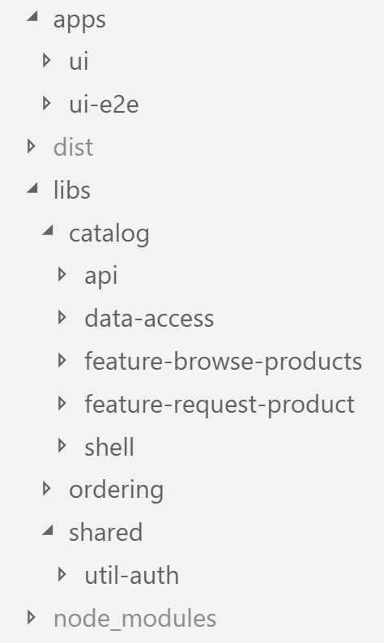
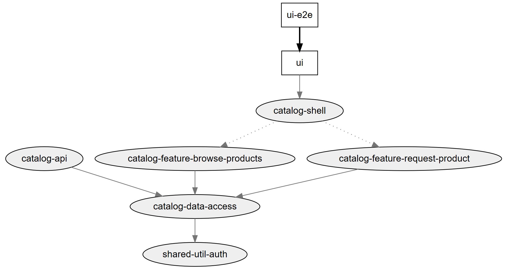
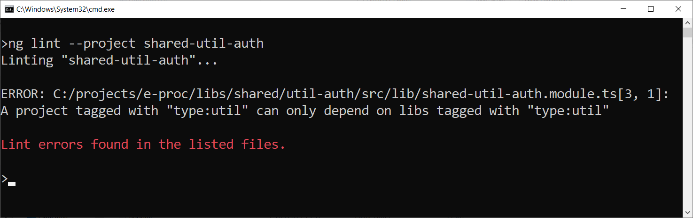

# Implementing Strategic Design with Nx Monorepos

In the previous chapter, I've presented the idea of Strategic Design which allows to subdivide a software system into several self-contained (sub-)domains. In this part, I show how to implement those domains with Angular and an [Nx](https://nx.dev/)-based monorepo.

If you want to have a look into the [underlying case study](https://github.com/manfredsteyer/strategic-design), you find the source code [here](https://github.com/manfredsteyer/strategic-design)

For this, I'm following some recommendations the Nx team recently wrote down in their free e-book about [Monorepo Patterns](https://go.nrwl.io/angular-enterprise-monorepo-patterns-new-book). Before this was available, I've used similar strategies but in order to help establishing a common vocabulary and common conventions in the community, I seek to use this official way.

## Implementation with Nx

For the implementation of the defined architecture, a workspace based on Nx [Nx] is used. This is an extension for the Angular CLI, which among other things helps to break down a solution into different applications and libraries. Of course this is just one of several possible approaches. As an alternative, one could, for example, implement each domain as a completely separate solution. This would be called a micro-app approach.

The solution shown here puts all applications into one ``apps`` folder, and all the reusable libraries are grouped by the respective domain name in the ``libs`` folder:

{width=30%}


Because such a workspace consists of several applications and libraries that are managed in a common source code repository, there is also talk of a monorepo. This pattern is used extensively by Google and Facebook, among others, and has been the standard case for the development of .NET solutions in the Microsoft world for about 20 years.

It allows the sharing of source code between the project participants in a particularly simple way and also prevents version conflicts by having only one central ``node_modules`` folder with dependencies. This ensures that e.g. each library uses the same Angular version.

To create a new Nx based Angular CLI project -- a so called workspace -- you can just use the following command:

```
npm init nx-workspace e-proc
```

This downloads a script which created your workspace.

Within this workspace, you can use ``ng generate`` to add applications and libraries:

```
cd e-proc
ng generate app ui
ng generate lib feature-request-product
```

## Categories for Libraries

In their [free e-book about Monorepo Patterns](https://go.nrwl.io/angular-enterprise-monorepo-patterns-new-book), [Nrwl](https://nrwl.io/) -- the company behind Nx -- use the following categories for libraries:

-	**feature**: Implements a use case using smart components
-	**data-access**: Implements data accesses, e.g. via HTTP or WebSockets
-	**ui**: Provides use case agnostic and thus reusable components (dumb components)
-	**util**: Provides helper functions

Please note the separation between smart and dumb components here. Smart components within feature libraries are use case specific. An example is a component which allows to search for products. 

On contrary, dumb components don't know the current use case at all. They just receive data via inputs, display it in a specific way and emit events. Such presentational components "just" help to implement use cases and hence they can be reused across them. A example is a date time picker, which does not know at all which use case it supports. Hence, it can be used within all use cases dealing with dates.

In addition to these categories, I'm also using the following categories:

-	**shell**: For an application that contains multiple domains, a shell provides the entry point for a domain
-	**api**: Provides functionalities exposed for other domains
-	**domain**: Domain logic like calculating additional expanses (not used here), validations or facades for use cases and state management. I'll come back to this idea in the next chapter.

To keep the overview, the categories are used as a prefix for the individual library folders. Thus, libraries of the same category are presented next to each other in a sorted overview.

## Public APIs for Libraries

Each library has a public API exposed via a generated ``index.ts`` through which it publishes individual components. On the other hand, they hide all other components. These can be changed as desired:

```
export * from './lib/catalog-data-access.module';
export * from './lib/catalog-repository.service';
```

This is a vital aspect of good software design as it allows to split them into a public and a private part. The public one is exposed for other libraries. Hence, here we have to take care about breaking changes as they would affect other parts of the system.

However, the private part can be changed quite flexible as long as you make sure the public part stays the same.

## Check Accesses between libraries

To improve maintainability, it is important to minimize the dependencies between the individual libraries. The achievement of this goal can be checked graphically with Nx. For this, it provides the ``dep-graph`` npm script:

```
npm run dep-graph
```

If we just concentrate on the ``Catalog`` domain in our case study, the result looks as follows:



## Access Restrictions for a Solid Architecture

To provide a solid architecture, it's vital to ensure that not every library can access every other library. If this was the case, we had a heap of intermingled libraries where each change would affect all the other ones. Obviously, this affects maintainability in a bad way!

In alignment with ideas of DDD, a few rules are used for the communication between libraries and these lead to a consistent layering. For example, **each library may only access libraries from the same domain or shared libraries**.

Access to APIs such as ``catalog-api`` must be explicitly granted to individual domains.

The categorization of libraries also has limitations: a ``shell`` only accesses ``features`` and a ``feature`` accesses ``data-access`` libraries. In addition, anyone can access ``utils``.

To define such restrictions, Nx allows us to assign tags to each library. Based on this tags, we can define linting rules.

### Tagging Libraries

The tags for our libraries are defined in the file ``nx.json``, which is generated by Nx:

```json
"projects": {
  "ui": {
    "tags": ["scope:app"]
  },
  "ui-e2e": {
    "tags": ["scope:e2e"]
  },
  "catalog-shell": {
    "tags": ["scope:catalog", "type:shell"]
  },
  "catalog-feature-request-product": {
    "tags": ["scope:catalog", "type:feature"]
  },
  "catalog-feature-browse-products": {
    "tags": ["scope:catalog", "type:feature"]
  },
  "catalog-api": {
    "tags": ["scope:catalog", "type:api", "name:catalog-api"]
  },
  "catalog-data-access": {
    "tags": ["scope:catalog", "type:data-access"]
  },
  "shared-util-auth": {
    "tags": ["scope:shared", "type:util"]
  }
}
```

Alternatively, these tags can also be specified when setting up the applications and libraries.

According to a suggestion from the [mentioned e-book about Monorepo Patterns](https://go.nrwl.io/angular-enterprise-monorepo-patterns-new-book), the domains are named with the prefix `` scope`` and The library types are prefixed with ``kind``. Prefixes of this type are only intended to increase readability and can be freely assigned.

### Defining Linting Rules based upon Tags

To enforce access restrictions, Nx comes with its own linting rules. As usual, they are configured within ``tslint.json``:

```json
"nx-enforce-module-boundaries": [
  true,
  {
    "allow": [],
    "depConstraints": [
      { "sourceTag": "scope:app", 
        "onlyDependOnLibsWithTags": ["type:shell"] },
      { "sourceTag": "scope:catalog", 
        "onlyDependOnLibsWithTags": ["scope:catalog", "scope:shared"] },
      { "sourceTag": "scope:shared", 
        "onlyDependOnLibsWithTags": ["scope:shared"] },
      { "sourceTag": "scope:booking", 
        "onlyDependOnLibsWithTags": ["scope:booking", "scope:shared", "name:catalog-api"] },

      { "sourceTag": "type:shell", 
        "onlyDependOnLibsWithTags": ["type:feature", "type:util"] },
      { "sourceTag": "type:feature", 
        "onlyDependOnLibsWithTags": ["type:data-access", "type:util"] },
      { "sourceTag": "type:api", 
        "onlyDependOnLibsWithTags": ["type:data-access", "type:util"] },
      { "sourceTag": "type:util", 
        "onlyDependOnLibsWithTags": ["type:util"] }
    ]
  }
]
```

To test against these rules, just call ``ng lint`` on the command line:

<!-- TODO: Add Image -->


Development environments such as WebStorm / IntelliJ or Visual Studio Code show such violations while typing. In the latter case, a corresponding plugin must be installed.

> Hint: Consider using Git Hooks, e. g. by leveraging [Husky](https://github.com/typicode/husky), which ensures that only code not violating your linting rules can be pushed to the repository.

## Conclusion

Strategic Design provides a proven way to break an application into self-contained domains. These domains are characterized by their own specialized vocabulary, which must be used rigorously by all stakeholders.

The CLI extension Nx provides a very charming way to implement these domains with different domain-grouped libraries. To restrict access by other domains and to reduce dependencies, it allows setting access restrictions to individual libraries.

This helps to ensure a loosely coupled system which is easier to maintain as a sole change only affects a minimum of other parts of the system.