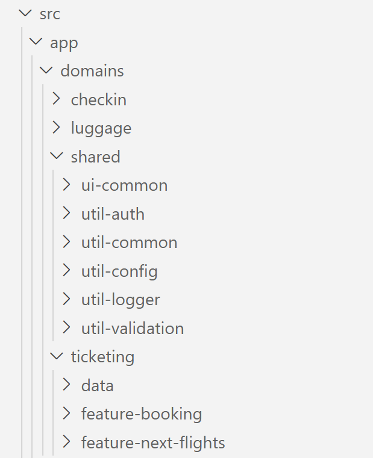

# Architectures with Sheriff and Standalone Components

In the previous chapter, I've shown how to define your Strategic Design. This chapter highlights the implementation of your Strategic Design based on Standalone Components and Standalone APIs. The specified architecture is enforced with the open-source project Sheriff.

The examples used here work with a traditional Angular CLI-Project but also with Nx the next chapter focuses on.

[Source Code](https://github.com/manfredsteyer/modern-arc.git)

## The Architecture Matrix

For implementing our strategic design, it makes sense to further subdivide the individual domains into different modules:


This matrix is often the starting point of our projects and can be tailored to individual needs. Each cell results in a module in the source code. [Nrwl](https://go.nrwl.io/angular-enterprise-monorepo-patterns-new-book) suggests the following categories (originally for libraries), among others, which have proven helpful in our daily work:

- **feature:** A feature module implements a use case with so-called smart components. Due to their focus on a feature, such components are not very reusable. Smart Components communicate with the backend. Typically, in Angular, this communication occurs through a store or services.
- **ui:** UI modules contain so-called dumb or presentational components. These are reusable components that support the implementation of individual features but do not know them directly. The implementation of a design system consists of such components. However, UI modules can also contain general technical components that are used across all use cases. An example of this would be a ticket component, which ensures that tickets are presented in the same way in different features. Such components usually only communicate with their environment via properties and events. They do not get access to the backend or a store outside of the module.
- **data:** Data modules contain the respective domain model (actually the client-side view of it) and services that operate on it. Such services validate e.g. Entities and communicate with the backend. State management, including the provision of view models, can also be accommodated in data modules. This is particularly useful when multiple features in the same domain are based on the same data.
- **util:** General helper functions etc. can be found in utility modules. Examples of this are logging, authentication, or working with date values.

Another special aspect of the implementation in the code is the shared area, which offers code for all domains. This should primarily have technical code -- use case-specific code is usually located in the individual domains.

The structure shown here brings order to the system: There is less discussion about where to find or place certain sections of code. In addition, two simple but effective rules can be introduced on the basis of this matrix:

- In terms of strategic design, each domain may only communicate with its own modules. An exception is the shared area to which each domain has access.

- Each module may only access modules in lower layers of the matrix. Each module category becomes a layer in this sense.

Both rules support the decoupling of the individual modules or domains and help to avoid cycles.

Being a reference architecture, this matrix is often adopted to project-specific needs. Some teams simplify it by reducing the amount of layers and access rules; some teams add additional ones. In some projects, the data layer is called domain or state layer and there are projects where the aspects of these different names end up in layers of their own.

## Project Structure for the Architecture Matrix

The architecture matrix can be mapped in the source code in the form of folders: Each domain has its own folder, which in turn has a subfolder for each of its modules:

{width=50}


The module names are prefixed with the name of the respective module category. This means that you can see at first glance where the respective module is located in the architecture matrix. Within the modules are typical Angular building blocks such as components, directives, pipes, or services.

The use of Angular modules is no longer necessary since the introduction of standalone components (directives and pipes). Instead, the *standalone* flag is set to *true:*

```typescript
@Component({
  selector: 'app-flight-booking',
  standalone: true,
  imports: [CommonModule, RouterLink, RouterOutlet],
  templateUrl: './flight-booking.component.html',
  styleUrls: ['./flight-booking.component.css'],
})
export class FlightBookingComponent {
}
```

In the case of components, the so-called compilation context must also be imported. These are all other standalone components, directives and pipes that are used in the template.

An *index.ts* is used to define the module's public interface. This is a so-called barrel that determines which module components may also be used outside of the module:

```typescript
export * from './flight-booking.routes';
```

Care should be taken in maintaining the published constructs, as breaking changes tend to affect other modules. Everything that is not published here, however, is an implementation detail of the module. Changes to these parts are, therefore, less critical.

## Enforcing your Architecture with Sheriff

The architecture discussed so far is based on several conventions:

- Modules may only communicate with modules of the same domain and *shared*
- Modules may only communicate with modules on below layers
- Modules may only access the public interface of other modules

The [Sheriff](https://github.com/softarc-consulting/sheriff) open-source project allows these conventions to be enforced via linting. Violation is warned with an error message in the IDE or on the console:


The error message in the IDE provides instant feedback during development and the linter output on the console can be used to automate these checks in the build process. Hence, source code that violates the defined architecture can be prevented being committed.

To set up Sheriff, the following two packages must be obtained via npm:

```javascript
npm i @softarc/sheriff-core @softarc/eslint-plugin-sheriff -D
```

The former includes Sheriff, the latter is the bridge to *eslint*. To use this bridge, it must be registered in the *.eslintrc.json* found in the project root:

```json
{
  [...],
  "overrides": [
    [...]
    {
      "files": ["*.ts"],
      "extends": ["plugin:@softarc/sheriff/default"]
    }
  ]
}
```

Sheriff considers any folder with an *index.ts* as a module. By default, Sheriff prevents this *index.js* from being bypassed and thus access to implementation details by other modules. The *sheriff.config.ts* to be set up in the root of the project defines categories (*tags*) for the individual modules and defines dependency rules (*depRules*) based on them. The following shows a Sheriff configuration for the architecture matrix discussed above:

```typescript
import { noDependencies, sameTag, SheriffConfig } from '@softarc/sheriff-core';

export const sheriffConfig: SheriffConfig = {
  version: 1,

  tagging: {
    'src/app': {
      'domains/<domain>': {
        'feature-<feature>': ['domain:<domain>', 'type:feature'],
        'ui-<ui>': ['domain:<domain>', 'type:ui'],
        'data': ['domain:<domain>', 'type:data'],
        'util-<ui>': ['domain:<domain>', 'type:util'],
      },
    },
  },
  depRules: {
    root: ['*'],

    'domain:*': [sameTag, 'domain:shared'],

    'type:feature': ['type:ui', 'type:data', 'type:util'],
    'type:ui': ['type:data', 'type:util'],
    'type:data': ['type:util'],
    'type:util': noDependencies,
  },
};
```

The tags refer to folder names. Expressions such as `<domain>` or `<feature>` are placeholders. Each module below `src/app/domains/<domain>` whose folder name begins with `feature-*` is therefore assigned the categories `domain:<domain>` and `type:feature`. In the case of `src/app/domains/booking`, these would be the categories `domain:booking` and `type:feature`.

The dependency rules under `depRules` pick up the individual categories and stipulate, for example, that a module only has access to modules in the same domain and to `domain:shared`. Further rules define that each layer only has access to the layers below it. Thanks to the `root: ['*']` rule, all non-explicitly categorized folders in the root folder and below are allowed access to all modules. This primarily affects the shell of the application.

## Lightweight Path Mappings

Path mappings can be used to avoid unreadable relative paths within the imports. These allow, for example, instead of

```typescript
import { FlightBookingFacade } from '../../data';
```

to use the following:

```typescript
import { FlightBookingFacade } from'@demo/ticketing/data' ;
```

Such three-part imports consist of the project name or name of the workspace (e.g. `@demo`), the domain name (e.g. `ticketing`), and a module name (e.g. `data`) and thus reflect the desired position within the architecture matrix.

This notation can be enabled independently of the number of domains and modules with a single path mapping within *tsconfig.json* in the project root:

```json
{
  "compileOnSave": false,
  "compilerOptions": {
    "baseUrl": "./",
    [...]
    "paths": {
      "@demo/*": ["src/app/domains/*"],
    }
  },
  [...]
}
```

IDEs like Visual Studio Code should be restarted after this change. This ensures that they take this change into account.

The build system Nx, introduced in the next chapter, adds such path mappings automatically to your project when adding a library.

## Conclusion

Strategic design subdivides a system into different ones that are implemented as independently as possible. This decoupling prevents changes in one area of application from affecting others. The architecture approach shown subdivides the individual domains into different modules, and the open-source project Sheriff ensures that the individual modules only communicate with one another in respecting the established rules.

This approach allows the implementation of large and long-term maintainable frontend monoliths. Due to their modular structure, the language is sometimes also of moduliths. A disadvantage of such architectures is increased build and test times. This problem can be solved with incremental builds and tests. The next chapter addresses this.