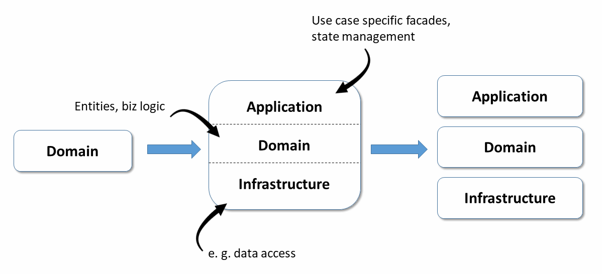
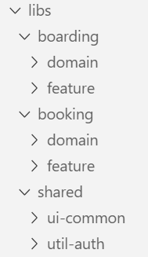

# Tactical Domain-Driven Design with Angular and Nx

The previous chapters showed how to use the ideas of strategic design with Angular and Nx. This chapter builds upon the outlined ideas and describes further steps to respect tactical design too.

The case study used in this chapter is a travel web application which has the following sub-domains:


The [source code](https://github.com/manfredsteyer/angular-ddd) of this case study can be found [here](https://github.com/manfredsteyer/angular-ddd).

Let's turn to structuring our application with tactical design.

### Domain Organisation using Layers

We use column subdivisions ("swimlanes") for domains. We can organise these domains with layers of libraries which leads to row subdivisions:


Note how each layer can consist of one or more **libraries**

>Using layers is a traditional way of organising a domain. There are alternatives like hexagonal architectures or clean architecture. 

#### What about shared functionality?

For those aspects that are *shared* and used across domains, we use an additional ``shared`` swimlane. Shared libraries can be useful. Consider, for example, shared libraries for authentication or logging.

>  Note: the `shared` swimlane corresponds to the Shared Kernel proposed by DDD and also includes technical libraries to share.

#### How to prevent high coupling?

As discussed in the previous chapter, access constraints define which libraries can use/depend upon other libraries. Typically, each layer is only allowed to communicate with underlying layers. Cross-domain access is allowed only with the ``shared`` area. The benefit of using these restrictions is loose coupling and thus increased maintainability.

> To prevent too much logic from being put into the ``shared`` area, the approach presented uses APIs that publish building blocks for other domains. This approach corresponds to Open Services in DDD.

We can see the following two characteristics in the shared part:

*  As the greyed-out blocks indicate, most ``util`` libraries are in the ``shared`` area, primarily because we use aspects such as authentication or logging across systems.
*  The same applies to general UI libraries that ensure a system-wide look and feel.

#### What about feature-specific functionality?

Notice that domain-specific `feature` libraries, however, are not in the ``shared`` area. Feature-related code should be within its own domain.

While developers may share feature code (between domains), this practice can lead to shared responsibilities, more coordination effort, and breaking changes. Hence, it should only be shared sparingly.

## Code Organisation

Based on Nrwl.io's [Enterprise MonoRepository Patterns](https://go.nrwl.io/angular-enterprise-monorepo-patterns-new-book), I distinguish between five categories of layers or libraries:

| Category | Description | Exemplary content |
| -------- | ----------- | ----------------- |
| feature | Contains components for a use case. | search-flight component |
| ui | Contains so-called "dumb components" that are use case-agnostic and thus reusable. | date-time component, address component, address pipe |
| api | Exports building blocks from the current subdomain for others. | Flight API |
| domain   | Contains the **domain models** (classes, interfaces, types) that are used by the domain (swimlane) |
| util | Include general utility functions | formatDate |

This complete architectural matrix is initially overwhelming. But after a brief review, almost all the developers I've worked with agreed that the code organisation facilitates code reuse and future features.

## Isolate the Domain

To isolate the domain logic, we hide it behind facades which represent it in a use case-specific manner: 



This facade can also deal with state management.

While facades are currently popular in the Angular environment, this idea correlates beautifully with DDD (where they are called application services).

It is crucial to architecturally separate *infrastructure requirements* from the actual domain logic.

In an SPA, infrastructure concerns are -- generally -- asynchronous communication with the server and data exchanges. Maintaining this separation results in three additional layers:  

* the application services/facades,
* the actual domain layer, and 
* the infrastructure layer.

Of course, we can package these layers in their own libraries. For the sake of simplicity, it is also possible to store them in a single subdivided library. This subdivision makes sense if these layers are ordinarily used together and only exchanged for unit tests.


## Implementations in a Monorepos

Once we have determined our architecture's components, we consider how to implement them in Angular. A common approach by Google is monorepos. Monorepos are a code repository of all the libraries in a software system.

While a project created with the Angular CLI can nowadays serve as a monorepo, the popular tool [Nx](https://nx.dev/) offers additional features which are particularly valuable for large enterprises. These include the previously discussed ways to introduce [access restrictions between libraries](https://www.softwarearchitekt.at/aktuelles/sustainable-angular-architectures-2/). These restrictions prevent each library from accessing one another, resulting in a highly coupled overall system.

One instruction suffices to create a library in a monorepo:

```
ng generate library domain --directory boarding
```

> You use `ng generate library` instead of `ng generate module`, requiring no extra effort. However, you get a cleaner structure, improved maintainability, and less coupling.

The switch ``directory`` provided by Nx specifies an optional subdirectory for the libraries, so they can be **grouped by domain**:



The libraries' names reflect the layers.
If a layer has multiple libraries, it makes sense to use these names as a prefix, producing names such as ``feature-search`` or ``feature-edit``.

This example divides the domain library into the three further layers mentioned to isolate the exact domain model:


## Builds within a Monorepo

By looking at the git commit log, Nx can identify which libraries are *affected by the latest code changes*.

This change information recompiles only the **affected** libraries or just run their **affected** tests, saving time on large systems entirely stored in a repository.


## Entities and your Tactical Design

Tactical design provides many ideas for structuring the domain layer. At the centre of this layer, there are **entities**, the reflecting real-world domain, and constructs.   

The following listing shows an enum and two entities that conform to the usual practices of object-oriented languages such as Java or C#.
 

```Java
public enum BoardingStatus {
  WAIT_FOR_BOARDING,
  BOARDED,
  NO_SHOW
}

public class BoardingList {

  private int id;
  private int flightId;
  private List<BoardingListEntry> entries;
  private boolean completed;

  // getters and setters

  public void setStatus (int passengerId, BoardingStatus status) {
    // Complex logic to update status
  }

}

public class BoardingListEntry {

  private int id;
  private boarding status status;

  // getters and setters
}
```

As usual in OO-land, these entities use information hiding to ensure their state remains consistent. You implement this with private fields and public methods that operate on them.

These entities encapsulate data and business rules. The ``setStatus`` method indicates this circumstance. DDD defines so-called domain services only in cases where you cannot meaningfully accommodate business rules in an entity.


> DDD frowns upon e
ntities that only represent data structures. The community calls them devaluing [bloodless (anaemic)](https://martinfowler.com/bliki/AnemicDomainModel.html).

## Tactical DDD with Functional Programming

From an object-oriented point of view, the previous approach makes sense. However, with languages such as JavaScript and TypeScript, object-orientation is less critical.

Typescript is a multi-paradigm language in which functional programming plays a major role. Here are some books which explore  functional DDD:

* [Domain Modeling Made Funcitonal](https://pragprog.com/book/swdddf/domain-modeling-made-functional),
* [Functional and Reactive Domain Modeling](https://www.amzn.com/1617292249).

Functional programming splits the previously considered entity model into data and logic parts. [Domain-Driven Design Distilled](https://www.amzn.com/0134434420) which is one of the standard works for DDD and primarily relies on OOP, also concedes that this rule change is necessary in the world of FP:

```Typescript
export type BoardingStatus = 'WAIT_FOR_BOARDING' | 'BOARDED' | 'NO_SHOW' ;

export interface BoardingList {
    readonly id: number;
    readonly flightId: number;
    readonly entries: BoardingListEntry [];
    readonly completed: boolean;
}

export interface BoardingListEntry {
    readonly passengerId: number;
    readonly status: BoardingStatus;
}
```

```Typescript
export function updateBoardingStatus (
                   boardingList: BoardingList,
                   passengerId: number,
                   status: BoardingStatus): Promise <BoardingList> {

        // Complex logic to update status

}
```
 
The entities also use public properties here. This practice is common in FP. Excessive use of getters and setters, which only delegate to private properties, is often ridiculed.

More interesting, however, is how the functional world avoids inconsistent states. The answer is amazingly simple: Data structures are preferentially **immutable**. The keyword ``read-only`` in the example shown emphasises this.

Any part of the programme that seeks to change such objects has first to clone it. If other parts of the programme have first validated an object for their purposes, they can assume that it remains valid.

> A pleasant side-effect of using immutable data structures is that it optimises change detection performance. *Deep-comparisons* are no longer required. Instead, a *changed* object is a new instance, and thus the object references are no longer the same.

## Tactical DDD with Aggregates

To keep track of the components of a domain model, tactical DDD combines entities into aggregates. In the previous example, ``BoardingList`` and ``BoardingListEntry`` form such an aggregate.
 
The state of an aggregate's components must be consistent as a whole. For instance, in the above example, we could specify that ``completed`` in `` BoardingList`` may only be ``true`` if no ``BoardingListEntry`` has the status `` WAIT_FOR_BOARDING ``. 

Furthermore, different aggregates may not reference each other through object references. Instead, they can use IDs. Using IDs should prevent unnecessary coupling between aggregates. Large domains can thus be broken down into smaller groups of aggregates.

> [Domain-Driven Design Distilled](https://www.amzn.com/0134434420) suggests making aggregates as small as possible. First of all, consider each entity as an aggregate and then merge aggregates that need to be changed together without delay.


## Facades

**[Facades](https://go.nrwl.io/angular-enterprise-monorepo-patterns-new-book)** (aka applications services) are used to represent the domain logic in a use case-specific way. They have several advantages:

* Encapsulating complexity
* Taking care of state management
* Simplified APIs 
 
Independent of DDD, this idea has been prevalent in Angular for some time.

For our example, we could create the following facade:
 

```typescript
@Injectable ({providedIn: 'root'})
export class FlightFacade {

    private notifier = new BehaviorSubject<Flight[]>([]);    
    public  flights$ = this.notifier.asObservable();

    constructor(private flightService: FlightService) { }

    search(from: string, to: string, urgent: boolean): void {
        this.flightService
            .find(from, to, urgent)
            .subscribe (
              (flights) => this.notifier.next(flights),
              (err) => console.error ('err', err);
            );
    }
}
```

Note the use of RxJS and observables in the facade. The facade can auto-deliver updated flight information when conditions change. Facades can introduce Redux transparently and ``@ngrx/store`` later when needed, without affecting any external application components.

> For the consumer of the facade it is irrelevant whether it manages the state by itself or by delegating to a state-management library. 

## Stateless Facades

While it is good practice to make server-side services stateless, this goal is frequently not performant for services in web/client-tier.

A web SPA has a state, and that's what makes it user-friendly
.

To prevent UX issues, Angular applications avoid repeatedly reloading all the information from the server. Hence, the facade outlined holds the loaded flights (within the observable discussed before).


## Domain Events

Besides performance improvements, using observables provides a further advantage. Observables allow further decoupling since the sender and receiver do not have to know each other directly.

This structure also perfectly fits DDD, where the use of **domain events** are now part of the architecture. If something interesting happens in one part of the application, it sends a domain event, and other application parts can react.

In the shown example, a domain event could indicate that a passenger is now ``BOARDED``. If this is relevant for other parts of the system, they can execute specific logic.

> For Angular developers familiar with Redux or Ngrx: We can represent domain events as *dispatched actions*.

## Conclusion

Modern single-page applications (SPAs) are often more than just recipients of data transfer objects (DTOs). They often have significant domain logic which adds complexity. Ideas from DDD help developers to manage and scale with the resulting complexity.

A few rule changes are necessary due to the object-functional nature of TypeScript and prevailing customs. For instance, we usually use immutables and separate data structures from the logics operating on them.

The implementation outlined here bases upon the following ideas:

* The use of monorepos with multiple libraries grouped by domains helps to build the basic structure.
* Access restrictions between libraries prevent coupling between domains. 
* Facades prepare the domain model for individual use cases and maintain the state.
* If needed, Redux can be used behind the facade without affecting the rest of the application.

> If you want to see all these topics in action, check out our [Angular architecture workshop](https://www.softwarearchitekt.at/schulungen/advanced-angular-enterprise-anwendungen-und-architektur/).

---

Learn more about this and further architecture topics regarding Angular and huge enterprise as well as industrial solution in our [advanced Online Workshop](https://www.angulararchitects.io/schulungen/advanced-angular-enterprise-anwendungen-und-architektur/):


Save your [ticket](https://www.angulararchitects.io/schulungen/advanced-angular-enterprise-anwendungen-und-architektur) now or [request a company workshop](https://www.angulararchitects.io/schulungen/advanced-angular-enterprise-anwendungen-und-architektur) for you and your team!

If you like our offer, keep in touch with us so that you don't miss anything.

For this, you can [subscribe to our newsletter](https://www.angulararchitects.io/subscribe/) and/ or follow the book's [author on Twitter](https://twitter.com/ManfredSteyer).