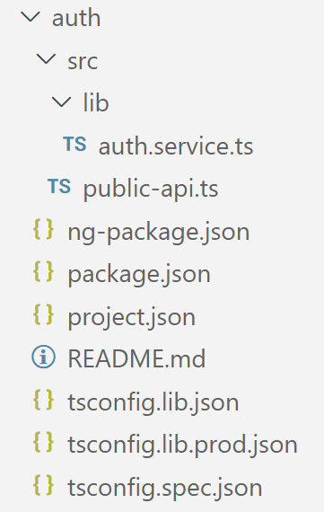
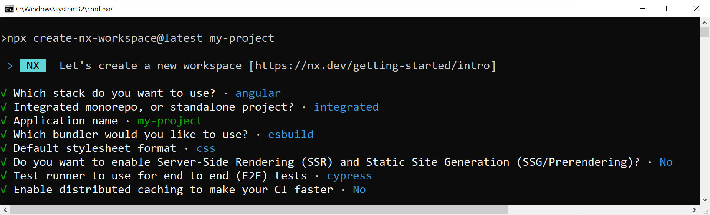
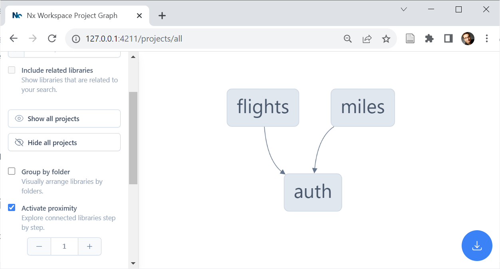
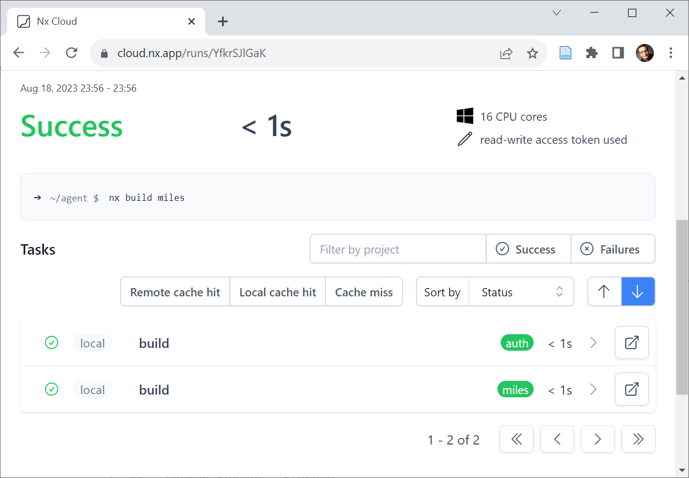
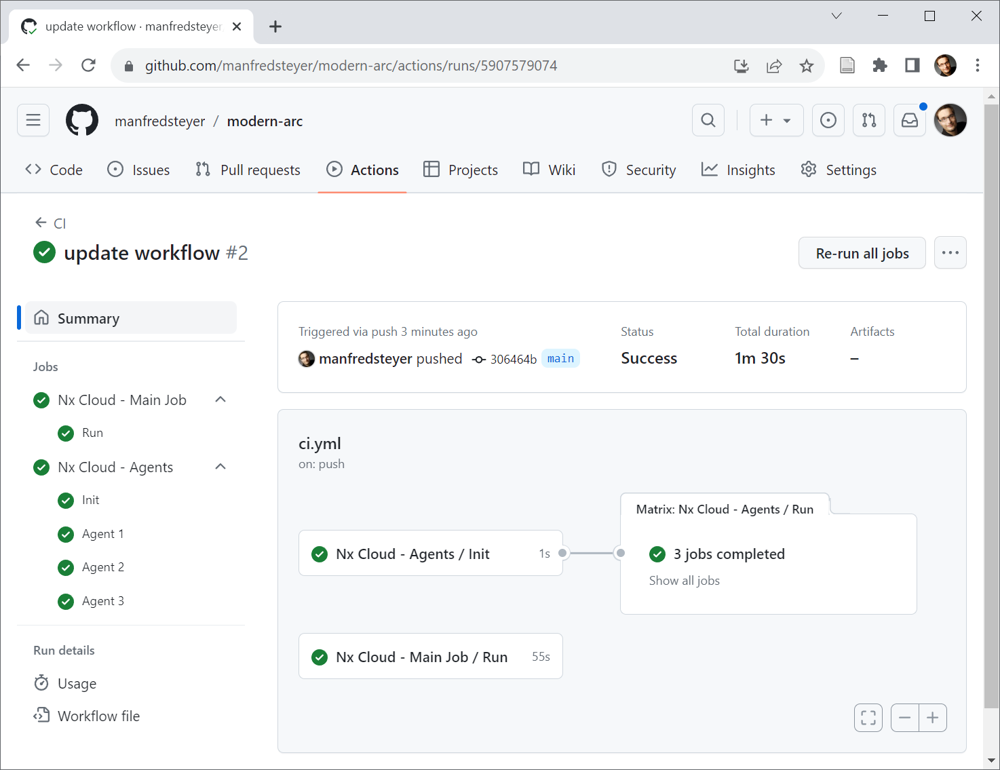

# Build Performance with Nx

So far, we laid the foundation for a maintainable Angular architecture. We've been thinking about domain slicing, categorizing modules, and enforcing rules based on them with Sheriff.

This chapter supplements our solution with measures to improve build performance. For this, we will switch to the well-known build system Nx.

📁 [Source Code](https://github.com/manfredsteyer/modern-arc.git) (see different branches)

## Incremental Builds – Getting Started

Incremental builds are about just rebuilding changed parts of the repository and hence allow for tremendously speeding up the build process. For this purpose, the solution is divided into several applications. This means only the application that has just been changed must be rebuilt. The same applies to running tests.

The following statement creates another application in a workspace:

```
ng g app miles
```

Libraries can be used to share code between applications:

```
ng g lib auth
```

All applications and libraries set up this way are part of the same workspace and repo. It is, therefore, not necessary to distribute the libraries via npm:



The file `public-api.ts`, sometimes also called `index.ts`, has a special task. It defines the library's public API:

```typescript
// public-api.ts

export * from "./lib/auth.service";
```

All constructs published here are visible to other libraries and applications. The rest is considered a private implementation detail. In order to grant other libraries and applications in the same workspace access to a library, a corresponding path mapping must be set up in the central `tsconfig.json`:

```json
[…]
"paths": {
  "@demo/auth": [
    "auth/src/public-api.ts"
  ],
  […]
}
[…]
```

Calling `ng g lib` takes care of this path mapping. However, the implementation of the Angular CLI makes point to the `dist` folder and, therefore, to the compiled version. This means the author would have to rebuild the library after every change. To avoid this annoying process, the previous listing has the mapping point to the library's source code version. Unlike the CLI, the below-mentioned tool Nx takes care of this automatically.

Once path mapping is set up, individual applications and libraries can import public API exports:

```typescript
import { AuthService } from "@demo/auth";
```

## More comfortable and more powerful: Nx

The solution in the last section is simple, but it has a catch: developers must know which applications have changed and manually trigger the corresponding build command. And the build server probably still has to rebuild and test all applications to be on the safe side.

It would be better to let the tooling figure out which applications have changed. To do this, you could calculate a hash value for all source files that flow into your applications. Whenever a hash value changes, it can be assumed that the corresponding application needs to be rebuilt or tested.

Nx is a popular solution that supports this idea and comes with many additional features. In addition to Angular, it also supports other technologies such as React or Node.js-based backends, and integrates numerous tools commonly used in the development of web-based solutions. Examples are the testing tools Jest, Cypress, and Playwright, the npm server _verdaccio,_ and Storybook used for interactive component documentation. Developers do not have to invest any effort in setting up such tools but can get started straight away.

For incremental builds, Nx uses a build cache. Because Nx analyzes dependencies between the individual program parts, these mechanisms often require no manual configuration. Nx feels very natural, especially for Angular developers: The Nx CLI can be used similarly to the Angular CLI. You simply swap out the `ng` instruction for `nx` - the usual arguments remain largely the same (`nx build`, `nx serve`, `nx g app`, `nx g lib`, etc.). The Nx CLI is installed via npm:

```
npm i -g nx
```

To create a new Nx workspace, run the following command:

```
npx create-nx-workspace@latest my-project
```

For your first project, select the following options:



This command causes npm to load a script that sets up an Nx workspace with the current Nx version. There are also scripts for migrating CLI workspaces to Nx, although they do not always activate the full range of Nx features. For this reason, we had better experiences creating a new Nx workspace and – if necessary – copying over the existing source code. As usual with the Angular CLI, the workspace can then be divided into several applications and libraries:

```
nx g app apps/appName

nx g lib libs/libName
```

It's a usual Nx convention to place Angular apps in the `apps` folder and Angular libs in the `libs` folder. Also here, use the default settings for your first Nx projects. However, I would suggest one exception to this rule: Start with the new esbuild builder as it provides a better build performance compared to the traditional webpack-based one.

A call to

```
nx graph
```

illustrates the dependencies between applications and libraries:



## Incremental Builds with Nx

The data used for the dependency graph is also the basis for incremental builds that Nx offers out of the box. To build a specific project, you can go with `nx build`:

```
nx build miles
```

If the source files that flow into the affected application have not changed, you will immediately receive the result from the local cache. By default, this is located in a `.nx` folder excluded in your project's `.gitignore`.

Nx can also be instructed to rebuild certain or all projects:

```
npx nx run-many --target=build --projects=flights,miles

npx nx run-many --target=build --all
```

In this case, too, Nx falls back to the cache if the source files have not changed:


Unit tests, E2E tests, and linting can also be carried out incrementally in the same way. Nx even goes one step further and caches these actions at the library level. This improves performance by dividing the application across several libraries.

In principle, this would also be possible for `nx build`, provided individual libraries are created as `buildable` (`nx g lib myLib --buildable`). However, it has been shown that this approach rarely leads to performance advantages and that incremental application rebuilds are preferable.

## Side Note: Micro Frontends

The separately built applications can be integrated at runtime, giving users the feeling of working with a single application. For this purpose, techniques known from the world of micro frontends are used. This topic is discussed in several other chapters.

## Distributed Cache with Nx Cloud

By default, Nx sets up a local cache. If you want to go one step further, use a distributed cache to which the entire project team and the build server can access. This means you also benefit from the builds that others have already performed. The [Nx Cloud](https://nx.app/) – a commercial add-on to the free Nx – offers such a cache. If you don't want to or aren't allowed to use cloud providers, you can also host the Nx Cloud yourself.

To connect an Nx workspace to the Nx Cloud, all it needs is one command:

```
npx nx connect-to-nx-cloud
```

Technically, this command activates the `nx-cloud` task runner in the `nx.json` located in the project root:

```json
"tasksRunnerOptions": {
  "default": {
    "runner": "nx-cloud",
    "options": {
      "cacheableOperations": [
        "build",
        "test",
        "lint"
      ],
      "accessToken": "[…]"
    }
  }
},
```

A task runner takes care of the execution of individual tasks, such as those behind `nx build`, `nx lint` or `nx test`. The default implementation caches the results of these tasks in the file system, as discussed above. The `nx-cloud` Task Runner, on the other hand, delegates to an account in the Nx Cloud.

This also shows that the task runner and, thus, the caching strategy can be exchanged relatively easily. Some open-source projects take advantage of this and offer task runners that leverage their own data sources like AWS (see [here](https://www.npmjs.com/package/@magile/nx-distributed-cache) and [here](https://github.com/bojanbass/nx-aws)), [GCP](https://github.com/MansaGroup/nx-gcs-remote-cache), [Azure](https://npmjs.com/package/nx-remotecache-azure), or [Minio](https://npmjs.com/package/nx-remotecache-minio). Thanks to [Lars Gyrup Brink Nielsen](https://twitter.com/LayZeeDK) for pointing me to these solutions.

However, it should be noted that the task runner's API is not public and can, therefore, change from version to version.

The task runner for the Nx Cloud also needs to be configured with an access token (see above). Commands like _nx build_ output a link to a dynamically created cloud account. When accessing for the first time, it is advisable to create users to restrict access to them. You can also find a dashboard under this link that provides information about the builds carried out:



## Even Faster: Parallelization with Nx Cloud

To further accelerate the build process, the Nx Cloud offers the option of parallelizing individual build tasks. Here, too, the dependency graph proves to be an advantage: Nx can use it to find out the order in which individual tasks must take place or which tasks can be parallelized.

Different nodes in the cloud are used for parallelization: a main node takes over the coordination, and several worker nodes take care of the individual tasks in parallel. Nx can even generate build scripts that start and provide tasks to these nodes. For example, the following statement generates a workflow for GitHub:

```
nx generate @nx/workspace:ci-workflow --ci=github
```

This command supports CircleCI (`--ci=circleci`) and Azure (`--ci==azure`) too. If you go with another environment, you can at least use the generated workflows as a starting point. Essentially, these scripts specify the desired number of worker nodes and the number of parallel processes per worker node. The triggered commands are divided into three groups: commands that are executed sequentially for initialization (`init-commands`), commands that are executed in parallel on the main node (`parallel-commands`) and commands that the workers execute in parallel (`parallel-commands`) on agents.

The scripts are triggered whenever the main branch of the repo is changed - either by a direct `push` or by merging a pull request:



## Conclusion

Nx enables build tasks to be dramatically accelerated. This is made possible, among other things, by incremental builds, in which only the application parts that have actually changed are rebuilt or tested. The Nx Cloud offers further acceleration options with its distributed cache. It also allows the individual builds to be parallelized. Because Nx analyzes the program code and recognizes dependencies between individual applications and libraries, these options often do not require manual configuration.
