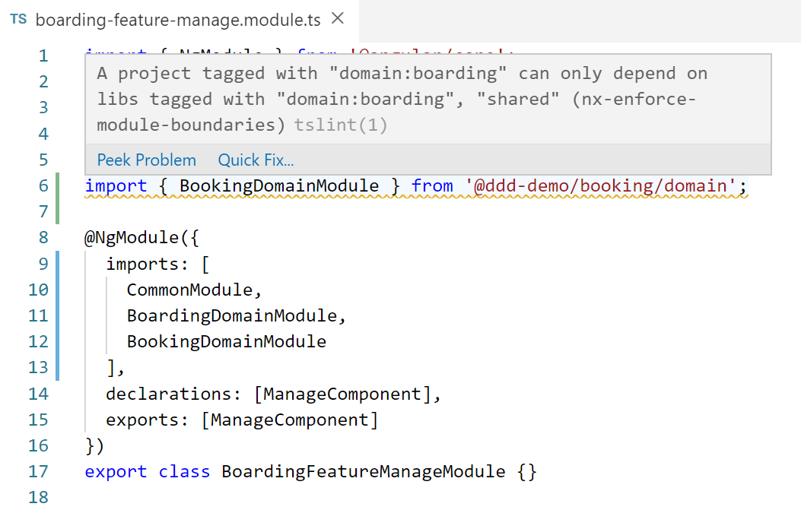
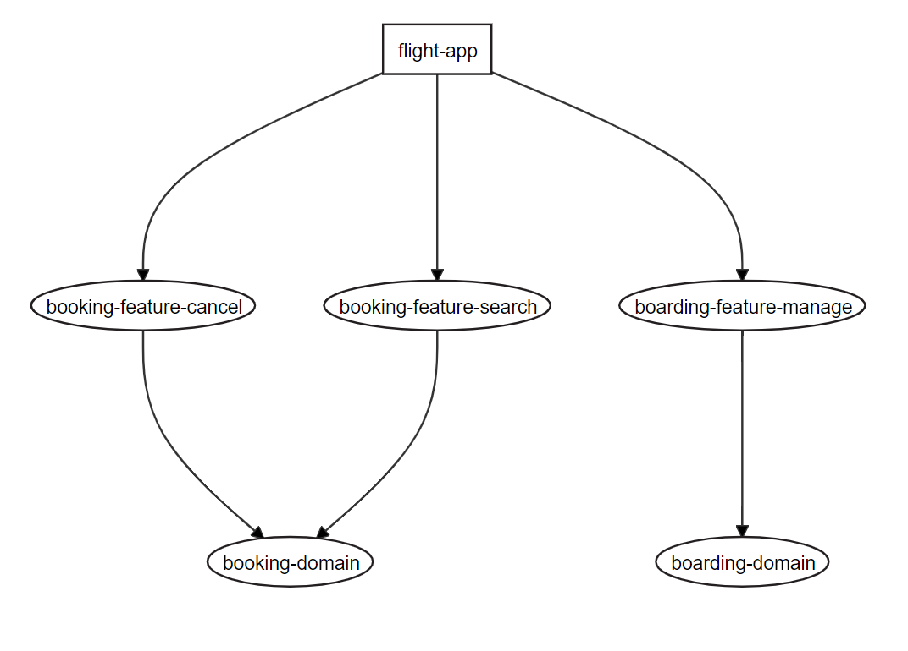
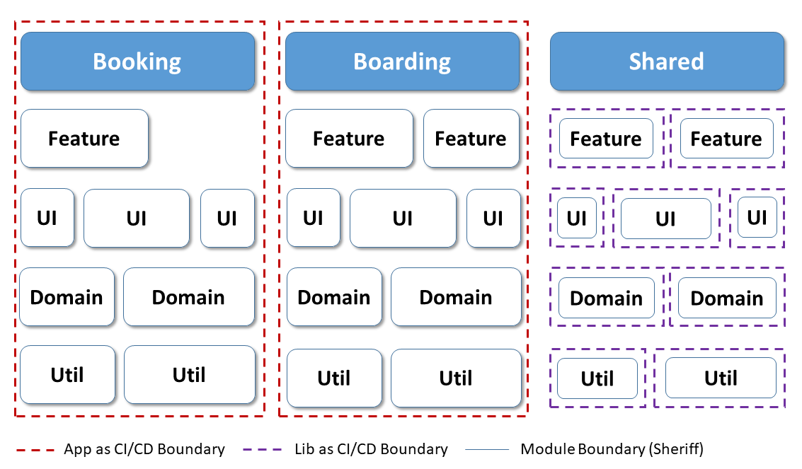
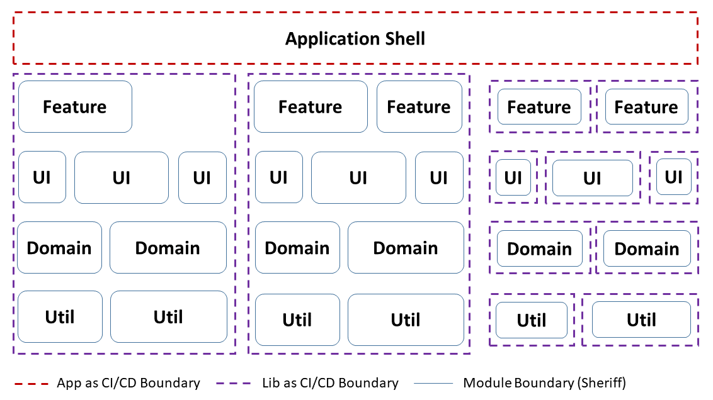

# Nx & Sheriff - Friends for Life

Nx provides a lot of features (not only) for Angular teams: A fast CI thanks to the build cache and parallelization, integration into popular tools like Jest, Cypress, Playwright, or Storybook by the push of a button, and linting rules for enforcing module boundaries are just a few examples. Sheriff, on the other hand, focuses on enforcing module boundaries. 

At first glance, Sheriff seems to be a small subset of Nx. However, we quite often use both tools together in our customer projects. In this chapter, I explain why and how your architectures can benefit from this combination.

## Module Boundaries in Nx

By default, Nx allows to enforce module boundaries like those in our architecture matrix:


Here, a technical layer can only access the below layers, and domains like booking and boarding are not allowed to access each other. However, they can access the shared area (see arrows in the previous image).

### Tagging Apps and Libs

To enforce these boundaries with Nx, each cell in our matrix is implemented as a library of its own. Instead of using an overarching `angular.json`,  Nx creates a local `project.json` for each app and lib. This file allows you to tag the app or lib in question:

```json
{
  [...]
  "tags": ["domain:tickets", "type:domain-logic"]
}
```

Tags are just strings. In the shown case, they reflect the lib's or app's position in the architecture matrix. The prefixes `domain` and `type` help to distinguish the two dimensions (columns with domains and rows with types). This is just to improve readability - for Nx they don't add any meaning.

### Defining Module Boundaries

On top of the tags, we can set up module boundaries telling Nx which apps and libs can access which other libs. These boundaries are defined using a linting rule in the `.eslintrc.json` found in the workspace root:

```json
"rules": {
  "@nx/enforce-module-boundaries": [
    "error",
    {
      "enforceBuildableLibDependency": true,
      "allow": [],
      "depConstraints": [
        {
          "sourceTag": "type:app",
          "onlyDependOnLibsWithTags": [
            "type:api",
            "type:feature",
            "type:ui",
            "type:domain-logic",
            "type:util"
          ]
        },
        {
          "sourceTag": "type:feature",
          "onlyDependOnLibsWithTags": [
            "type:ui",
            "type:domain-logic",
            "type:util"
          ]
        },
        {
          "sourceTag": "type:ui",
          "onlyDependOnLibsWithTags": ["type:domain-logic", "type:util"]
        },
        {
          "sourceTag": "type:domain-logic",
          "onlyDependOnLibsWithTags": ["type:util"]
        },

        
        {
          "sourceTag": "domain:booking",
          "onlyDependOnLibsWithTags": ["domain:booking", "shared"]
        },
        {
          "sourceTag": "domain:boarding",
          "onlyDependOnLibsWithTags": ["domain:boarding", "shared"]
        },
        {
          "sourceTag": "shared",
          "onlyDependOnLibsWithTags": ["shared"]
        },

      ]
    }
  ]
}
```

There is a set of restrictions for each dimension found in the matrix. As we don't add new types of layers and new domains regularly, these linting rules don't come with a lot of maintenance effort. After changing these rules, restart your IDE to ensure it rereads the modified files. 

### Enforcing Module Boundaries

When your source code breaks the defined rules, your IDE should give you a linting error:



Also, a call to `nx lint` will unveil the same linting errors. This allows your build tasks to check for alignment with the architecture defined. Using git hooks and tools like [husky](https://typicode.github.io/husky/), you can also prevent people from checking in source code that breaks the rules.

### Your Architecture by the Push of a Button

If you want to automate the creation of all these libraries for each matrix cell, defining tags, and linting rules, you might like our [DDD Nx plugin](https://www.npmjs.com/package/@angular-architects/ddd). Using this plugin, the following commands are all you need to set up two domains with some features:

```bash
npm i @angular-architects/ddd
ng g @angular-architects/ddd:init

ng g @angular-architects/ddd:domain booking --addApp --standalone
ng g @angular-architects/ddd:domain boarding --addApp --standalone
ng g @angular-architects/ddd:feature search --domain booking --entity flight --standalone
ng g @angular-architects/ddd:feature cancel --domain booking --standalone
ng g @angular-architects/ddd:feature manage --domain boarding --standalone
```

If you visualize this architecture with the command `nx graph`, you get the following graph:




## Recap: Different Types of Boundaries

So far, we've discussed how to introduce boundaries in Nx. However, if we look closer to Nx, we see that there are two types of boundaries:

- Boundaries for modularization
- Boundaries for incremental CI/CD

Both boundary types align with each other and are implemented as apps and libs.

However, there are situations where having that many apps and libs feels a bit overwhelming, and such a fine-grained incremental CI/CD is not needed. In some cases, the build might already be fast enough or might not benefit much from further apps and libs as the amount of build agents is limited too.

On the other hand, having module boundaries on this granularization level is essential for our architecture. Hence, we need to find a way to decouple these two types of boundaries from each other. For this, we combine Nx with [Sheriff](https://github.com/softarc-consulting/sheriff) introduced in the chapter _Architectures with Sheriff and Standalone Components_:

- Fewer, more coarse-grained libraries define the boundaries for incremental CI/CD
- The usual fine-grained boundaries for modularization are implemented on a per-folder level with Sheriff

- As so often, this is a trade-off situation: We trade in the possibility of a more fine-grained incremental CI/CD for a simplified project structure.

## Options with Sheriff

There are several ways to combine Sheriff with Nx. Here, I want to show two options we often use: Having an app per domain and having a lib per domain. 

### App per Domain

The first approach I want to mention here is creating an application per sub domain:



This strategy was already used in the chapter _Architectures with_ Sheriff and Standalone Components_.

Shared modules are still implemented as separate libraries. This approach is fitting when we go with several applications that might be integrated using Hyperlinks or technologies also used for Micro Frontends, e.g., Federation. More information about Micro Frontends and Federation can be found in the preceding chapters.

This style gives us a great performance in terms of both incremental builds and incremental testing and linting. Even though Micro Frontend Technologies might be involved, this does not necessarily lead to a Micro Frontend architecture, especially if all applications are deployed together.

### Lib per Domain

If your application is intended to be a modular monolith, sometimes referred to as a "Modulith", you only might have one application consisting of several Domains:  



In this case, putting the domains in different libraries helps to speed up incremental testing and linting. However, in this case, the potential for speeding up the build performance is limited as each change leads to a rebuild of the whole application. 

## Conclusion

Nx is a great build system that uses a build cache and parallelization to speed up your CI tremendously. It comes with integrations into popular tools like Jest, Cypress, Playwright, and Storybook. To enforce our architecture, module boundaries can be configured.

Apps and libs define the boundaries for incremental CI and the module boundaries. Hence, we need to split our software system into several apps and libs. 

While having fine-grained module boundaries is preferable, having too many small apps and libraries might be overwhelming and not needed to improve CI performance. This is where Sheriff comes in: It allows defining module boundaries on a per-folder basis, while Nx establishes boundaries on a per-app and per-lib basis.