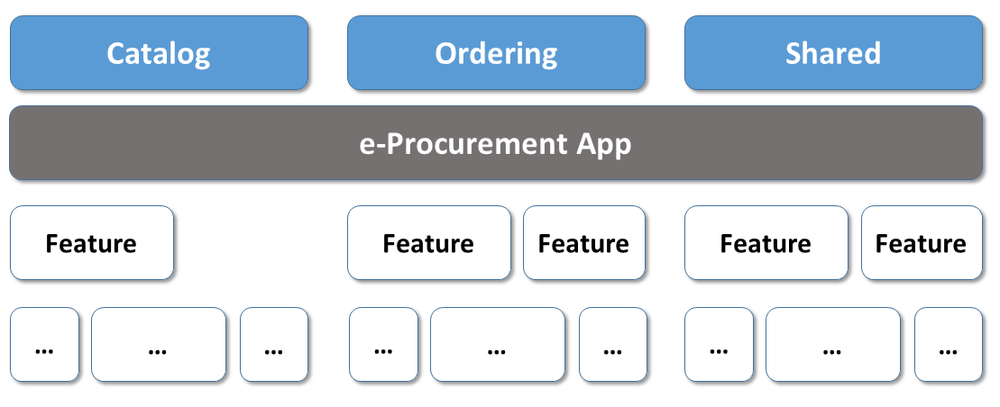
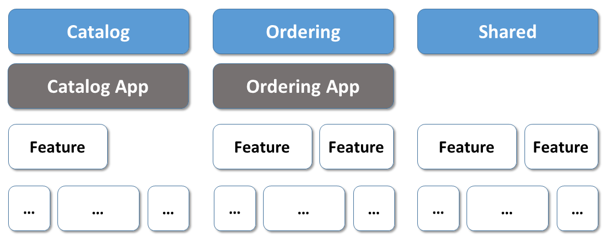
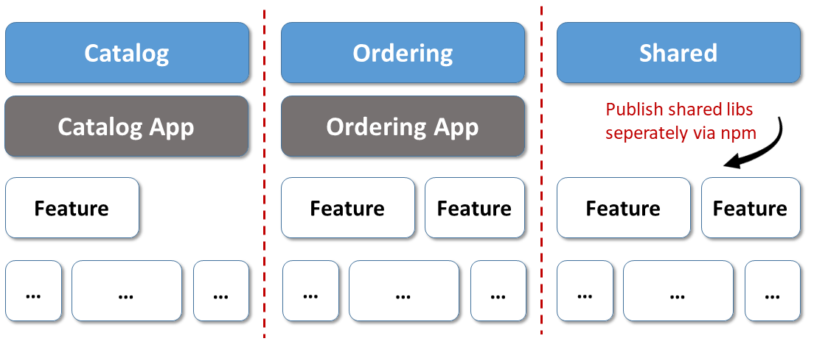
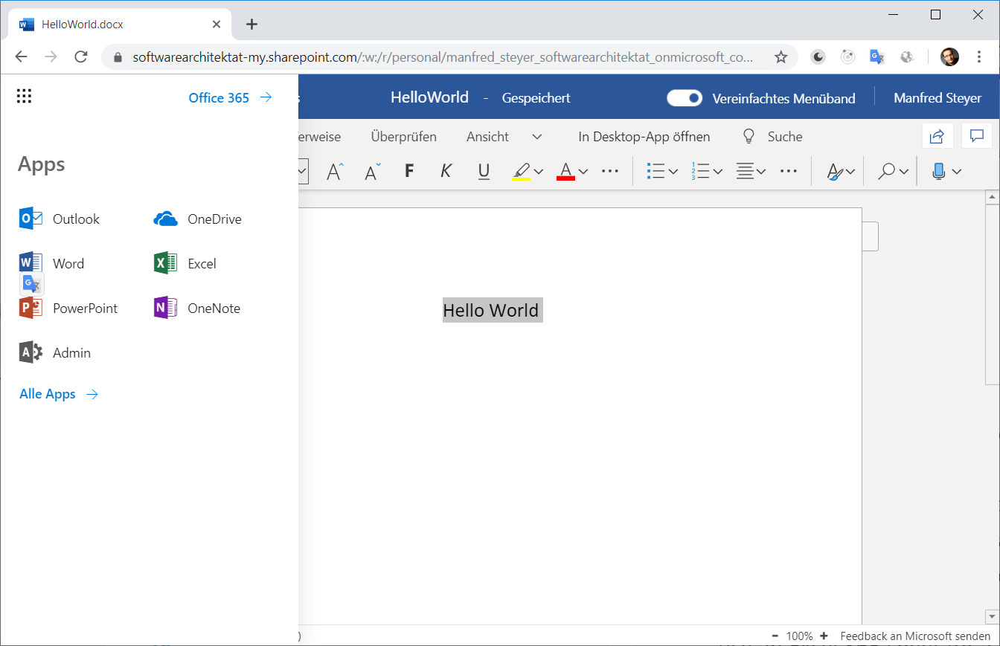
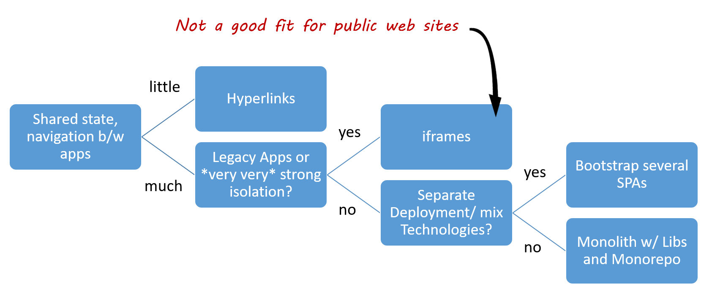

# From Domains to Microfrontends

Let's assume you've identified the sub-domains for your system. The next question is how to implement them.

One option is to implement them within a large application -- aka a deployment monolith. The second is to provide a separate application for each domain.

Such applications are called microfrontends.

## Deployment Monoliths

A deployment monolith is an integrated solution comprising different domains:



This approach supports a consistent UI and leads to optimised bundles by compiling everything together.

A team responsible for a specific sub-domain must coordinate with other sub-domain teams. They have to agree on overall architecture, the leading framework, and an updated policy for dependencies. Interestingly, you may consider this an advantage.

It is tempting to reuse parts of other domains which may lead to higher coupling and -- eventually -- to breaking changes. To prevent this, you can use free tools like [Nrwl's Nx](https://nx.dev/angular). For instance, Nx allows you to define access restrictions between the parts of your monorepo to enforce your envisioned architecture and loose coupling.

## Deployment monoliths, microfrontends, or a mix?

To further decouple your system, you could split it into several smaller applications. If we assume that use cases do not overlap your sub-domains' boundaries, this can lead to more autarkic teams and applications which are separately deployable.

.

Having several tiny systems decreases complexity.

If you seek even more isolation between your sub-domains and the teams responsible for them, you could put each sub-domain into its individual (mono) repository:



You now have something called microfrontends. Microfrontends allow individual teams to be as autarkic as possible. Each team can choose their architectural style, their technology stack, and they can even decide when to update to newer framework versions. They can use "the best technology" for the requirements given within the current sub-domain.  

The option to use their framework and architecture is useful when developing applications over the long term. If, for instance, a new framework appears in five years, we can use it to implement the next domain.

However, this has costs. Now you have to deal with shipping your shared libraries via npm, and this includes versioning which can lead to version conflicts.

## UI Composition with Hyperlinks

You have to find ways to integrate the different applications into one large system for your users. Hyperlinks are one simple way to accomplish this:


This approach fits product suites like Google or Office 365 well:



Each domain is a self-contained application here. This structure works well because we don't need many interactions between the domains. If we needed to share data, we could use the backend. Using this strategy, Word 365 can use an Excel 365 sheet for a series letter. 

This approach has several advantages:

- It is simple
- It uses SPA frameworks as intended
- We get optimised bundles per domain

However, there are some disadvantages:

- We lose our state when switching to another application
- We have to load another application -- which we wanted to prevent with SPAs
- We have to work to get a standard look and feel (we need a universal design system).

## UI Composition with a Shell

Another much-discussed approach is to provide a shell that loads different single-page applications on-demand:


In the screenshot, the shell loads the microfrontend with the red border into its working area. Technically, it simply loads the microfrontend bundles on demand. The shell then creates an element for the microfrontend's root element:

```javascript
const script = document.createElement('script');
script.src = 'assets/external-dashboard-tile.bundle.js';
document.body.appendChild(script);

const clientA = document.createElement('client-a');
clientA['visible'] = true;
document.body.appendChild(clientA);
```

Instead of bootstrapping several SPAs, we could also use iframes. While we all know the enormous disadvantages of iframes and have strategies to deal with most of them, they do provide two useful features:

1) Isolation: A microfrontend in one iframe cannot influence or hack another microfrontend in another iframe. Hence, they are handy for plugin systems or when integrating applications from other vendors. 
2) They also allow the integration of legacy systems.

You can find a library that compensates most of the disadvantages of iframes for intranet applications [here](https://www.npmjs.com/package/@microfrontend/common).

The shell approach has the following advantages:

- The user has an integrated solution consisting of different microfrontends.
- We don't lose the state when navigating between domains.

The disadvantages are:

- If we don't use specific tricks (outlined in the next chapter), each microfrontend comes with its own copy of Angular and the other frameworks, increasing the bundle sizes.
- We have to implement infrastructure code to load microfrontends and switch between them.
- We have to work to get a standard look and feel (we need a universal design system).

## Finding a Solution

Choosing between a deployment monolith and different approaches for microfrontends is tricky because each option has advantages and disadvantages.

I've created the following decision tree, which also sums up the ideas outlined in this chapter:



As the implementation of a deployment monolith and the hyperlink approach is obvious, the next chapter discusses how to implement a shell.

## Conclusion

There are several ways to implement microfrontends. All have advantages and disadvantages. Using a consistent and optimised deployment monolith can be the right choice.

It's about knowing your architectural goals and about evaluating the consequences of architectural candidates. 
