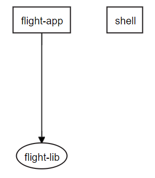

# A lightweight Approach towards Microfrontends

For implementing Microfrontends with Angular, there are several approaches and here I present one of them: Loading separately compiled UMD bundles. The [source code](https://github.com/manfredsteyer/module-federation-light) can be found [here](https://github.com/manfredsteyer/module-federation-light).

> The approach presented here has been inspired by the work of [Victor Savkin](https://twitter.com/victorsavkin) and by a great conversation I had with [Rob Wormald](https://twitter.com/robwormald) several months ago.

## The Case Study

Even though everything I'm showing here works directly with Angular and the Angular CLI, I'm using an [Nx workspace](https://nx.dev/angular) because it provides lots of nice features for big systems subdivided into tiny parts. For instance, it allows visualizing them:



The `shell` app in our example is capable of **loading separately compiled and deployed libraries** like the `flight-lib`:


If we wanted to start the `flight-lib` in **standalone mode**, you would use the `flight-app` which directly references it.

## Prevent Duplicates with UMD Bundles

Of course, when loading the `flight-lib` into the shell, we don't want to load all the dependencies like Angular itself one more time. Instead, we want to **reuse the already loaded Angular** instance. For this, we are going to use **UMD bundles** which lookup dependencies in the global namespace if no module loader is used. 

Also, UMD bundles can export elements to the global namespace. Our shell will leverage this to get hold of dynamically loaded libraries.

If you wonder how to get UMD bundles for our libraries, I have a good message for you: We get them automatically when building our library because the official [Angular Package Format](https://docs.google.com/document/d/1CZC2rcpxffTDfRDs6p1cfbmKNLA6x5O-NtkJglDaBVs/edit#heading=h.k0mh3o8u5hx) prescribes it among several other formats like ES5 and ES2015 bundles using EcmaScript modules.

## Providing the Library

The `flight-lib` is a traditional feature library with child routes:

```typescript
@NgModule({
  imports: [
    CommonModule,
    RouterModule.forChild([
      { path: 'flights-search', component: FlightComponent  },
      [...]
    ])
  ],
  declarations: [FlightComponent]
})
export class FlightLibModule {}
```

There is really nothing special about it. After building it (`ng build flight-lib`), we get the following folders:

```
dist/libs/flight-lib
├───bundles
├───esm2015
├───esm5
├───fesm2015
├───fesm5
└───lib
```

Each of these folders contains the library compiled into < specific module format. The UMD bundles can be found in the **bundles folder**:

```
18.767 flights-flight-lib.umd.js
30.145 flights-flight-lib.umd.js.map
 5.923 flights-flight-lib.umd.min.js
17.766 flights-flight-lib.umd.min.js.map
```

By looking at the file size of the minimized version, you can tell that it only contains our code and not the code of the dependencies referenced. Now, you only need to **deploy** these files -- at least the minimized bundle -- **to any webserver** of your choice. To simplify this demonstration, I've just copied it over to the shell's `assets` folder.

## Implementing the Shell

Also the shell is a **traditional Angular application**. It just uses two **helper functions** for loading the separately compiled UMD bundle and for sharing libraries like Angular with it. In this section, I thread these functions as a black box. In the next section I will reveal their implementations.

To load the **UMD bundle**, I use the router's lazy loading capabilities: 

```typescript
@NgModule({
  declarations: [AppComponent, HomeComponent],
  imports: [
    BrowserModule,
    RouterModule.forRoot([
      {
        path: '',
        component: HomeComponent
      },
      {
        path: 'flights',
        loadChildren: () => loadModule('assets/flights-flight-lib.umd.min.js')
                              .then(g => g.flights['flight-lib'].FlightLibModule)
      }
    ])
  ],
  providers: [],
  bootstrap: [AppComponent]
})
export class AppModule {}
```

At first sight, this really looks like traditional **lazy loading**. However, **instead** of a **dynamic import** I'm using the **helper function** `loadModule`. This is needed because when using webpack -- and hence the Angular CLI -- a dynamic import assumes that the referenced code is already available at compile time. Of course, here, this is not the case as we want to load separately compiled stuff. 

After loading, the `then` handler is grabbing the `FlightLibModule` **out of the global namespace**. Fortunately, it is not directly put there but into the sub namespace `flight-lib` which is part of the sub namespace `flights`. Technically, we are talking about nested JavaScript objects here. As `flight-lib` contains a dash (`-`), we have to use the bracket syntax for referencing it.

> Here, `flights` is the name of the Angular project (and hence the Nx workspace) and `flight-lib` is the library's name. If you are not sure about these names you can look them up in the first 3 to 5 lines of your UMD bundle.

For such bundles, we also need to expose all libraries it needs via the global namespace. For this, I'm calling my helper function 

```typescript
initExternals(environment.production);
```

before bootstrapping in the file `main.ts`.

## The Helper Functions

Now it's time to look into the two helper functions used by the shell. The function `loadModule` is basically dynamically creating a **script tag** to **load** the passed UMD **bundle**:

```typescript
const moduleMap = {};

export function loadModule(umdFileName: string): Promise<any> {
    return new Promise<any>((resolve, reject) => {

        if (moduleMap[umdFileName]) {
            resolve(window);
            return;
        }

        const script = document.createElement('script');
        script.src = umdFileName;
        
        script.onerror = reject;
        
        script.onload = () => {
            moduleMap[umdFileName] = true;
            resolve(window); // window is the global namespace
        }
        
        document.body.append(script);
    });
}
```

This is a very common way of dynamic script loading which is normally hidden behind libraries. The `moduleMap` makes sure each bundle is only loaded once. Please also note that the returned promise is resolved with the `window` object which **represents the global namespace** in the browser.

The helper function `initExternals` is just **putting** the **shared libraries** into the **global namespace** where the separately compiled UMD bundles expects them:

```typescript
declare const require: any;

export function initExternals(production: boolean) {
    (window as any).ng = {};
    (window as any).ng.core = require('@angular/core');
    (window as any).ng.forms = require('@angular/forms');
    (window as any).ng.common = require('@angular/common');
    (window as any).ng.router = require('@angular/router');
    (window as any).ng.platformBrowser = require('@angular/platform-browser');

    if (!production) {
        (window as any).ng.platformBrowserDynamic = require('@angular/platform-browser-dynamic');
        (window as any).ng.compiler = require('@angular/compiler');
    }
}
```

To find out about the right location like `ng.core` or `ng.common`, just have a look into this libraries' UMD bundles. It should be used there in the first 3 to 5 lines of code.

## Conclusion

The approach outlined here is **simple** and can be used with Angular libraries **already today**. The **bundles** are **small** because they only contain the lazily loaded code and no dependencies. They are always **shared** with the shell.

One downside is, that the **shell needs to provide all the dependencies** the library needs. They have to be either part of the shell upfront and exposed as shown here or loaded alongside the library in question. Also, traditional lazy loading does not work from within an UMD bundle as the CLI's build task is not splitting UMD such bundles. However, traditional lazy loading works well in the shell and an UMD bundle can load further UMD bundles as shown above. 

The upcoming **Webpack 5 Module Federation provides** (see chapter about Module Federation) a lot **more convenience** out of the box: It doesn't demand you to create separate libraries and it allows the microfrontend to directly come with its own dependencies. To be more precise, both, the microfrontend and the shell can decide which dependencies they want to share. If the shell does not provide a given dependency, the microfrontend can fall back to loading it directly. Also, Module Federation defines all the details in a declarative way.

One benefit of the approach outlined here is that we **don't need to know the amount of microfrontends** during compile time. Instead we could load a configuration at runtime telling us how many microfronts are available and where they can be found. However, eventually there will be a webpack plugin which allows the same.

If you want to get started **today**, the **"light" approach** shown here might be the best you can have today. However, **keep an eye to** the further development of **Module Federation** and to approaches for integrating them into the Angular CLI.

