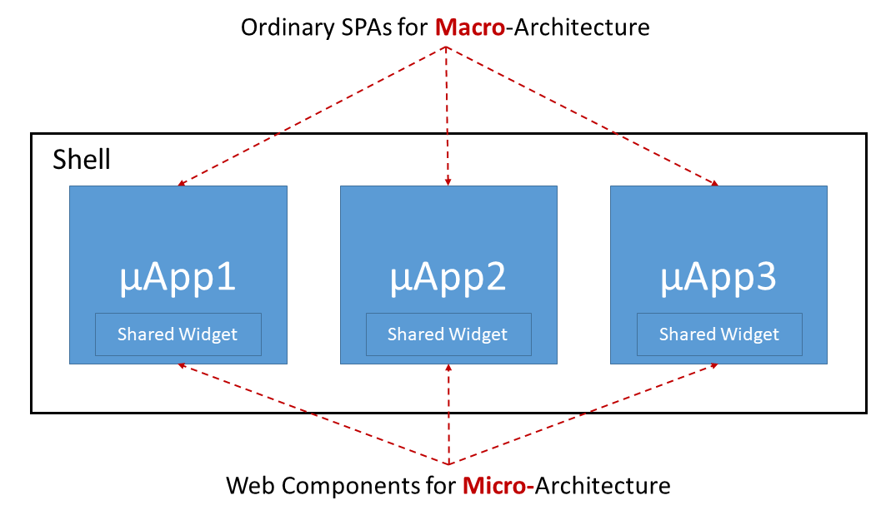
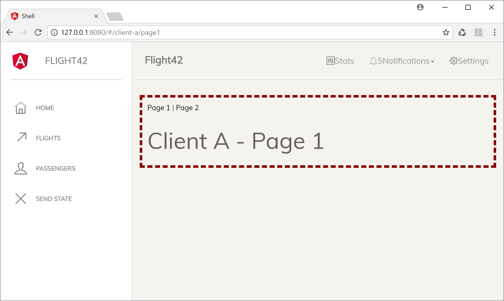
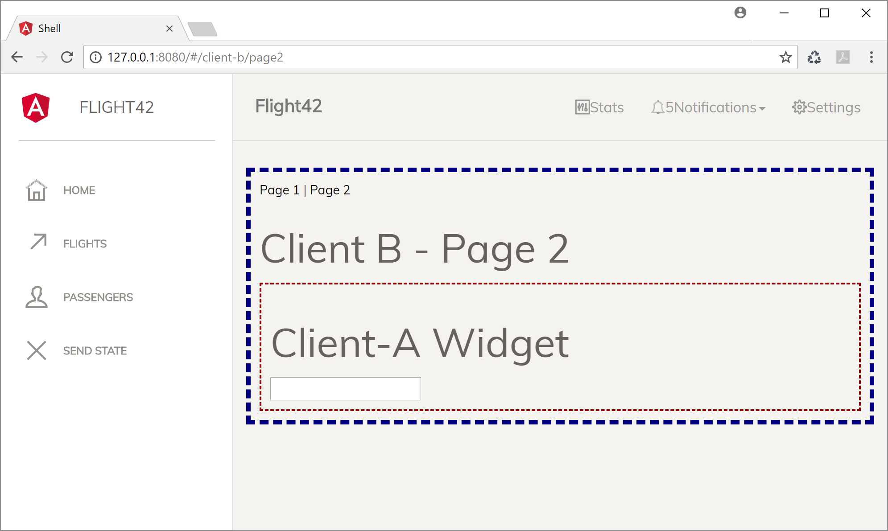
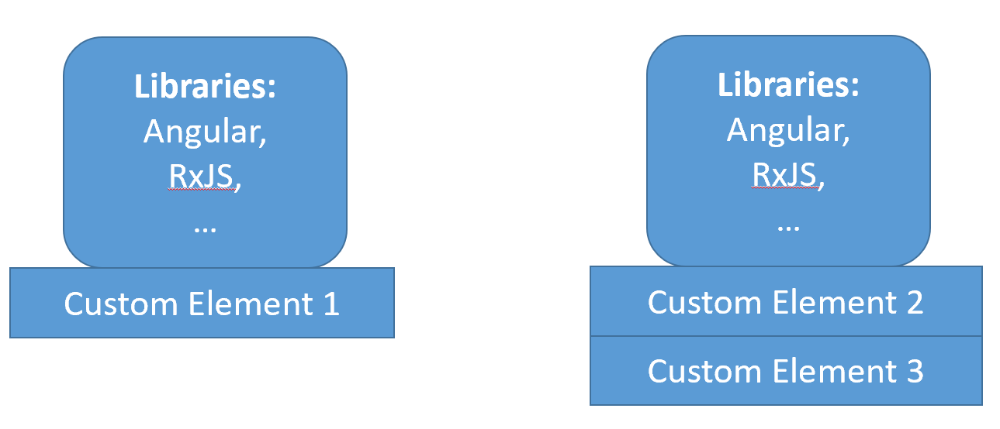
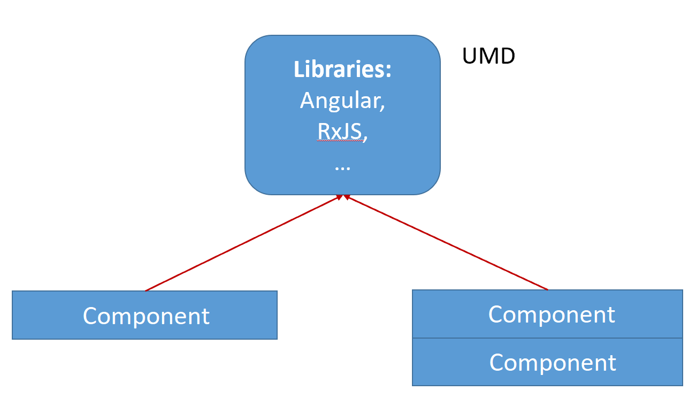

# 6 Steps to your Angular-based Micro Frontend Shell

As discussed in the last chapter, there are several approaches for implementing SPA-based micro frontends.

In this chapter, I show how to implement one of them in 6 steps: A shell loading micro frontends on demand. Other than in my chapter about micro frontends and web components, I don't use web components for the macro architecture. Instead, I just go with ordinary SPAs which are loaded and bootstrapped on demand. For the micro architecture I still use web components.



While this decision simplifies the implementation, we can still isolate different applications using shadow DOM as Angular also supports this standard associated with web components for traditional Angular components since its first day.

The case study loads a simple ``client-a`` and a simple ``client-b`` into the shell. Also, the former one shares a widget with the latter one:




The [source code](https://github.com/manfredsteyer/angular-microfrontend) for this can be found in my [GitHub account here](https://github.com/manfredsteyer/angular-microfrontend).

## Step 0: Make sure you need it

Make sure this approach fits to your architectural goals. As discussed in the previous chapter, micro frontends come with a lot of consequences. Make sure you are aware of them.

## Step 1: Implement Your SPAs

Implement your micro frontends as ordinary Angular applications. In an micro service architecture it's quite common that every part gets its own repository in order to decouple them as much as possible (see [Componentization via Services](https://martinfowler.com/chapters/microservices.html#ComponentizationViaServices)) On contrary, I've seen a lot of micro frontends based upon monorepos for practical reasons. 

Of course, now, we could discuss when the term micro frontend is appropriate. I won't, because this discussion doesn't really help. What counts is to find a architecture that fits your goals and to be aware of its consequences. 

If we go with a monorepo, we have to ensure, e. g. with linting rules, that the micro frontends are not coupled to each other. As discussed in a previous chapter, [Nrwl's Nx](https://nx.dev/angular) provides a great solution for that: It allows to set up access restrictions defining which library can access which other one. Also, Nx can detect which parts of your monorepo are affected by a change in order to only recompile and retest them.

To make routing across micro frontends easier, it's a good idea to prefix all the routes with the application's name. In the following case, the application name is ``client-a``

```TypeScript
@NgModule({
  imports: [
    ReactiveFormsModule,
    BrowserModule,
    RouterModule.forRoot([
      { path: 'client-a/page1', component: Page1Component },
      { path: 'client-a/page2', component: Page2Component },
      { path: '**', component: EmptyComponent}
    ], { useHash: true })
  ],
  [...] 
})
export class AppModule {
  [...]
}
```

## Step 2: Expose Shared Widgets

Expose widgets you want to share as Web Components/ Custom Elements. Please note that from the perspective of micro services, you should avoid sharing code between micro frontends as much as possible. The reason is that this causes coupling which is exactly what you want to avoid with this architectural style.

For exposing an Angular Component as a Custom Element, you can use Angular Elements. My blog chapter about [Angular Elements](https://www.softwarearchitekt.at/aktuelles/angular-elements-part-i/) and [lazy and external Angular Elements](https://www.softwarearchitekt.at/aktuelles/angular-elements-part-ii/) provides the necessary information. 

## Step 3: Compile your SPAs

Webpack, and hence the Angular CLI, use a global array for registering bundles. It enables different (lazy) chunks of your application to find each other. However, if we are going to load several SPAs into one page, they will compete over this array, mess it up, and stop working. 

For this dilemma, we have two solutions:

1. Just put everything into one bundle, so that this global array is not needed
2. Rename the global array

Here, I use solution 1) because a micro frontend is by definition small and just having one bundle makes loading it on demand easier. Also, as we will see later, we can share libraries like RxJS or Angular itself between them.

To tweak the CLI to produce one bundle, I'm using my free tool [ngx-build-plus](https://www.npmjs.com/package/ngx-build-plus) which provides a ``--single-bundle`` switch:

```
ng add ngx-build-plus
ng build --prod --single-bundle
```

Within a monorepo, you have to provide the project in question:

```
ng add ngx-build-plus --project myProject
ng build --prod --single-bundle --project myProject
```


## Step 4: Create a shell and load the bundles on demand

Loading the bundles on demand is straight forward. All you need is some vanilla JavaScript code dynamically creating a ``script`` tag and the tag for application's root element:

```javascript
// add script tag
const script = document.createElement('script');
script.src = '[...]/client-a/main.js';
document.body.appendChild(script);

// add app
const frontend = document.createElement('client-a');
const content = document.getElementById('content');
content.appendChild(frontend);
```

Of course, you can also wrap this into a directive. 

Also, you need some code to show and hide the loaded micro frontend on demand:

```javascript
frontend['visible'] = false;
```

## Step 5: Communication Between Microfrontends

In general, we should keep the communication between microfrontends at a minimum, as it couples them to each other. 

To implement communication, we have several options. Here, I go with the least obtrusive one: using the query string. This has several advantages:

1. It does not matter in which order the micro frontends are loaded. When they are loaded, they can grab the current parameters from the url
2. It allows deep linking
3. It's like the web is supposed to work
4. It's easy to implement

Setting an url parameter with the Angular router is just a matter of calling one method:

```typescript
this.router.navigate(['.'], { 
  queryParamsHandling: 'merge', queryParams: { id: 17 }});
```

The option ``merge`` makes sure that the existing url parameters are not lost. If there is already a parameter ``id``, the router will overwrite it. 

Also, listening for changes within url parameters is also something the Angular router can help with:

```TypeScript
route.queryParams.subscribe(params => {
    console.debug('params', params);
});
```

There are some alternatives for this:

1. If you wrap your micro frontends into web components, you could use their properties and events to communicate with the shell.
2. The shell could put a "message bus" into the global namespace:
    ```typescript
    (window as any).messageBus = new BehaviorSubject<MicroFrontendEvent>(null);
    ```

    Both, the shell and the Microfrontends could now subscribe to this message bus and listen for specific events they are interested into. Also, both can emit events.
3. Using custom Events provided by the browser:
    ```typescript
    // Sender
    const customer = { id: 17, ... };
    window.raiseEvent(new CustomEvent('CustomerSelected', {details: customer}))

    // Receiver
    window.addEventListener('CustomerSelected', (e) => { ... })
    ```

## Step 6: Sharing Libraries Between Micro Frontends

Now, as we have several self-contained micro frontends, each of them has its own dependencies, e. g. Angular itself or RxJS. From an micro service perspective, this is perfect because it allows each team behind your micro frontends to choose any library or framework in any version. They can even decide by their own if and when to update to newer versions. 

However, from the perspective of performance and loading time, this is a bad situation because it leads to code duplication within the bundles. For instance, we could end up with having a specific angular version in several of your bundles:



Fortunately, there is a solution for this: Webpack externals. 

Externals allow us to share common libraries. For this, they are loaded into the global namespace. This was quite usual in the days of jQuery (which provided a global $ object) and is still sometimes done for simple react and vue applications nowadays. 

In the case of most libraries we can use UMD bundles which do exactly this besides other things. Then, we have to tell webpack to not bundle them together with every micro frontend but to reference it within the global namespace instead:



To use webpack externals together with the Angular CLI you can leverage [ngx-build-plus](https://www.npmjs.com/package/ngx-build-plus) which even comes with a schematic introducing the needed changes into your application.

As mentioned above, you can install it with ``ng add``:

```
ng add ngx-build-plus
```

Then, call the following schematic:

```
ng g ngx-build-plus:externals
```

Please remember that within an monorepo you have to provide the name of the project in question:

```
ng add ngx-build-plus --project myProject
ng g ngx-build-plus:externals --project myProject
```

This also introduces an npm script ``build:<project-name>:externals``. For the default project there is a script ``build:externals`` too.

If you look into the ``index.html`` after running this script, you see that Angular is directly loaded:

```html
<!-- Angular Packages -->
<script src="./assets/core/bundles/core.umd.js"></script>
<script src="./assets/common/bundles/common.umd.js"></script>
<script src="./assets/common/bundles/common-http.umd.js"></script>
<script src="./assets/elements/bundles/elements.umd.js"></script>

<script src="./assets/forms/bundles/forms.umd.js"></script>
<script src="./assets/router/bundles/router.umd.js"></script>
```

To optimize this, one could also put those parts of Angular into one bundle.

Also, if you have a look into the generated ``webpack.externals.js``, you find a section mapping package names to global variables:

```javascript
const webpack = require('webpack');

module.exports = {
    "externals": {
        "rxjs": "rxjs",
        "@angular/core": "ng.core",
        "@angular/common": "ng.common",
        "@angular/common/http": "ng.common.http",
        "@angular/platform-browser": "ng.platformBrowser",
        "@angular/platform-browser-dynamic": "ng.platformBrowserDynamic",
        "@angular/compiler": "ng.compiler",
        "@angular/elements": "ng.elements",
        "@angular/router": "ng.router",
        "@angular/forms": "ng.forms"
    }
}
```

This, for instance, makes the produced bundle to reference the global variable ``ng.core`` when it needs ``@angular/core``. Hence, ``@angular/core`` does not need to be part of the bundle anymore.

Please note that this is not the default operation mode for Angular and hence it comes with some risks. 

## Conclusion

With the right wrinkles, implementing a shell for micro elements is not that difficult. However, this is only one way for implementing micro frontends and -- as all -- it comes with its very own advantages and disadvantages. Hence, before implementing it, make sure it fits your architectural goals.


