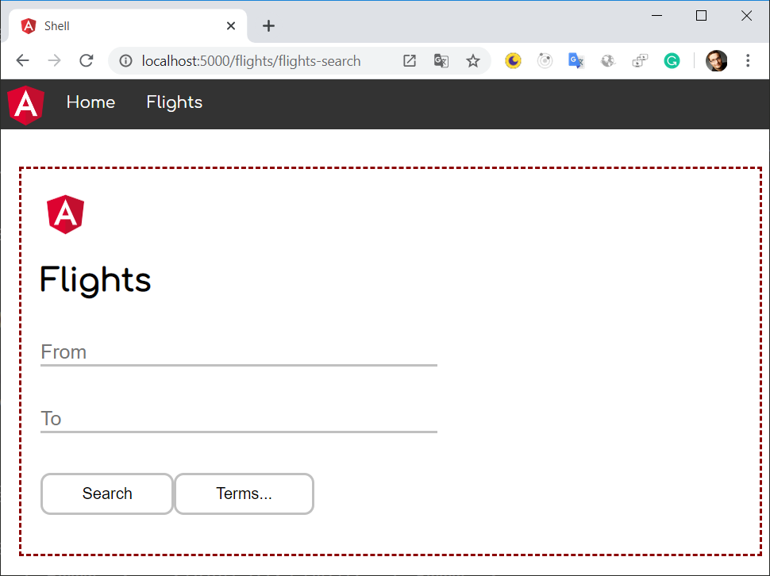
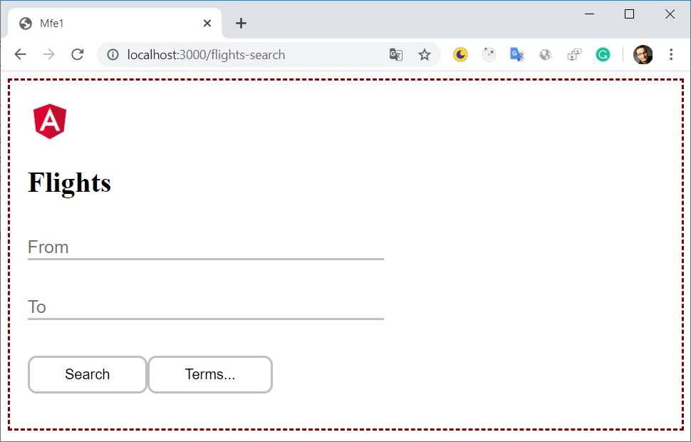
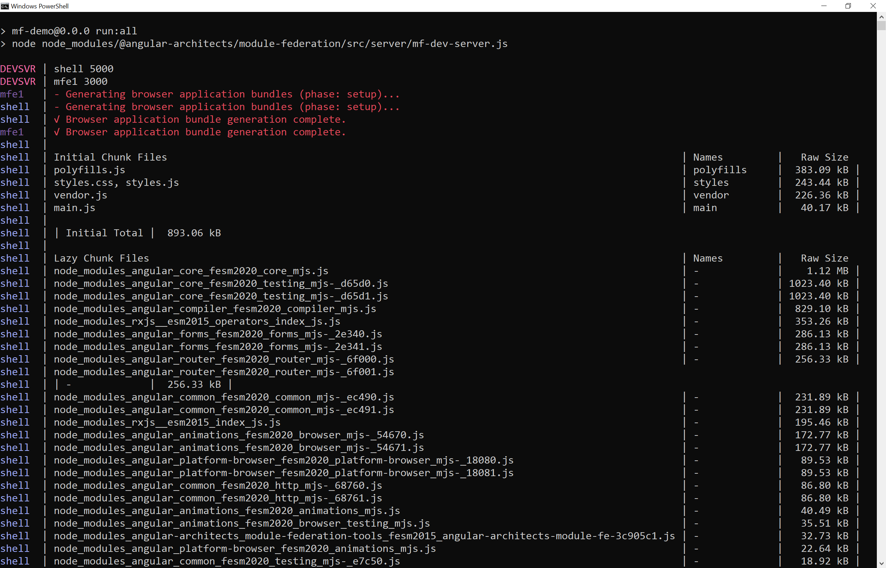

# The Microfrontend Revolution: Using Module Federation with Angular 

In the past, when implementing microfrontends, you had to dig a little into the bag of tricks. One reason is surely that build tools and frameworks did not know this concept. Fortunately, Webpack 5 initiated a change of course here.

Webpack 5 comes with an implementation provided by the webpack contributor Zack Jackson. It's called Module Federation and allows referencing parts of other applications not known at compile time. These can be microfrontends that have been compiled separately. In addition, the individual program parts can share libraries with each other, so that the individual bundles do not contain any duplicates.

In this chapter, I will show how to use Module Federation using a simple example.

## Example

The example used here consists of a shell, which is able to load individual, separately provided microfrontends if required:



The loaded microfrontend is shown within the red dashed border. Also, the microfrontend can be used without the shell:



📂 [Source Code](https://github.com/manfredsteyer/module-federation-plugin-example/tree/static) (see branch _static_)


> **Important**: This book is written for Angular and **Angular CLI 14** and higher. Make sure you have a fitting version if you try out the examples outlined here! For more details on the differences/ migration to Angular 14 please see this [migration guide](https://github.com/angular-architects/module-federation-plugin/blob/main/migration-guide.md).

## Activating Module Federation for Angular Projects

The case study presented here assumes that both, the shell and the microfrontend are projects in the same Angular workspace. For getting started, we need to tell the CLI to use module federation when building them. However, as the CLI shields webpack from us, we need a custom builder.

The package [@angular-architects/module-federation](https://www.npmjs.com/package/@angular-architects/module-federation) provides such a custom builder. To get started, you can just "ng add" it to your projects:

```json
ng add @angular-architects/module-federation --project shell --port 4200 --type host

ng add @angular-architects/module-federation --project mfe1 --port 4201 --type remote
```

If you use Nx, you should `npm install` the library separately. After that, you can use the `init` schematic:

```bash
npm i @angular-architects/module-federation -D 

ng g @angular-architects/module-federation:init --project shell --port 4200 --type host

ng g @angular-architects/module-federation:init --project mfe1 --port 4201 --type remote
```

> The command line argument `--type` was added in version 14.3 and makes sure, only the needed configuration is generated.

While it's obvious that the project `shell` contains the code for the `shell`, `mfe1` stands for *Micro Frontend 1*.

The command shown does several things:

- Generating the skeleton of an `webpack.config.js` for using module federation
- Installing a custom builder making webpack within the CLI use the generated `webpack.config.js`.
- Assigning a new port for ng serve so that several projects can be served simultaneously.

Please note that the `webpack.config.js` is only a **partial** webpack configuration. It only contains stuff to control module federation. The rest is generated by the CLI as usual.

## The Shell (aka Host)

Let's start with the shell which would also be called the host in module federation. It uses the router to lazy load a `FlightModule`:

```typescript
export const APP_ROUTES: Routes = [
    {
      path: '',
      component: HomeComponent,
      pathMatch: 'full'
    },
    {
      path: 'flights',
      loadChildren: () => import('mfe1/Module').then(m => m.FlightsModule)
    },
];
```

However, the path `mfe1/Module` which is imported here, **does not exist** within the shell. It's just a virtual path pointing to another project.

To ease the TypeScript compiler, we need a typing for it:

```typescript
// decl.d.ts
declare module 'mfe1/Module';
```

Also, we need to tell webpack that all paths starting with `mfe1` are pointing to an other project. This can be done in the generated `webpack.config.js`:

```typescript
const { shareAll, withModuleFederationPlugin } = require('@angular-architects/module-federation/webpack');

module.exports = withModuleFederationPlugin({

  remotes: {
    "mfe1": "http://localhost:4201/remoteEntry.js",
  },

  shared: {
    ...shareAll({ singleton: true, strictVersion: true, requiredVersion: 'auto' }),
  },

});
```

The `remotes` section maps the path `mfe1` to the separately compiled microfrontend -- or to be more precise: to its remote entry. This is a tiny file generated by webpack when building the remote. Webpack loads it at runtime to get all the information needed for interacting with the microfrontend.

While specifying the remote entry's URL that way is convenient for development, we need a more dynamic approach for production. 
The next chapter provides a solution for this.

The property `shared` defines the npm packages to be shared between the shell and the microfrontend(s). For this property, The generated configuration uses the helper method `shareAll` that is basically sharing all the dependencies found in your `package.json`. While this helps to quickly get a working setup, it might lead to too much shared dependencies. A later section here addresses this.

The combination of `singleton: true` and `strictVersion: true` makes webpack emit a runtime error when the shell and the micro frontend(s) need different incompetible versions (e. g. two different major versions). If we skipped `strictVersion` or set it to `false`, webpack would only emit a warning at runtime. [More information](https://www.angulararchitects.io/aktuelles/getting-out-of-version-mismatch-hell-with-module-federation/) about dealing with version mismatches can be found in one of the subsequent chapters.

The setting `requiredVersion: 'auto'` is a little extra provided by the `@angular-architects/module-federation` plugin. It looks up the used version in your `package.json`. This prevents several issues. 

> The helper function share used in this generated configuration replaces the value `'auto'` with the version found in your `package.json`.

## The Microfrontend (aka Remote)

The microfrontend -- also referred to as a _remote_ with terms of module federation -- looks like an ordinary Angular application. It has routes defined within in the `AppModule`:

```typescript
export const APP_ROUTES: Routes = [
    { path: '', component: HomeComponent, pathMatch: 'full'}
];
```

Also, there is a `FlightsModule`:

```typescript
@NgModule({
  imports: [
    CommonModule,
    RouterModule.forChild(FLIGHTS_ROUTES)
  ],
  declarations: [
    FlightsSearchComponent
  ]
})
export class FlightsModule { }
```

This module has some routes of its own:

```typescript
export const FLIGHTS_ROUTES: Routes = [
    {
      path: 'flights-search',
      component: FlightsSearchComponent
    }
];
```

In order to make it possible to load the `FlightsModule` into the shell, we also need to expose it via the remote's webpack configuration:

```javascript
const { shareAll, withModuleFederationPlugin } = require('@angular-architects/module-federation/webpack');

module.exports = withModuleFederationPlugin({

  name: 'mfe1',

  exposes: {
    './Module': './projects/mfe1/src/app/flights/flights.module.ts',
  },

  shared: {
    ...shareAll({ singleton: true, strictVersion: true, requiredVersion: 'auto' }),
  },

});
```

The configuration shown here exposes the `FlightsModule` under the public name `Module`. The section `shared` points to the libraries shared with the shell.


## Trying it out

To try everything out, we just need to start the shell and the microfrontend:

```json
ng serve shell -o
ng serve mfe1 -o
```

Then, when clicking on `Flights` in the shell, the micro frontend is loaded:


**Hint:** You can also use the npm script run:all the plugin installs with its ng-add and init schematics:

```bash
npm run run:all
```



To just start a few applications, add their names as command line arguments:

```bash
npm run run:all shell mfe1
```

## A Little Further Detail

Ok, that worked quite well. But have you had a look into your `main.ts`?

It just looks like this:

```typescript
import('./bootstrap')
	.catch(err => console.error(err));
```

The code you normally find in the file `main.ts` was moved to the `bootstrap.ts` file loaded here. All of this was done by the `@angular-architects/module-federation` plugin. 

While this doen't seem to make a lot of sense at first glance, it's a typical pattern you find in Module Federation-based applications. The reason is that Module Federation needs to decide which version of a shared library to load. If the shell, for instance, is using version 12.0 and one of the micro frontends is already built with version 12.1, it will decide to load the latter one. 

To look up the needed meta data for this decision, Module Fedaration squeezes itself into dynamic imports like this one here. Other than the more tradtional static imports, dynamic imports are asynchronous. Hence, Module Federation can decide on the versions to use and actually load them.

## More Details: Sharing Dependencies

As mentioned above, the usage of `shareAll` allows for a quick first setup that "just works". However, it might lead to too much shared bundles. As shared dependencies cannot be tree shaken and by default end up in separate bundles that need to be loaded, you might want to optimize this behavior by switching over from `shareAll` to the `share` helper:

```javascript
// Import share instead of shareAll:
const { share, withModuleFederationPlugin } = require('@angular-architects/module-federation/webpack');

module.exports = withModuleFederationPlugin({

    // Explicitly share packages:
    shared: share({
        "@angular/core": { singleton: true, strictVersion: true, requiredVersion: 'auto' }, 
        "@angular/common": { singleton: true, strictVersion: true, requiredVersion: 'auto' }, 
        "@angular/common/http": { singleton: true, strictVersion: true, requiredVersion: 'auto' },                     
        "@angular/router": { singleton: true, strictVersion: true, requiredVersion: 'auto' },
    }),

});
```

## More on This


Learn more about this and further architecture topics regarding Angular and huge enterprise as well as industrial solution in our [advanced Online Workshop](https://www.angulararchitects.io/schulungen/advanced-angular-enterprise-anwendungen-und-architektur/):


Save your [ticket](https://www.angulararchitects.io/en/angular-workshops/) for one of our **online or on-site** workshops now or [request a company workshop](https://www.angulararchitects.io/en/contact/) (online or In-House) for you and your team!

If you like our offer, keep in touch with us so that you don't miss anything.

For this, you can [subscribe to our newsletter](https://www.angulararchitects.io/en/subscribe/) and/ or follow the book's [author on Twitter](https://twitter.com/ManfredSteyer).

## Conclusion and Evaluation

The implementation of microfrontends has so far involved numerous tricks and workarounds. Webpack Module Federation finally provides a simple and solid solution for this. To improve performance, libraries can be shared and strategies for dealing with incompatible versions can be configured.

It is also interesting that the microfrontends are loaded by Webpack under the hood. There is no trace of this in the source code of the host or the remote. This simplifies the use of module federation and the resulting source code, which does not require additional microfrontend frameworks.

However, this approach also puts more responsibility on the developers. For example, you have to ensure that the components that are only loaded at runtime and that were not yet known when compiling also interact as desired.

One also has to deal with possible version conflicts. For example, it is likely that components that were compiled with completely different Angular versions will not work together at runtime. Such cases must be avoided with conventions or at least recognized as early as possible with integration tests.