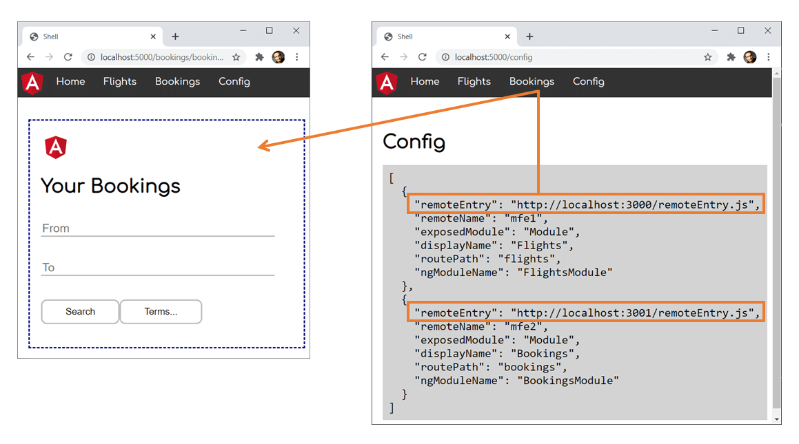

# Dynamic Module Federation

In the chapter, I've shown how to use Webpack Module Federation for loading separately compiled microfrontends into a shell. As the shell's webpack configuration describes the microfrontends, we already needed to know them when compiling it.

In this chapter, I'm assuming a more dynamic situation where the shell does not know the microfrontends or even their number upfront. Instead, this information is provided at runtime via a lookup service.

**Important**: This book is written for Angular and **Angular CLI 13.1** and higher. Make sure you have a fitting version if you try out the examples outlined here! For more details on the differences/ migration to Angular 13.1 please see this [migration guide](https://github.com/angular-architects/module-federation-plugin/blob/main/migration-guide.md).

The following image displays the idea used describe in this chapter:



For all microfrontends the shell gets informed about at runtime it displays a menu item. When clicking it, the microfrontend is loaded and displayed by the shell's router.

As usual, the [source code](https://github.com/manfredsteyer/module-federation-with-angular-dynamic.git) used here can be found in my [GitHub account](https://github.com/manfredsteyer/module-federation-with-angular-dynamic.git).

## Module Federation Config

Let's start with the shell's Module Federation configuration. In this scenario, it uses the `ModuleFederationPlugin` as follows:

```JavaScript
[...]
new ModuleFederationPlugin({
  library: { type: "module" },

  // No remote configured upfront anymore!
  remotes: { },

  shared: share({
    "@angular/core": { 
      singleton: true, 
      strictVersion: true, 
      requiredVersion: 'auto' 
    },
    "@angular/common": { 
      singleton: true, 
      strictVersion: true, 
      requiredVersion: 'auto' 
    },
    "@angular/router": { 
      singleton: true, 
      strictVersion: true, 
      requiredVersion: 'auto' 
    },
    "@angular/common/http": { 
      singleton: true, 
      strictVersion: true, 
      requiredVersion: 'auto' 
    }, 

    ...sharedMappings.getDescriptors()
  })

}),
```

We don't define any remotes (microfrontends) upfront but configure the packages we want to share with the remotes we get informed about at runtime.

As mentioned in the previous chapter, the combination of `singleton: true` and `strictVersion: true` makes webpack emit a runtime error when the shell and the micro frontend(s) need different incompetible versions (e. g. two different major versions). If we skipped `strictVersion` or set it to `false`, webpack would only emit a warning at runtime.

The configuration of the microfrontends, however, looks like in the previous chapter:

```JavaScript
const ModuleFederationPlugin = 
  require("webpack/lib/container/ModuleFederationPlugin");
const mf = 
  require("@angular-architects/module-federation/webpack");
const path = require("path");

const share = mf.share;

[...]

module.exports = {
  output: {
    uniqueName: "mfe1",
    publicPath: "auto"
  },
  optimization: {
    runtimeChunk: false
  },  
  resolve: {
    alias: {
      ...sharedMappings.getAliases(),
    }
  },
  experiments: {
    outputModule: true
  },  
  plugins: [
    new ModuleFederationPlugin({
        library: { type: "module" },

        name: "mfe1",
        filename: "remoteEntry.js",
        exposes: {
            './Module': './projects/mfe1/src/app/flights/flights.module.ts',
        },        
        shared: share({
          "@angular/core": { 
            singleton: true, 
            strictVersion: true, 
            requiredVersion: 'auto' 
          },
          "@angular/common": { 
            singleton: true, 
            strictVersion: true, 
            requiredVersion: 'auto' 
          },
          "@angular/router": { 
            singleton: true, 
            strictVersion: true, 
            requiredVersion: 'auto' 
          },
          "@angular/common/http": { 
            singleton: true, 
            strictVersion: true, 
            requiredVersion: 'auto' 
          }, 
  
          ...sharedMappings.getDescriptors()
        })
        
    }),
    sharedMappings.getPlugin(),
  ],
};
```

## Routing to Dynamic Microfrontends

To dynamically load a microfrontend at runtime, we can use the helper function loadRemoteModule provided by the `@angular-architects/module-federation` plugin:

```typescript
import { loadRemoteModule } from '@angular-architects/module-federation';

[...]

const routes: Routes = [
    [...]
    {
        path: 'flights',
        loadChildren: () =>
            loadRemoteModule({
                type: 'module',
                remoteEntry: 'http://localhost:3000/remoteEntry.js',
                exposedModule: './Module'
            })
            .then(m => m.FlightsModule)
    },
    [...]
];
```

Please note that beginning with Angular 13.1 we need to specificy type: 'module', as CLI 13 started with emitting EcmaScript modules instead of script files. For older versions you could use the following options:

```typescript
// Before Angular 13:
// const routes: Routes = [
//    [...]
//    {
//        path: 'flights',
//        loadChildren: () =>
//            loadRemoteModule({
//                type: 'script',
//                remoteEntry: // 'http://localhost:3000/remoteEntry.js',
//                remoteName: 'mfe1',
//                  // The remoteName is defined in the
//                  // remote's webpack config
//                exposedModule: './Module'
//            })
//            .then(m => m.FlightsModule)
//    },
//    [...]
//];
```

As you might have noticed, we're just switching out the dynamic `import` normally used here by a call to `loadRemoteModule` which also works with key data not known at compile time. The latter one uses the webpack runtime api to get hold of the remote on demand.

## Improvement for Dynamic Module Federation

This was quite easy, wasn't it? However, we can improve this solution a bit. Ideally, we load the remote entry upfront before Angular bootstraps. In this early phase, Module Federation tries to determine the highest compatible versions of all dependencies. 

Let's assume, the shell provides version 1.0.0 of a dependency (specifying ^1.0.0 in its package.json) and the micro frontend uses version 1.1.0 (specifying ^1.1.0 in its package.json). In this case, they would go with version 1.1.0. However, this is only possible if the remote's entry is loaded upfront. More details about this be found in the chapter on version mismatches.

To achieve this goal, let's use the helper function `loadRemoteEntry` in our `main.ts`

```typescript
import { loadRemoteEntry } from '@angular-architects/module-federation';

Promise.all([
   loadRemoteEntry({
     type: 'module', 
     remoteEntry: 'http://localhost:3000/remoteEntry.js'
   })
])
.catch(err => console.error('Error loading remote entries', err))
.then(() => import('./bootstrap'))
.catch(err => console.error(err));
```

Also here, you need to set `type` to `module` for Angular CLI 13.1 or above. The call for version below 13 looks like this:

```typescript
[...]
// For Angular 12
// loadRemoteEntry({
//   type: 'script', 
//   remoteEntry: 'http://localhost:3000/remoteEntry.js', 
//   remoteName: 'mfe1'
// })
[...]
```

Here, we need to remember, that the `@angular-architects/module-federation` plugin moves the contents of the original `main.ts` into the `bootstrap.ts` file. Also, it loads the `bootstrap.ts` with a **dynamic import** in the `main.ts`. This is necessary because the dynamic import gives Module Federation the needed time to negotiate the verions of the shared libraries to use with all the remotes.

Also, loading the remote entry needs to happen before importing `bootstrap.ts` so that its metadata can be respected during the negotiation.

## Bonus: Dynamic Routes for Dynamic Microfrontends

There might be situations where you don't even know the number of microfrontends upfront. Hence, we also need an approach for setting up the routes dynamically.

For this, I've defined a `Microfrontend` type holding all the key data for the routes:

```typescript
export type Microfrontend = LoadRemoteModuleOptions & {
    displayName: string;
    routePath: string;
    ngModuleName: string;
}
```

`LoadRemoteModuleOptions` is the type that's passed to the above-discussed `loadRemoteModule` function. The type `Microfrontend` adds some properties we need for the dynamic routes and the hyperlinks pointing to them:

- **displayName:** Name that should be displayed within the hyperlink leading to route in question.

- **routePath:** Path used for the route.

- **ngModuleName**: Name of the Angular Module exposed by the remote. 

For loading this key data, I'm using a `LookupService`:

```typescript
@Injectable({ providedIn: 'root' })
export class LookupService {
    lookup(): Promise<Microfrontend[]> {
        [...]
    }
}
```

After receiving the `Microfrontend` array from the `LookupService`, we can build our dynamic routes:

```typescript
export function buildRoutes(options: Microfrontend[]): Routes {

    const lazyRoutes: Routes = options.map(o => ({
        path: o.routePath,
        loadChildren: () => loadRemoteModule(o).then(m => m[o.ngModuleName])
    }));

    return [...APP_ROUTES, ...lazyRoutes];
}
```

This function creates one route per array entry and combines it with the static routes in `APP_ROUTES`.

Everything is put together in the shell's `AppComponent`. It's `ngOnInit` method fetches the key data, builds routes for it, and resets the Router's configuration with them:

```typescript
@Component({ [...] })
export class AppComponent implements OnInit {

  microfrontends: Microfrontend[] = [];

  constructor(
    private router: Router,
    private lookupService: LookupService) {
  }

  async ngOnInit(): Promise<void> {
    this.microfrontends = await this.lookupService.lookup();
    const routes = buildRoutes(this.microfrontends);
    this.router.resetConfig(routes);
  }
}
```

Besides this, the `AppComponent` is also rendering a link for each route:

```html
<li *ngFor="let mfe of microfrontends">
    <a [routerLink]="mfe.routePath">{{mfe.displayName}}</a>
</li>
```

## Conclusion

Dynamic Module Federation provides more flexibility as it allows loading microfrontends we don't have to know at compile time. We don't even have to know their number upfront. This is possible because of the runtime API provided by webpack. To make using it a bit easier, the `@angular-architects/module-federation` plugin wrap it nicely into some convenience functions.
