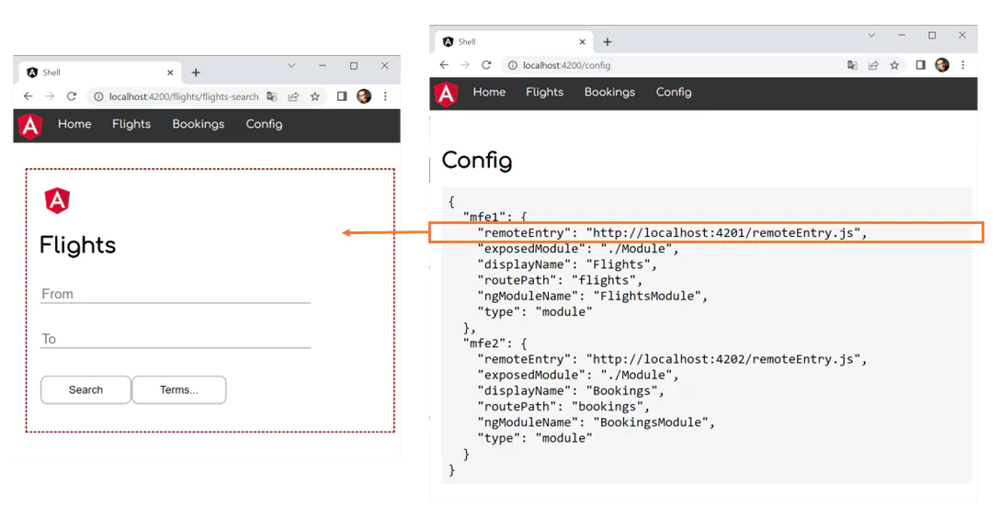

# Dynamic Module Federation

In the previous chapter, I've shown how to use webpack Module Federation for loading separately compiled Micro Frontends into a shell. As the shell's webpack configuration describes the Micro Frontends, we already needed to know them when compiling it.

In this chapter, I'm assuming a more dynamic situation where the shell does not know the Micro Frontend upfront. Instead, this information is provided at runtime via a configuration file. While this file is a static JSON file in the examples shown here, it's content could also come from a Web API.

> **Important**: This book is written for Angular and **Angular CLI 14** or higher. Make sure you have a fitting version if you try out the examples! For more details on the differences/ migration to Angular 14 please see this [migration guide](https://github.com/angular-architects/module-federation-plugin/blob/main/migration-guide.md).

The following image displays the idea described here:



For all Micro Frontends the shell gets informed about at runtime, it displays a menu item. When clicking it, the Micro Frontend is loaded and displayed by the shell's router.

> [Source Code (simple version, see branch: simple)](https://github.com/manfredsteyer/module-federation-with-angular-dynamic/tree/simple)

> [Source Code (full version)](https://github.com/manfredsteyer/module-federation-with-angular-dynamic.git)


## A Simple Dynamic Solution

Let's start with a simple approach. For this, we assume that we know the Micro Frontends upfront and just want to switch out their URLs at runtime, e. g. with regards to the current environment. A more advanced approach, where we don't even need to know the number of Micro Frontends upfront is presented afterwards.

### Adding Module Federation

The demo project used contains a shell and two Micro Frontends called ``mfe1`` and ``mfe2``. As in the previous chapter, we add and initialize the Module Federation plugin for the Micro Frontends:

```bash
npm i -g @angular-architects/module-federation -D

ng g @angular-architects/module-federation 
  --project mfe1 --port 4201 --type remote

ng g @angular-architects/module-federation 
  --project mfe2 --port 4202 --type remote
```

### Generating a Manifest

Beginning with the plugin's version 14.3, we can generate a **dynamic host** that takes the key data about the Micro Frontend from a JSON file -- called the Micro Frontend Manifest -- at runtime: 

```bash
ng g @angular-architects/module-federation 
  --project shell --port 4200 --type dynamic-host
```

This generates:

* a webpack configuration
* the manifest and 
* some code in the ``main.ts`` loading the manifest.

The manifest can be found here: ``projects/shell/src/assets/mf.manifest.json``. This is what it looks like:

```json
{
	"mfe1": "http://localhost:4201/remoteEntry.js",
	"mfe2": "http://localhost:4202/remoteEntry.js"
}
```

After generating the manifest, make sure the ports match.

### Loading the Manifest

The generated ``main.ts`` file loads the manifest:

```typescript
import { loadManifest } from '@angular-architects/module-federation';

loadManifest("/assets/mf.manifest.json")
  .catch(err => console.error(err))
  .then(_ => import('./bootstrap'))
  .catch(err => console.error(err));
```

By default, ``loadManifest`` not just loads the manifest but also the remote entries the manifest points to. Hence, Module Federation gets all the required metadata for fetching the Micro Frontends on demand.

### Loading the Micro Frontends

To load the Micro Frontends described by the manifest, we go with the following routes:

```typescript
import { Routes } from '@angular/router';
import { HomeComponent } from './home/home.component';
import { loadRemoteModule } from '@angular-architects/module-federation';

export const APP_ROUTES: Routes = [
    {
      path: '',
      component: HomeComponent,
      pathMatch: 'full'
    },
    {
      path: 'flights',
      loadChildren: () => loadRemoteModule({
          type: 'manifest',
          remoteName: 'mfe1',
          exposedModule: './Module'
        })
        .then(m => m.FlightsModule)
    },
    {
      path: 'bookings',
      loadChildren: () => loadRemoteModule({
          type: 'manifest',
          remoteName: 'mfe2',
          exposedModule: './Module'
        })
        .then(m => m.BookingsModule)
    },
];
```

The option ``type: 'manifest'`` makes ``loadRemoteModule`` to look up the key data needed in the loaded manifest. The property ``remoteName`` points to the key that was used in the manifest.

### Configuring the Micro Frontends

We expect both Micro Frontends to provide an NgModule with sub routes via ``'./Module'``. The NgModules are exposed via the ``webpack.config.js`` in the Micro Frontends:

```javascript
// projects/mfe1/webpack.config.js

const { shareAll, withModuleFederationPlugin } = 
  require('@angular-architects/module-federation/webpack');

module.exports = withModuleFederationPlugin({

  name: 'mfe1',

  exposes: {
    // Adjusted line:
    './Module': './projects/mfe1/src/app/flights/flights.module.ts'
  },

  shared: {
    ...shareAll({ 
      singleton: true, 
      strictVersion: true, 
      requiredVersion: 'auto' 
    }),
  },

});
```

```javascript
// projects/mfe2/webpack.config.js

const { shareAll, withModuleFederationPlugin } = 
  require('@angular-architects/module-federation/webpack');

module.exports = withModuleFederationPlugin({

  name: 'mfe2',

  exposes: {
    // Adjusted line:
    './Module': './projects/mfe2/src/app/bookings/bookings.module.ts'
  },

  shared: {
    ...shareAll({ 
      singleton: true, 
      strictVersion: true, 
      requiredVersion: 'auto' 
    }),
  },

});
```

### Trying it Out

For each route loading a Micro Frontend, the shell's ``AppComponent`` contains a ``routerLink``:

```html
<!-- projects/shell/src/app/app.component.html -->
<ul>
    <li></li>
    <li><a routerLink="/">Home</a></li>
    <li><a routerLink="/flights">Flights</a></li>
    <li><a routerLink="/bookings">Bookings</a></li>
</ul>

<router-outlet></router-outlet>
```

That's it. Just start all the three projects (e. g. by using ``npm run run:all``). The main difference to the result in the previous chapter is that now the shell informs itself about the Micro Frontends at runtime. If you want to point the shell to different Micro Frontends, just adjust the manifest.


## Going "Dynamic Dynamic"

The solution we have so far is suitable in many situations: The usage of the manifest allows to adjust it to different environments without rebuilding the application. Also, if we switch out the manifest for a dynamic REST service, we could implement strategies like A/B testing.

However, in some situation you might not even know about the number of Micro Frontends upfront. This is what we discuss here.

### Adding Custom Metadata to The Manifest

For dynamically setting up the routes, we need some additional metadata. For this, you might want to extend the manifest:

```json
{
	"mfe1": {
		"remoteEntry": "http://localhost:4201/remoteEntry.js",

		"exposedModule": "./Module",
		"displayName": "Flights",
		"routePath": "flights",
		"ngModuleName": "FlightsModule"
	},
	"mfe2": {
		"remoteEntry": "http://localhost:4202/remoteEntry.js",

		"exposedModule": "./Module",
		"displayName": "Bookings",
		"routePath": "bookings",
		"ngModuleName": "BookingsModule"
	}
}
```

Besides ``remoteEntry``, all other properties are **custom**. 

### Types for Custom Configuration

To represent our extended configuration, we need some types in the shell's code:

```typescript
// projects/shell/src/app/utils/config.ts

import { 
  Manifest, 
  RemoteConfig 
} from "@angular-architects/module-federation";

export type CustomRemoteConfig = RemoteConfig & {
  exposedModule: string;
  displayName: string;
  routePath: string;
  ngModuleName: string;
};

export type CustomManifest = Manifest<CustomRemoteConfig>;
```

The ``CustomRemoteConfig`` type represents the entries in the manifest and the ``CustomManifest`` type the whole manifest.

### Dynamically Creating Routes

Now, we need an utility function iterating through the whole manifest and creating a route for each Micro Frontend described there:

```typescript
// projects/shell/src/app/utils/routes.ts

import { loadRemoteModule } from '@angular-architects/module-federation';
import { Routes } from '@angular/router';
import { APP_ROUTES } from '../app.routes';
import { CustomManifest } from './config';

export function buildRoutes(options: CustomManifest): Routes {

    const lazyRoutes: Routes = Object.keys(options).map(key => {
        const entry = options[key];
        return {
            path: entry.routePath,
            loadChildren: () => 
                loadRemoteModule({
                    type: 'manifest',
                    remoteName: key,
                    exposedModule: entry.exposedModule
                })
                .then(m => m[entry.ngModuleName])
        }
    });

    return [...APP_ROUTES, ...lazyRoutes];
}
```

This gives us the same structure, we directly configured above. 

The shell's ``AppComponent`` glues everything together:

```typescript
@Component({
  selector: 'app-root',
  templateUrl: './app.component.html'
})
export class AppComponent implements OnInit  {

  remotes: CustomRemoteConfig[] = [];

  constructor(
    private router: Router) {
  }

  async ngOnInit(): Promise<void> {
    const manifest = getManifest<CustomManifest>();
    
    // Hint: Move this to an APP_INITIALIZER 
    //  to avoid issues with deep linking
    const routes = buildRoutes(manifest);
    this.router.resetConfig(routes);

    this.remotes = Object.values(manifest);
  }
}
```

The ``ngOnInit`` method retrieves the loaded manifest (it's still loaded in the ``main.ts`` as shown above) and passes it to ``buildRoutes``. The retrieved dynamic routes are passed to the router. Also, the values of the key/value pairs in the manifest, are put into the ``remotes`` field. It's used in the template to dynamically create the menu items:

```html
<!-- projects/shell/src/app/app.component.html -->

<ul>
    <li></li>
    <li><a routerLink="/">Home</a></li>

    <!-- Dynamically create menu items for all Micro Frontends -->
    <li *ngFor="let remote of remotes">
      <a [routerLink]="remote.routePath">{{remote.displayName}}</a>
    </li>

    <li><a routerLink="/config">Config</a></li>
</ul>

<router-outlet></router-outlet>
```

### Trying it Out

Now, let's try out this "dynamic dynamic" solution by starting the shell and the Micro Frontends (e. g. with ``npm run run:all``). 

## Some More Details

So far, we used the high-level functions provided by the plugin. However, for cases you need more control, there are also some low-level alternatives:

- ``loadManifest(...)``: The above used ``loadManifest`` function provides a second parameter called ``skipRemoteEntries``. Set it to ``true`` to prevent loading the entry points. In this case, only the manifest is loaded:
    
    ```typescript
    loadManifest("/assets/mf.manifest.json", true)
        .catch(...)
        .then(...)
        .catch(...)
    ```

- ``setManifest(...)``: This function allows to directly set the manifest. It comes in handy if you load the data from somewhere else. 

- ``loadRemoteEntry(...)``: This function allows to directly load the remote entry point. It's useful if you don't use the manifest:

    ```typescript
    Promise.all([
        loadRemoteEntry({ 
          type: 'module', 
          remoteEntry: 'http://localhost:4201/remoteEntry.js' 
        }),
        loadRemoteEntry({ 
          type: 'module', 
          remoteEntry: 'http://localhost:4202/remoteEntry.js' 
        })
    ])
    .catch(err => console.error(err))
    .then(_ => import('./bootstrap'))
    .catch(err => console.error(err));
    ```

- ``loadRemoteModule(...)``: Also, if you don't want to use the manifest, you can directly load a Micro Frontend with ``loadRemoteModule``:

    ```typescript
    {
        path: 'flights',
        loadChildren: () =>
            loadRemoteModule({
                type: 'module',
                remoteEntry: 'http://localhost:4201/remoteEntry.js',
                exposedModule: './Module',
            }).then((m) => m.FlightsModule),
    },
    ```

In general I think most people will use the manifest in the future. Even if one doesn't want to load it from a JSON file with ``loadManifest``, one can define it via ``setManifest``.

The property ``type: 'module'`` defines that you want to load a "real" EcmaScript module instead of "just" a JavaScript file. This is needed since Angular CLI 13. If you load stuff not built by CLI 13 or higher, you very likely have to set this property to ``script``. This can also happen via the manifest:

```json
{
	"non-cli-13-stuff": {
        "type": "script",
        "remoteEntry": "http://localhost:4201/remoteEntry.js"
    }
}
```

> If an entry in the manifest does not contain a ``type`` property, the plugin assumes the value ``module``. 

## Conclusion

Dynamic Module Federation provides more flexibility as it allows loading Micro Frontends we don't have to know at compile time. We don't even have to know their number upfront. This is possible because of the runtime API provided by webpack. To make using it a bit easier, the `@angular-architects/module-federation` plugin wrap it nicely into some convenience functions.
