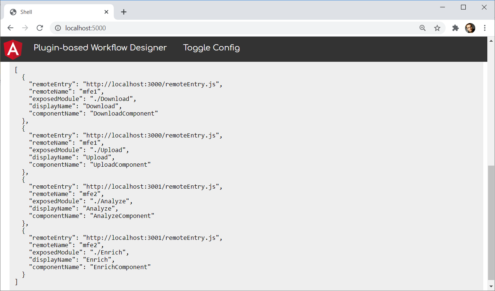

# Plugin Systems with Module Federation: Building An Extensible Workflow Designer

In the previous chapter, I showed how to use Dynamic Module Federation. This allows us to load Micro Frontends -- or remotes, which is the more general term in Module Federation -- not known at compile time. We don't even need to know the number of remotes upfront.

While the previous chapter leveraged the router for integrating remotes available, this chapter shows how to load individual components. The example used for this is a simple plugin-based workflow designer.


The workflow designer acts as a so-called host loading tasks from plugins provided as remotes. Thus, they can be compiled and deployed individually. After starting the workflow designer, it gets a configuration describing the available plugins: 



Please note that these plugins are provided via different origins (http://localhost:4201 and http://localhost:4202), and the workflow designer is served from an origin of its own (http://localhost:4200).

> [Source Code](https://github.com/manfredsteyer/module-federation-with-angular-dynamic-workflow-designer)

> Thanks to [Zack Jackson](https://twitter.com/ScriptedAlchemy) and [Jack Herrington](https://twitter.com/jherr), who helped me to understand the rater new API for Dynamic Module Federation.

## Building the Plugins

The plugins are provided via separate Angular applications. For the sake of simplicity, all applications are part of the same monorepo. Their webpack configuration uses Module Federation for exposing the individual plugins as shown in the previous chapters of this book:

```javascript
const { shareAll, withModuleFederationPlugin } = 
  require('@angular-architects/module-federation/webpack');

module.exports = withModuleFederationPlugin({

  name: 'mfe1',

  exposes: {
    './Download': './projects/mfe1/src/app/download.component.ts',
    './Upload': './projects/mfe1/src/app/upload.component.ts'
  },

  shared: {
    ...shareAll({ singleton: true, strictVersion: true, requiredVersion: 'auto' }),
  },

});
```

One difference to the configurations shown in the previous chapter is that here we are directly exposing standalone components. Each component represents a task that can be put into the workflow.   

The combination of `singleton: true` and `strictVersion: true` makes webpack emit a runtime error when the shell and the micro frontend(s) need different incompatible versions (e. g. two different major versions). If we skipped `strictVersion` or set it to `false`, webpack would only emit a warning at runtime.

## Loading the Plugins into the Workflow Designer

For loading the plugins into the workflow designer, I'm using the helper function `loadRemoteModule` provided by the `@angular-architects/module-federation` plugin. To load the above mentioned `Download` task, `loadRemoteModule` can be called this way:

```typescript
import { loadRemoteModule } from '@angular-architects/module-federation';

[...]

const component = await loadRemoteModule({
    type: 'module',
    remoteEntry: 'http://localhost:4201/remoteEntry.js',
    exposedModule: './Download'
})
```

## Providing Metadata on the Plugins

At runtime, we need to provide the workflow designer with key data about the plugins. The type used for this is called `PluginOptions` and extends the `LoadRemoteModuleOptions` shown in the previous section by a `displayName` and a `componentName`:

```typescript
export type PluginOptions = LoadRemoteModuleOptions & {
    displayName: string;
    componentName: string;
};
```

> An alternative to this is extending the Module Federation Manifest as shown in the previous chapter.

While the `displayName` is the name presented to the user, the `componentName` refers to the TypeScript class representing the Angular component in question.

For loading this key data, the workflow designer leverages a `LookupService`:

```typescript
@Injectable({ providedIn: 'root' })
export class LookupService {
    lookup(): Promise<PluginOptions[]> {
        return Promise.resolve([
            {
              type: 'module',
              remoteEntry: 'http://localhost:4201/remoteEntry.js',
              exposedModule: './Download',

              displayName: 'Download',
              componentName: 'DownloadComponent'
            },
            [...]
        ] as PluginOptions[]);
    }
}
```

For the sake of simplicity, the `LookupService` provides some hardcoded entries. In the real world, it would very likely request this data from a respective HTTP endpoint.

## Dynamically Creating the Plugin Component

The workflow designer represents the plugins with a `PluginProxyComponent`. It takes a `PluginOptions` object via an input, loads the described plugin via Dynamic Module Federation and displays the plugin's component within a placeholder:

```typescript
@Component({
    standalone: true,
    selector: 'plugin-proxy',
    template: `
        <ng-container #placeHolder></ng-container>
    `
})
export class PluginProxyComponent implements OnChanges {
    @ViewChild('placeHolder', { read: ViewContainerRef, static: true })
    viewContainer: ViewContainerRef;

    constructor() { }

    @Input() options: PluginOptions;

    async ngOnChanges() {
        this.viewContainer.clear();

        const Component = await loadRemoteModule(this.options)
            .then(m => m[this.options.componentName]);

        this.viewContainer.createComponent(Component);
    }
}
```

In versions before Angular 13, we needed to use a ComponentFactoryResolver to get the loaded component's factory:

```typescript
// Before Angular 13, we needed to retrieve a ComponentFactory
//
// export class PluginProxyComponent implements OnChanges {
//     @ViewChild('placeHolder', { read: ViewContainerRef, static: true })
//     viewContainer: ViewContainerRef;

//     constructor(
//       private injector: Injector,
//       private cfr: ComponentFactoryResolver) { }

//     @Input() options: PluginOptions;

//     async ngOnChanges() {
//         this.viewContainer.clear();

//         const component = await loadRemoteModule(this.options)
//             .then(m => m[this.options.componentName]);

//         const factory = this.cfr.resolveComponentFactory(component);

//         this.viewContainer.createComponent(factory, null, this.injector);
//     }
// }
```

## Wiring Up Everything

Now, it's time to wire up the parts mentioned above. For this, the workflow designer's `AppComponent` gets a `plugins` and a `workflow` array. The first one represents the `PluginOptions` of the available plugins and thus all available tasks while the second one describes the `PluginOptions` of the selected tasks in the configured sequence:

```typescript
@Component({ [...] })
export class AppComponent implements OnInit {

  plugins: PluginOptions[] = [];
  workflow: PluginOptions[] = [];
  showConfig = false;

  constructor(
    private lookupService: LookupService) {
  }

  async ngOnInit(): Promise<void> {
    this.plugins = await this.lookupService.lookup();
  }

  add(plugin: PluginOptions): void {
    this.workflow.push(plugin);
  }

  toggle(): void {
    this.showConfig = !this.showConfig;
  }
}
```

The `AppComponent` uses the injected `LookupService` for populating its `plugins` array. When a plugin is added to the workflow, the `add` method puts its `PluginOptions` object into the workflow array.

For displaying the workflow, the designer just iterates all items in the workflow array and creates a `plugin-proxy` for them:

```html
<ng-container *ngFor="let p of workflow; let last = last">
    <plugin-proxy [options]="p"></plugin-proxy>
    <i *ngIf="!last" class="arrow right" style=""></i>
</ng-container> 
```

As discussed above, the proxy loads the plugin (at least, if it isn't already loaded) and displays it.

Also, for rendering the toolbox displayed on the left, it goes through all entries in the `plugins` array. For each of them it displays a hyperlink calling bound to the `add` method:

```html
<div class="vertical-menu">
    <a href="#" class="active">Tasks</a>
    <a *ngFor="let p of plugins" (click)="add(p)">Add {{p.displayName}}</a>
</div>
```

## Conclusion

While Module Federation comes in handy for implementing Micro Frontends, it can also be used for setting up plugin architectures. This allows us to extend an existing solution by 3rd parties. It also seems to be a good fit for SaaS applications, which needs to be adapted to different customers' needs.  

