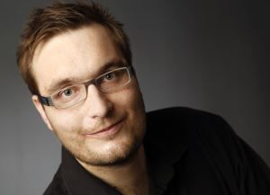

# About the Author

Manfred Steyer is a trainer, consultant, and programming architect with focus on Angular. 

For his community work, Google recognizes him as a Google Developer Expert (GDE). Also, Manfred is a Trusted Collaborator in the Angular team. In this role he implemented differential loading for the Angular CLI. 

Manfred wrote several books, e. g. for O'Reilly, as well as several articles, e. g. for the German Java Magazine, windows.developer, and Heise.

He regularly speaks at conferences and blogs about Angular.

Before, he was in charge of a project team in the area of web-based business applications for many years. Also, he taught several topics regarding software engineering at a university of applied sciences.

Manfred has earned a Diploma in IT- and IT-Marketing as well as Master's degree in Computer Science by conducting part-time and distance studies parallel to full-time employments.

You can follow him on Twitter (https://twitter.com/ManfredSteyer) and Facebook (https://www.facebook.com/manfred.steyer) and find his blog here (http://www.softwarearchitekt.at).