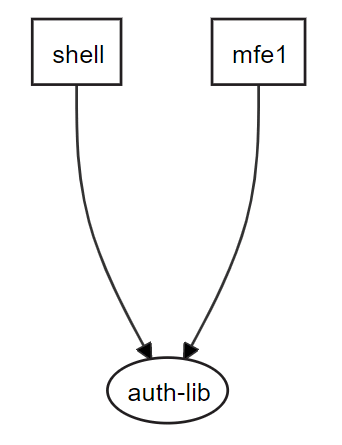
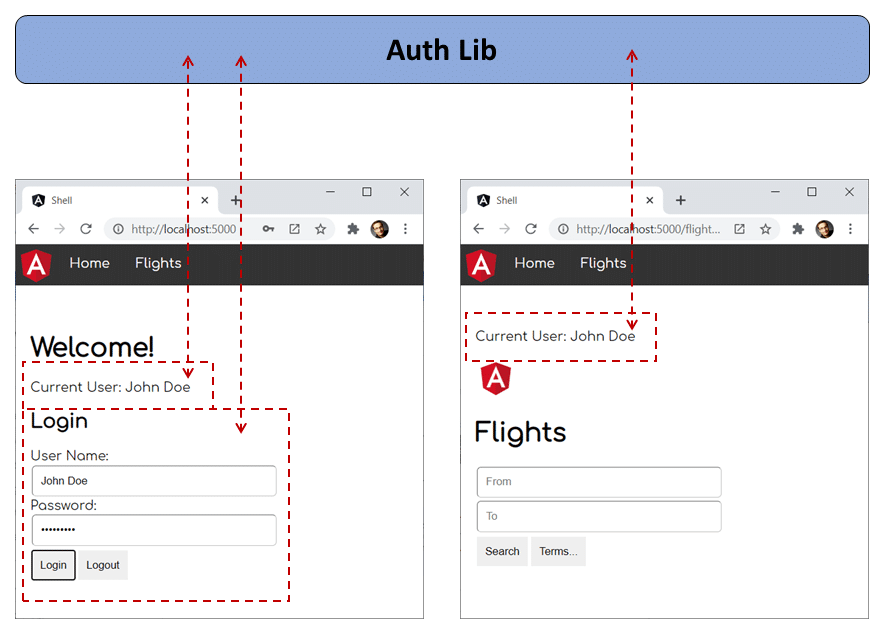

# Using Module Federation with Nx

The combination of Micro Frontends and monorepos can be quite tempting: Monorepos make it easy to share libraries. Thanks to access restrictions, individual business domains can be isolated. Also, having all micro frontends in the same monorepo doesn't prevent us from deploying them separately.

This chapter gives some hints about using Module Federation for such a scenario. While the examples use a Nx workspace, the principal ideas can also be implemented with a classic Angular workspace. However, as you will see, Nx provides some really powerful features that make your life easier, e. g. the possibility of generating a visual dependency graph or finding out which applications have been changed and hence need to be redeployed. 

If you want to have a look at the [source code](https://github.com/manfredsteyer/module_federation_nx_mono_repo) used here, you can check out [this repository](https://github.com/manfredsteyer/module_federation_nx_mono_repo). 

**Important**: This book is written for **Angular 13.1** and higher. Hence you also need **Nx 13.3.12** or higher. To find out about the small differences for lower versions of Angular and for the migration from such a lower version, please have a look to our [migration guide](https://github.com/angular-architects/module-federation-plugin/blob/main/migration-guide.md).

## Example

The example used here is a Nx monorepo with a micro frontend shell (`shell`) and a micro frontend (`mfe1`, "micro frontend 1"). Both share a common library for authentication (`auth-lib`) that is also located in the monorepo:



The `auth-lib` provides two components. One is logging-in users and the other one displays the current user. They are used by both, the `shell` and `mfe1`:



Also, the `auth-lib` stores the current user's name in a service.

As usual in Nx and Angular monorepos, libraries are referenced with path mappings defined in `tsconfig.json` (or `tsconfig.base.json` according to your project setup):

```json
"paths": {
    "@demo/auth-lib": [
        "libs/auth-lib/src/index.ts"
    ]
},
```

The `shell` and `mfe1` (as well as further micro frontends we might add in the future) need to be deployable in separation and loaded at runtime. However, we don't want to load the `auth-lib` twice or several times! Archiving this with an npm package is not that difficult. This is one of the most obvious and easy to use features of Module Federation. The next sections discuss how to do the same with libraries of a monorepo.

## The Shared Lib

Before we delve into the solution, let's have a look at the `auth-lib`. It contains an `AuthService` that logs-in the user and remebers them using the property `_userName`:

```typescript
@Injectable({
  providedIn: 'root'
})
export class AuthService {

  // tslint:disable-next-line: variable-name
  private _userName: string = null;

  public get userName(): string {
    return this._userName;
  }

  constructor() { }

  login(userName: string, password: string): void {
    this._userName = userName;
  }

  logout(): void {
    this._userName = null;
  }
}
```

The authentication method I'm using here, is what I'm calling "Authentication for honest users TM". Besides this service, there is also a `AuthComponent` with the UI for logging-in the user and a `UserComponent` displaying the current user's name. Both components are registered with the library's NgModule:

```typescript
@NgModule({
  imports: [
    CommonModule,
    FormsModule
  ],
  declarations: [
    AuthComponent,
    UserComponent
  ],
  exports: [
    AuthComponent,
    UserComponent
  ],
})
export class AuthLibModule {}
```

As every library, it also has a barrel `index.ts` (sometimes also called `public-api.ts`) serving as the entry point. It exports everything consumers can use:

```typescript
export * from './lib/auth-lib.module';
export * from './lib/auth.service';

// Don't forget about your components!
export * from './lib/auth/auth.component';
export * from './lib/user/user.component';
```

**Please note** that `index.ts` is also exporting the two components although they are already registered with the also exported `AuthLibModule`. In the scenario discussed here, this is vital in order to make sure it's detected and compiled by Ivy. 

## The Module Federation Configuration

As in the previous chapter, we are using the `@angular-architects/module-federation` plugin to enable Module Federation for the `shell` and `mfe1`. For this, just run this command twice and answer the plugin's questions:

```javascript
ng add @angular-architects/module-federation
```

This generates a webpack config for Module Federation. The latest version of the plugin uses a helper class called `SharedMapping`:

```javascript
const ModuleFederationPlugin = require("webpack/lib/container/ModuleFederationPlugin");
const mf = require("@angular-architects/module-federation/webpack");
const path = require("path");
const share = mf.share;

const sharedMappings = new mf.SharedMappings();
sharedMappings.register(
  path.join(__dirname, '../../tsconfig.base.json'),
  ['@demo/auth-lib']);

module.exports = {
  output: {
    uniqueName: "mfe1",
    publicPath: "auto"
  },
  optimization: {
    runtimeChunk: false
  },
  resolve: {
    alias: {
      ...sharedMappings.getAliases(),
    }
  },
  experiments: {
    outputModule: true
  },
  plugins: [
    new ModuleFederationPlugin({

	  library: { type: "module" },

      name: "mfe1",
      filename: "remoteEntry.js", // <-- Metadata
      exposes: {
          './Module': './apps/mfe1/src/app/flights/flights.module.ts',
      }, 

      shared: share({
        "@angular/core": { singleton: true, strictVersion: true, requiredVersion: 'auto' },
        "@angular/common": { singleton: true, strictVersion: true, requiredVersion: 'auto' },
        "@angular/common/http": { singleton: true, strictVersion: true, requiredVersion: 'auto' },
        "@angular/router": { singleton: true, strictVersion: true, requiredVersion: 'auto' },

        ...sharedMappings.getDescriptors()
      })

    }),
    sharedMappings.getPlugin()
  ],
};
```

Everything you need to do is registering the library's mapped name with the `sharedMappings` instance at the top of this file. However, we need to do this for all projects that want to share this lib. Or to put in in another way: **Each application needs to opt-in for sharing a libaray**. 

For the time being, this is all we need to know. In a section below, I'm going to explain what `SharedMappings` is doing and why it's a good idea to hide these details in such a convenience class. 

## Trying it out

To try this out, just start the two applications:

```javascript
ng serve shell -o
ng serve mfe1 -o
```

Then, log-in in the shell and make it to load `mfe1`. If you see the logged-in user name in `mfe1`, you have the proof that `auth-lib` is only loaded once and shared across the applications.

## Deploying

As normally, libraries don't have versions in a monorepo, we should always redeploy all the changed micro frontends together. Fortunately, Nx helps with finding out which applications/ micro frontends have been changed or affected by a change. For this, just run the `affected:apps` script:

```javascript
npm run affected:apps
```

You might also want to detect the changed applications as part of your CI pipeline. To make implementing such an automation script easier, leverage the Nx CLI (`npm i -g @nrwl/cli`) and call the `affected:apps` script with the `--plain` switch:

```javascript
nx affected:apps --plain
```

This switch makes the CLI to print out all affected apps in one line of the console separated by a space. Hence, this result can be easily parsed by your scripts.

Also, as the micro frontends loaded into the shell don't know each other upfront but only meet at runtime, it's a good idea to rely on some e2e tests.

## What Happens Behind the Covers?

So far, we've just treated the `SharedMappings` class as a black box. Now, let's find out what it does for us behind the covers. 

Its method `getDescriptors` returns the needed entries for the `shared` section in the configuration: 

```javascript
"@demo/auth-lib": {
    import: path.resolve(__dirname, "../../libs/auth-lib/src/index.ts"),
    requiredVersion: false
},
```

These entries look a bit different than the ones we are used to. Instead of pointing to an npm package to share, it directly points to the library's entry point using its `import` property. The right path is taken from the mappings in the `tsconfig.json`.

Normally, Module Federation knows which version of a shared library is needed because it looks into the project's `package.json`. However, in the case of a monorepo, shared libraries (very often) don't have a version. Hence, `requiredVersion` is set to `false`. This makes Module Federation accepting an existing shared instance of this library without drawing its very version into consideration.

However, to make this work, we should always redeploy all changed parts of our overall system together, as proposed above.

The second thing `SharedMappings` is doing, is rewriting the imports of the code produced by the Angular compiler. This is necessary because the code generated by the Angular compiler references shared libraries with a relative path:

```typescript
import { UserComponent } from '../../libs/auth-lib/src/lib/user/user.component.ts';
```

However, to make Module Federation only sharing one version of our lib(s), we need to import them using a consistent name like `@demo/auth-lib`:

```typescript
import { UserComponent } from '@demo/auth-lib';
```

For this, `SharedMappings` provides a method called `getPlugin` returning a configured `NormalModuleReplacementPlugin` instance that takes care of rewriting such imports. The key data needed here is take from `tsconfig.json`.


## Bonus: Versions in the Monorepo

As stated before, normally libraries don't have a version in a monorepo. The consequence is that we need to redeploy all the changed application together. This makes sure, all applications can work with the shared libs.

However, Module Federation is really flexible and hence it even allows to define versions for libraries in a monorepo. In the case of npm packages, both, the version provided by the library but also the versions needed by its consumers are defined in the respective `package.json` files.

In our monorepo, we don't have either, hence we need to pass this information directly to Module Federation. If we didn't use the `SharedMappings` convenience class, we needed to place such an object into the config's shared section: 

```javascript
"auth-lib": {
    import: path.resolve(__dirname, "../../libs/auth-lib/src/index.ts"),
    version: '1.0.0',
    requiredVersion: '^1.0.0'
},
```

Here, `version` is the actual library version while `requiredVersion` is the version (range) the consumer (micro frontend or shell) accepts. To prevent repeating the library version in all the configurations for all the micro frontends, we could centralize it. Perhaps, you want to create a `package.json` in the library's folder:

```json
{
  "name": "@demo/auth-lib",
  "version": "1.0.0",
}
```

Now, the webpack config of a specific micro frontend/ of the shell only needs to contain the accepted version (range) using `requiredVersion`: 

```javascript
"@demo/auth-lib": {
    import: path.resolve(__dirname, "../../libs/auth-lib/src/index.ts"),
    version: require('relative_path_to_lib/package.json').version,
    requiredVersion: '^1.0.0'
},
```

Because of this, we don't need to redeploy all the changed applications together anymore. Using the provided versions, Module Federation decides at runtime which micro frontends can safely share the same instance of a library and which micro frontends need to fall back to another version (e. g. the own one).

The drawback of this approach is that we need to rely on the authors of the libraries and the micro frontends to manage this meta data correctly. Also, if two micro frontends need two non-compatible versions of a shared library, the library is loaded twice. This is not only bad for performance but also leads to an issue in the case of stateful libraries as the state is duplicated. In our case, both `auth-lib` instances could store their own user name.

If you decide to go this road, the `SharedMappings` class has you covered. The `getDescriptor` method generates the shared entry needed for the passed library. Its second argument takes the expected version (range):

```javascript
new ModuleFederationPlugin({
  [...]
  shared: {
    [...]
    ...sharedMappings.getDescriptor('@demo/auth-lib', '^1.0.0')
  }
}),
```

The rest of the configuration would be as discussed above.

## Pitfalls

When using this approach, you might encounter some pitfalls. They are due to the fact that the CLI/webpack5 integration is still experimental in Angular 11 but also because we treat a folder with uncompiled typescript files like an npm package. 

### Sharing a library that is not even used

If you shared a local library that is not even used, you get the following error:

```javascript
./projects/shared-lib/src/public-api.ts - Error: Module build failed (from ./node_modules/@ngtools/webpack/src/index.js):
Error: C:\Users\Manfred\Documents\projekte\mf-plugin\example\projects\shared-lib\src\public-api.ts is missing from the TypeScript compilation. Please make sure it is in your tsconfig via the 'files' or 'include' property.
    at AngularCompilerPlugin.getCompiledFile (C:\Users\Manfred\Documents\projekte\mf-plugin\example\node_modules\@ngtools\webpack\src\angular_compiler_plugin.js:957:23)
    at C:\Users\Manfred\Documents\projekte\mf-plugin\example\node_modules\@ngtools\webpack\src\loader.js:43:31
```

### Not exported Components

If you use a shared component without exporting it via your library's barrel (`index.ts` or `public-api.ts`), you get the following error at runtime:

```javascript
core.js:4610 ERROR Error: Uncaught (in promise): TypeError: Cannot read property 'ɵcmp' of undefined
TypeError: Cannot read property 'ɵcmp' of undefined
    at getComponentDef (core.js:1821)
```

### Conflict: Multiple assets emit different content to the same filename

Add this to the output section of your webpack config:

```javascript
chunkFilename: '[name]-[contenthash].js',
```
