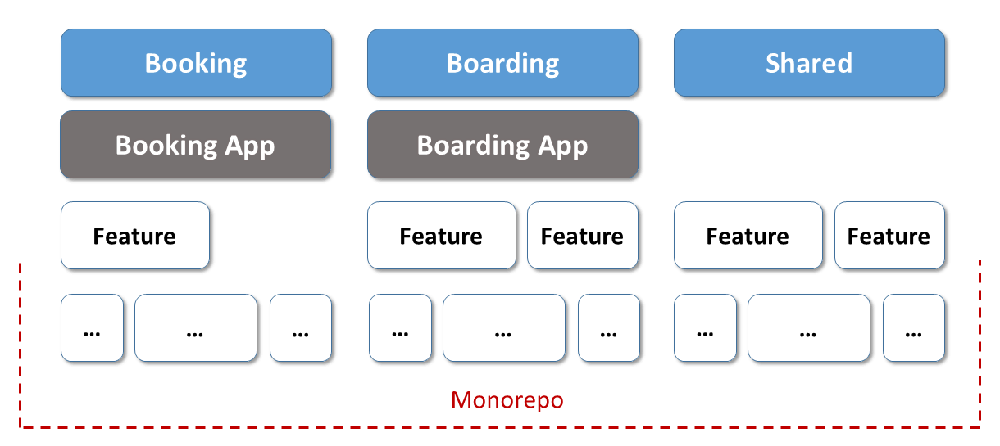
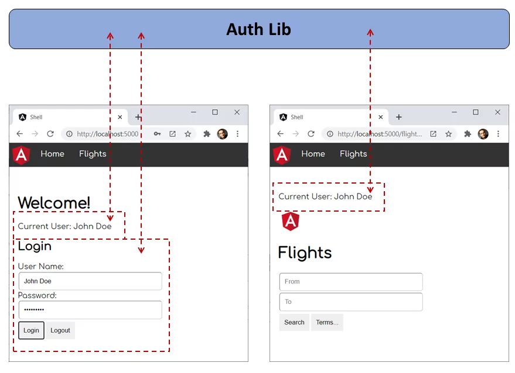
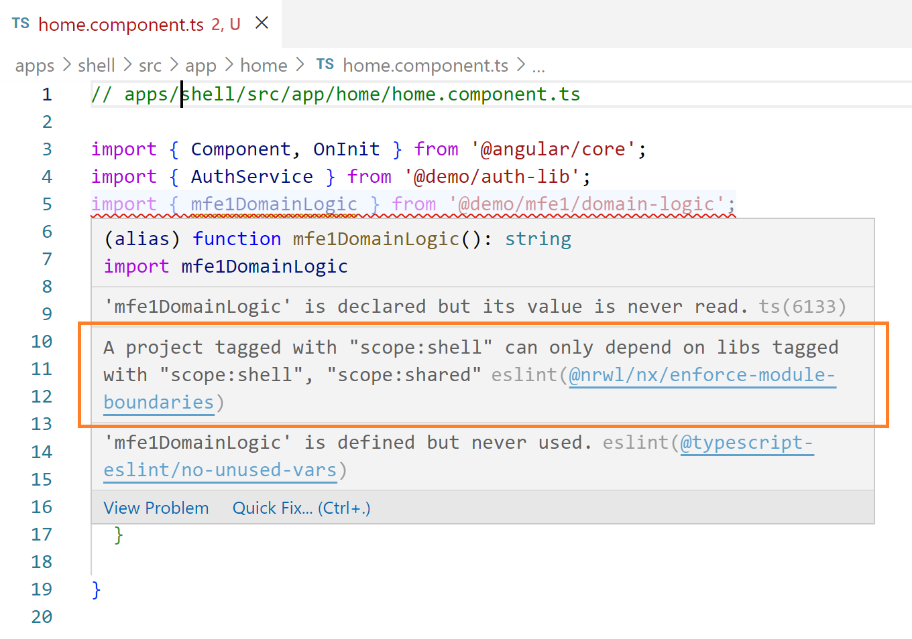
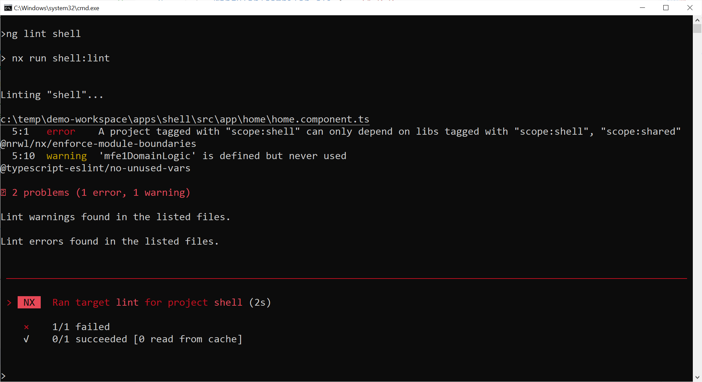
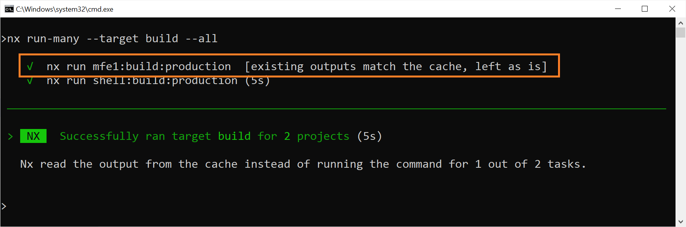
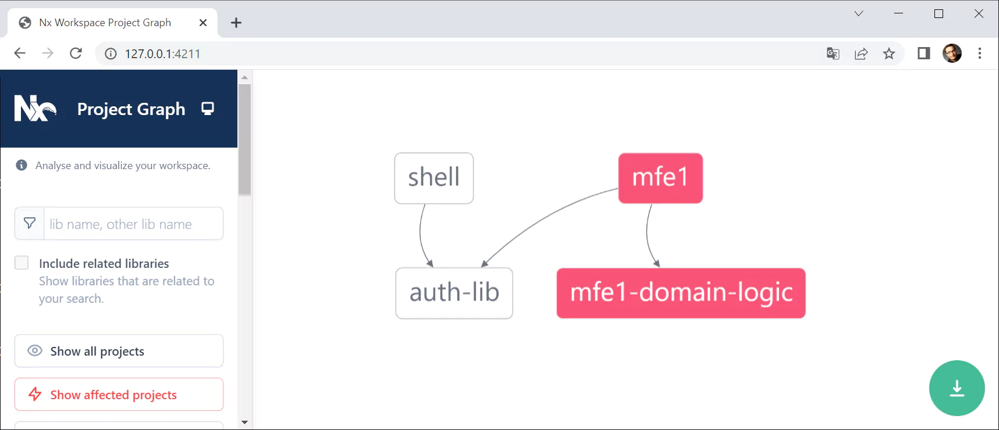

# Using Module Federation with Nx Monorepos and Angular

While it sounds like a contradiction, the combination of Micro Frontends and Monorepos can actually be quite tempting: No **version conflicts** by design, easy code sharing and **optimized bundles** are some of the benefits you get. Also, you can still **deploy** Micro Frontends **separately** and **isolate** them from each other. 

This chapter **compares the consequences** of using **several repositories** ("Micro Frontends by the book") and one sole **monorepo**. After that, it shows with an example, how to use Module Federation in an Nx monorepo.

If you want to have a look at the 📂 [source code](https://github.com/manfredsteyer/nx-module-federation-demo) used here, you can check out [this repository](https://github.com/manfredsteyer/nx-module-federation-demo). 

> Big thanks to the awesome [Tobias Koppers](https://twitter.com/wSokra) who gave me valuable insights into this topic and to the one and only [Dmitriy Shekhovtsov](https://twitter.com/valorkin) who helped me using the Angular CLI/webpack 5 integration for this.

**Important**: This book is written for **Angular 14.x** and higher. Hence, you also need **Nx 14.2.x** or higher. To find out about the small differences for lower versions of Angular and for the migration from such a lower version, please have a look to our [migration guide](https://github.com/angular-architects/module-federation-plugin/blob/main/migration-guide.md).

## Multiple Repos vs. Monorepos

I know, the discussion about using multiple repos vs. monorepos can be quite emotional. Different people made different experiences with both approaches. However, I can tell you: I've seen both working in huge real-world projects. Still, both comes **with different consequences**, I'm going to discuss in the following two section. 

At the end of the day, you need to **evaluate** these consequences against your very project situation and **goals**. This is what software architecture is about.

## Multiple Repositories: Micro Frontends by the Book

A traditional approach uses a separate repository per Micro Frontend:


This is also a quite usual for Micro Services and it provides the following **advantages**:

* Micro Frontends -- and hence the individual business domains -- are isolated from each other. As there are no dependencies between them, different teams can evolve them separately.

* Each team can concentrate on their Micro Frontend. They only need to focus on their very own repository. 

* Each team has the maximum amount of freedom in their repository. They can go with their very own architectural decisions, tech stacks, and build processes. Also, they decide by themselves when to update to newer versions.

* Each Micro Frontend can be separately deployed.

As this best fits the original ideas of Micro Frontends, I call this approach "Micro Frontends by the book". However, there are also some **disadvantages**:

* We need to version and distribute shared dependencies via npm. This can become quite an overhead, as after every change we need to assign a new version, publish it, and install it into the respective Micro Frontends. 

* As each team can use its own tech stack, we can end up with different frameworks and different versions of them. This might lead to version conflicts in the browser and to increased bundle sizes. 

Of course, there are approaches to **compensate for these drawbacks**: For instance, we can automate the distribution of shared libraries to minimize the overhead. Also, we can avoid version conflicts by not sharing libraries between different Micro Frontends. Wrapping these Micro Frontends into web components further abstracts away the differences between frameworks. 

While this prevents version conflicts, we still have increased bundle sizes. Also, we might need some workarounds here or there as Angular is not designed to work with another version of itself in the same browser window. Needless to say that there is no support by the Angular team for this idea.

If you find out that the advantages of this approach outweigh the disadvantages, you find a solution for mixing and matching different frameworks and versions in one of the next chapters.

However, if you feel that the disadvantages weigh heavier, the next sections show an alternative.

## Micro Frontends with Monorepos

Nearly all of the disadvantages outlined above can be prevented by putting all Micro Frontends into one sole monorepo:



Now, sharing libraries is easy and there is only one version of everything, hence we don't end up with version conflicts in the browser. We can also **keep some advantages outlined above**:

* Micro Frontends can be **isolated** from each other by using **linting** rules. They prevent one Micro Frontend from depending upon others. Hence, teams can separately evolve their Micro Frontend.

* Micro Frontends can still be **separately deployed.** 

Now, the question is, where's the catch? Well, the thing is, now we are **giving up** some of the **freedom**: Teams need to agree on **one version** of dependencies like Angular and on a common update cycle for them. To put it in another way: We trade in some freedom to prevent version conflicts and increased bundle sizes.

One more time, you need to evaluate all these consequences for your very project. Hence, you need to know your architecture goals and prioritize them. As mentioned, I've seen both working in the wild in several projects. It's all about the different consequences.

## Monorepo Example

After discussing the consequences of the approach outlined here, let's have a look at an implementation. The example used here is a Nx monorepo with a Micro Frontend shell (`shell`) and a Micro Frontend (`mfe1`, "micro frontend 1"). Both share a common library for authentication (`auth-lib`) that is also located in the monorepo. Also, `mfe1` uses a library `mfe1-domain-logic`.

If you haven't used Nx before, just assume a CLI workspace with tons additional features. You can find more [infos on Nx in our tutorial](https://www.angulararchitects.io/aktuelles/tutorial-first-steps-with-nx-and-angular-architecture/).

To visualize the monorepo's structure, one can use the Nx CLI to request a dependency graph:

```bash
nx graph
```

If you don't have installed this CLI, you can easily get it via npm (`npm i -g nx`). The displayed graph looks like this:


The `auth-lib` provides two components. One is logging-in users and the other one displays the current user. They are used by both, the `shell` and `mfe1`:



Also, the `auth-lib` stores the current user's name in a service.

As usual in Nx and Angular monorepos, libraries are referenced with path mappings defined in `tsconfig.base.json` (Nx)  or `tsconfig.json` (Angular CLI):

```json
"paths": {
    "@demo/auth-lib": [
        "libs/auth-lib/src/index.ts"
    ]
},
```

The `shell` and `mfe1` (as well as further Micro Frontends we might add in the future) need to be deployable in separation and loaded at runtime. 

However, we don't want to load the `auth-lib` twice or several times! Archiving this with an npm package is not that difficult. This is one of the most obvious and easy to use features of Module Federation. The next sections discuss how to do the same with libraries of a monorepo.

## The Shared Lib

Before we delve into the solution, let's have a look at the `auth-lib`. It contains an `AuthService` that logs-in the user and remembers them using the property `_userName`:

```typescript
@Injectable({
  providedIn: 'root'
})
export class AuthService {

  // tslint:disable-next-line: variable-name
  private _userName: string = null;

  public get userName(): string {
    return this._userName;
  }

  constructor() { }

  login(userName: string, password: string): void {
    // Authentication for honest users
    // (c) Manfred Steyer
    this._userName = userName;
  }

  logout(): void {
    this._userName = null;
  }
}
```

Besides this service, there is also a `AuthComponent` with the UI for logging-in the user and a `UserComponent` displaying the current user's name. Both components are registered with the library's NgModule:

```typescript
@NgModule({
  imports: [
    CommonModule,
    FormsModule
  ],
  declarations: [
    AuthComponent,
    UserComponent
  ],
  exports: [
    AuthComponent,
    UserComponent
  ],
})
export class AuthLibModule {}
```

As every library, it also has a barrel `index.ts` (sometimes also called `public-api.ts`) serving as the entry point. It exports everything consumers can use:

```typescript
export * from './lib/auth-lib.module';
export * from './lib/auth.service';

// Don't forget about your components!
export * from './lib/auth/auth.component';
export * from './lib/user/user.component';
```

**Please note** that `index.ts` is also exporting the two components although they are already registered with the also exported `AuthLibModule`. In the scenario discussed here, this is vital in order to make sure it's detected and compiled by Ivy. 

Let's assume the shell is using the `AuthComponent` and `mfe1` uses the `UserComponent`. As our goal is to only load the `auth-lib` once, this also allows for sharing information on the logged-in user. 

## The Module Federation Configuration

As in the previous chapter, we are using the `@angular-architects/module-federation` plugin to enable Module Federation for the `shell` and `mfe1`. For this, just run the following commands:

```javascript
npm i @angular-architects/module-federation -D

npm g @angular-architects/module-federation:init --project shell --port 4200 --type host

npm g @angular-architects/module-federation:init --project mfe1 --port 4201 --type remote
```

> Meanwhile, Nx also ships with its own [support for Module Federation](https://nx.dev/module-federation/micro-frontend-architecture). Beyond the covers, it handles Module Federation in a very similar way as the plugin used here.

This generates a webpack config for Module Federation. Since version 14.3, the `withModuleFederationPlugin` provides a property `sharedMappings`. Here, we can register the monorepo internal libs we want to share at runtime:

```javascript
// apps/shell/webpack.config.js

const { shareAll, withModuleFederationPlugin } = require('@angular-architects/module-federation/webpack');

module.exports = withModuleFederationPlugin({

    remotes: {
        'mfe1': "http://localhost:4201/remoteEntry.js" 
    },

    shared: shareAll({ singleton: true, strictVersion: true, requiredVersion: 'auto' }),

    sharedMappings: ['@demo/auth-lib'],

});
```

As sharing is always an opt-in in Module Federation, we also need the same setting in the Micro Frontend's configuration:

```javascript
// apps/mfe1/webpack.config.js

const { shareAll, withModuleFederationPlugin } = require('@angular-architects/module-federation/webpack');

module.exports = withModuleFederationPlugin({

    name: "mfe1",

    exposes: {
      './Module': './apps/mfe1/src/app/flights/flights.module.ts',
    }, 

    shared: shareAll({ singleton: true, strictVersion: true, requiredVersion: 'auto' }),

    sharedMappings: ['@demo/auth-lib'],

});
```

> Since version 14.3, the Module Federation plugin shares all libraries in the monorepo by default. To get this default behavior, just skip the `sharedMappings` property. If you use it, only the mentioned libs are shared.

## Trying it out

To try this out, just start the two applications. As we use Nx, this can be done with the following command:

```javascript
nx run-many --target serve --all
```

The switch `--all` starts all applications in the monorepo. Instead, you can also go with the switch `--projects` to just start a subset of them:

```bash
nx run-many --target serve --projects shell,mfe1
```

> `--project` takes a comma-separated list of project names. Spaces are **not** allowed.

After starting the applications, log-in in the shell and make it to load `mfe1`. If you see the logged-in user name in `mfe1`, you have the proof that `auth-lib` is only loaded once and shared across the applications.

## Isolating Micro Frontends 

One important goal of a Micro Frontend architecture is to isolate Micro Frontends from each other. Only if they don't depend on each other, they can be evolved by autarkic teams. For this, Nx provides **linting** rules. Once in place, they give us errors when we directly reference code belonging to another Micro Frontend and hence another business domain.

In the following example, the shell tries to access a library belonging to `mfe1`:



To make these error messages appear in your IDE, you need **eslint** support. For Visual Studio Code, this can be installed via an extension.

Besides checking against linting rules in your IDE, one can also call the linter on the command line:



The good message: If it works on the command line, it can be automated. For instance, your **build process** could execute this command and **prevent merging** a feature into the main branch if these linting rules fail: No broken windows anymore.

For configuring these linting rules, we need to **add tags** to each app and lib in our monorepo. For this, you can adjust the `project.json` in the app's or lib's folder. For instance, the `project.json` for the shell can be found here: `apps/shell/project.json`. At the end, you find a property tag, I've set to `scope:shell`:

```json
{
    [...]
    "tags": ["scope:shell"]
}
```

The value for the tags are just strings. Hence, you can set any possible value. I've repeated this for `mfe1` (`scope:mfe1`) and the `auth-lib` (`scope:auth-lib`).

Once the tags are in place, you can use them to define **constraints** in your **global eslint** configuration (`.eslintrc.json`): 

```json
"@nrwl/nx/enforce-module-boundaries": [
  "error",
  {
    "enforceBuildableLibDependency": true,
    "allow": [],
    "depConstraints": [
      {
        "sourceTag": "scope:shell",
        "onlyDependOnLibsWithTags": ["scope:shell", "scope:shared"]
      },
      {
        "sourceTag": "scope:mfe1",
        "onlyDependOnLibsWithTags": ["scope:mfe1", "scope:shared"]
      },
      {
        "sourceTag": "scope:shared",
        "onlyDependOnLibsWithTags": ["scope:shared"]
      }
    ]
  }
]
```

After changing global configuration files like the `.eslintrc.json`, it's a good idea to restart your IDE (or at least affected services of your IDE). This makes sure the changes are respected.

More on these ideas and their implementation with Nx can be found in the chapters on Strategic Design.

## Incremental Builds

To build all apps, you can use Nx' `run-many` command:

```bash
nx run-many --target build --all
```

However, this does not mean that Nx always rebuilds all the Micro Frontends as well as the shell. Instead, it **only rebuilds** the **changed** apps. For instance, in the following case mfe1 was not changed. Hence, only the shell is rebuilt:



> Using the build cache to only recompile changed apps can **dramatically speed up your build times.**

This also works for **testing, e2e-tests, and linting** out of the box. If an application (or library) hasn't been changed, it's neither retested nor relinted. Instead, the result is taken from the Nx **build cache**.

By default, the build cache is located in `node_modules/.cache/nx`. However, there are several options for configuring how and where to cache. 

## Deploying

As normally, libraries don't have versions in a monorepo, we should always redeploy all the changed Micro Frontends together. Fortunately, Nx helps with finding out which applications/ Micro Frontends have been changed or **affected by a change**:

```javascript
nx print-affected --type app --select projects
```

You might also want to detect the changed applications as part of your **build process**. 

> Redeploying all applications that have been changed or affected by a (lib) change is vital, if you share libraries at runtime. If you have a **release branch**, it's enough to just redeploy all apps that have been changed in this branch. 

If you want to have a **graphical** representation of the changed parts of your monorepo, you can request a dependency graph with the following command:

```bash
nx affected:graph
```

Assuming we changed the `domain-logic` lib used by `mfe1`, the result would look as follows:



By default, the shown commands **compare** your current working directory with the **main branch**. However, you can use these commands with the switches `--base` and `--head`.

```bash
nx print-affected --type app --select projects --base branch-or-commit-a --head branch-or-commit-b
```

These switches take a **commit hash** or the name of a **branch**. In the latter case, the last commit of the mentioned branch is used for the comparison.

## Conclusion

By using monorepos for Micro Frontends you trade in some freedom for preventing issues. You can still deploy Micro Frontends separately and thanks to linting rules provided by Nx Micro Frontends can be isolated from each other. 

However, you need to agree on common versions for the frameworks and libraries used. Therefore, you don't end up with version conflicts at runtime. This also prevents increased bundles. 

Both works, however, both has different consequences. It's on you to evaluate these consequences for your very project. 
