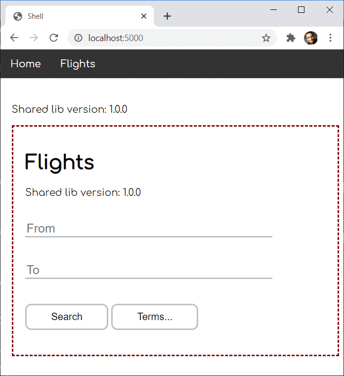
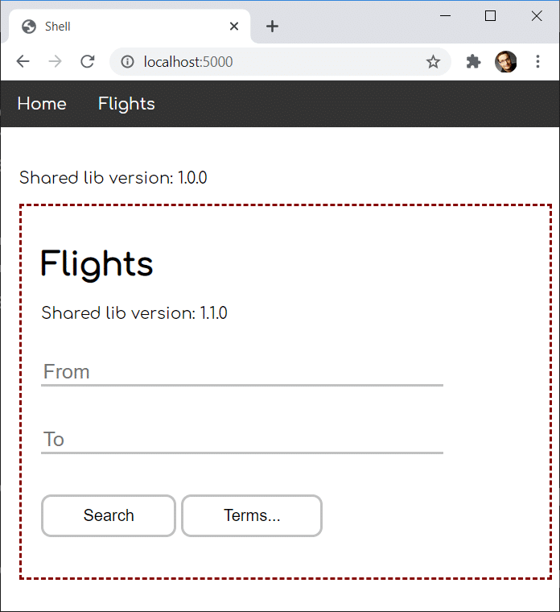
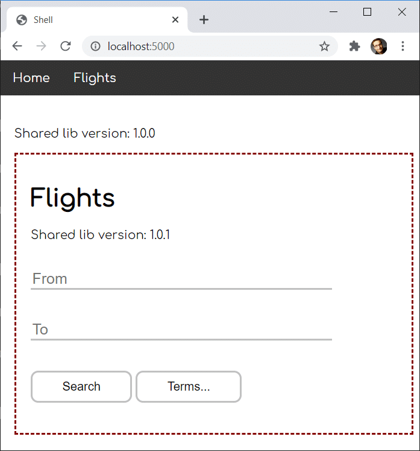
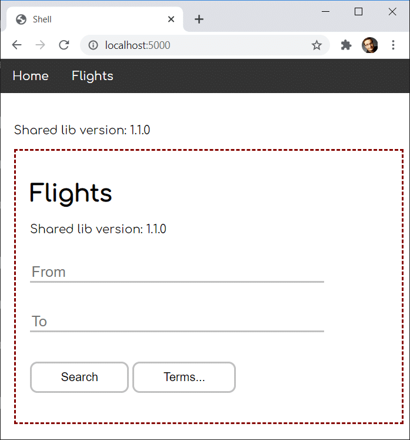
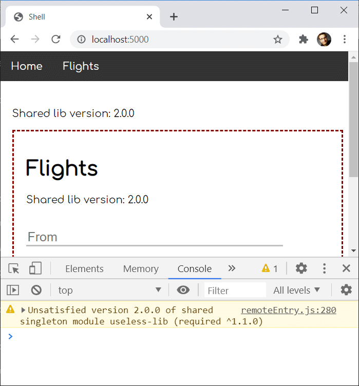
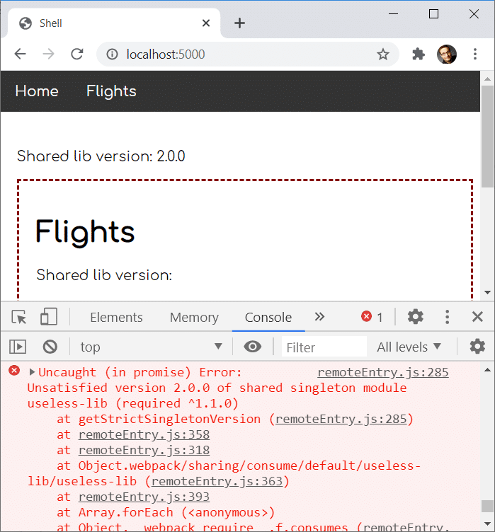
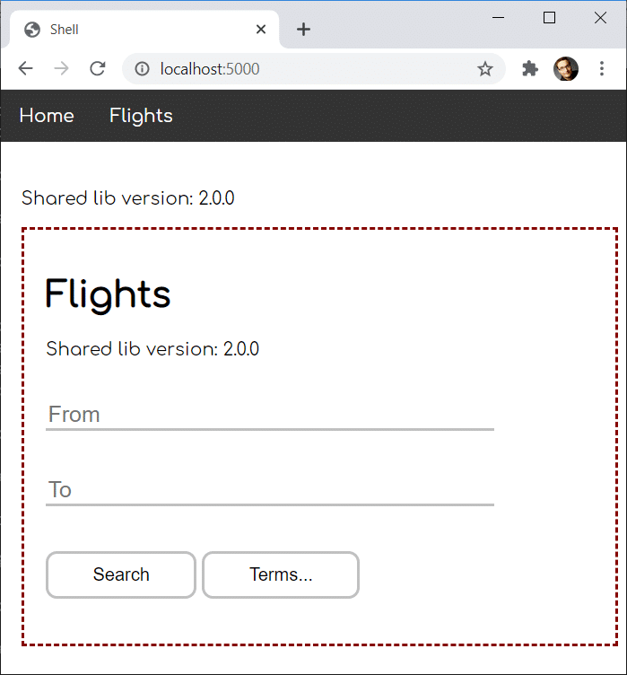

# Dealing with Version Mismatches in Module Federation

Webpack Module Federation makes it easy to load separately compiled code like micro frontends. It even allows us to share libraries among them. This prevents that the same library has to be loaded several times.

However, there might be situations where several micro frontends and the shell need different versions of a shared library. Also, these versions might not be compatible with each other.

For dealing with such cases, Module Federation provides several options. In this chapter, I present these options by looking at different scenarios. The [source code](https://github.com/manfredsteyer/module_federation_shared_versions) for these scenarios can be found in my [GitHub account](https://github.com/manfredsteyer/module_federation_shared_versions).


## Example Used Here

To demonstrate how Module Federation deals with different versions of shared libraries, I use a simple shell application known from previous chapters. It is capable of loading micro frontends into its working area:



The micro frontend is framed with the red dashed line. 

For sharing libraries, both, the shell and the micro frontend use the following setting in their webpack configurations:

```javascript
new ModuleFederationPlugin({
   [...],
   shared: ["rxjs", "useless-lib"]
})
```

The package [useless-lib](https://www.npmjs.com/package/useless-lib) is a dummy package, I've published for this example. It's available in the versions `1.0.0`, `1.0.1`, `1.1.0`, `2.0.0`, `2.0.1`, and `2.1.0`. In the future, I might add further ones. These versions allow us to simulate different kinds of version mismatches. 

To indicate the installed version, `useless-lib` exports a `version` constant. As you can see in the screenshot above, the shell and the micro frontend display this constant. In the shown constellation, both use the same version (`1.0.0`), and hence they can share it. Therefore, `useless-lib` is only loaded once.

However, in the following sections, we will examine what happens if there are version mismatches between the `useless-lib` used in the shell and the one used in the `microfrontend`. This also allows me to explain different concepts Module Federation implements for dealing with such situations.


## Semantic Versioning by Default

For our first variation, let's assume our `package.json` is pointing to the following versions:

- **Shell:** useless-lib@^1.0.0
- **MFE1:** useless-lib@^1.0.1


This leads to the following result:


Module Federation decides to go with version `1.0.1` as this is the highest version compatible with both applications according to semantic versioning (^1.0.0 means, we can also go with a higher minor and patch versions).


## Fallback Modules for Incompatible Versions

Now, let's assume we've adjusted our dependencies in `package.json` this way:

- **Shell:** useless-lib@~1.0.0
- **MFE1:** useless-lib@1.1.0

Both versions are not compatible with each other (`~1.0.0` means, that only a higher patch version but not a higher minor version is acceptable).

This leads to the following result:



This shows that Module Federation uses different versions for both applications. In our case, each application falls back to its own version, which is also called the fallback module.

<!--
FRAGE: Wenn ich hier auf einer oder auf beiden Seiten `strictVersion:false` setze, ändert sich nichts am Verhalten. Ist das so gewollt?

Wenn ich hier auf einer oder auf beiden Seiten `strictVersion:true` setze, bekomme ich auch keine Warnung. Ist das so gewollt?
-->

## Differences With Dynamic Module Federation

Interestingly, the behavior is a bit different when we load the micro frontends including their remote entry points just on demand using Dynamic Module Federation. The reason is that dynamic remotes are not known at program start, and hence Module Federation cannot draw their versions into consideration during its initialization phase.

For explaining this difference, let's assume the shell is loading the micro frontend dynamically and that we have the following versions:

- **Shell:** useless-lib@^1.0.0
- **MFE1:** useless-lib@^1.0.1

While in the case of classic (static) Module Federation, both applications would agree upon using version `1.0.1` during the initialization phase, here in the case of dynamic module federation, the shell does not even know of the micro frontend in this phase. Hence, it can only choose for its own version: 



If there were other static remotes (e. g. micro frontends), the shell could also choose for one of their versions according to semantic versioning, as shown above.

Unfortunately, when the dynamic micro frontend is loaded, module federation does not find an already loaded version compatible with `1.0.1`. Hence, the micro frontend falls back to its own version `1.0.1`.

On the contrary, let's assume the shell has the highest compatible version:

- **Shell:** useless-lib@^1.1.0
- **MFE1:** useless-lib@^1.0.1

In this case, the micro frontend would decide to use the already loaded one:



To put it in a nutshell, in general, it's a good idea to make sure your shell provides the highest compatible versions when loading dynamic remotes as late as possible.

However, as discussed in the chapter about Dynamic Module Federation, it's possible to dynamically load just the remote entry point on program start and to load the micro frontend later on demand. By splitting this into two loading processes, the behavior is exactly the same as with static ("classic") Module Federation. The reason is that in this case the remote entry's meta data is available early enoght to be considering during the negotation of the versions.

## Singletons

Falling back to another version is not always the best solution: Using more than one version can lead to unforeseeable effects when we talk about libraries holding state. This seems to be always the case for your leading application framework/ library like Angular, React or Vue.

For such scenarios, Module Federation allows us to define libraries as **singletons**. Such a singleton is only loaded once. 

If there are only compatible versions, Module Federation will decide for the highest one as shown in the examples above. However, if there is a version mismatch, singletons prevent Module Federation from falling back to a further library version.

For this, let's consider the following version mismatch:

- **Shell:** useless-lib@^2.0.0
- **MFE1:** useless-lib@^1.1.0

Let's also consider we've configured the `useless-lib` as a singleton:

```javascript
// Shell
shared: { 
  "rxjs": {}, 
  "useless-lib": {
    singleton: true,
  }
},
```

Here, we use an advanced configuration for defining singletons. Instead of a simple array, we go with an object where each key represents a package. 

If one library is used as a singleton, you will very likely set the singleton property in every configuration. Hence, I'm also adjusting the microfrontend's Module Federation configuration accordingly:

```javascript
// MFE1
shared: { 
    "rxjs": {},
    "useless-lib": {
        singleton: true
    } 
}
```

To prevent loading several versions of the singleton package, Module Federation decides for only loading the highest available library which it is aware of during the initialization phase. In our case this is version `2.0.0`: 



However, as version `2.0.0` is not compatible with version `1.1.0` according to semantic versioning, we get a warning. If we are lucky, the federated application works even though we have this mismatch. However, if version `2.0.0` introduced braking changes we run into, our application might fail.

In the latter case, it might be beneficial to fail fast when detecting the mismatch by throwing an example. To make Module Federation behaving this way, we set `strictVersion` to `true`: 


```javascript
// MFE1
shared: { 
  "rxjs": {},
  "useless-lib": {
    singleton: true,
    strictVersion: true
  } 
}
```

The result of this looks as follows at runtime:




## Accepting a Version Range

There might be cases where you know that a higher major version is backward compatible even though it doesn't need to be with respect to semantic versioning. In these scenarios, you can make Module Federation accepting a defined version range.

To explore this option, let's one more time assume the following version mismatch:

- **Shell:** useless-lib@^2.0.0
- **MFE1:** useless-lib@^1.1.0


Now, we can use the `requiredVersion` option for the `useless-lib` when configuring the microfrontend:

```javascript
// MFE1
shared: { 
  "rxjs": {},
  "useless-lib": {
    singleton: true,
    strictVersion: true,
    requiredVersion: ">=1.1.0 <3.0.0"
  } 
}
```

According to this, we also accept everything having `2` as the major version. Hence, we can use the version `2.0.0` provided by the shell for the micro frontend:




## Conclusion

Module Federation brings several options for dealing with different versions and version mismatches. Most of the time, you don't need to do anything, as it uses semantic versioning to decide for the highest compatible version. If a remote needs an incompatible version, it falls back to such one by default. 

In cases where you need to prevent loading several versions of the same package, you can define a shared package as a singleton. In this case, the highest version known during the initialization phase is used, even though it's not compatible with all needed versions. If you want to prevent this, you can make Module Federation throw an exception using the `strictVersion` option.

You can also ease the requirements for a specific version by defining a version range using `requestedVersion`. You can even define several scopes for advanced scenarios where each of them can get its own version.

