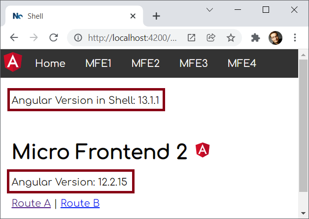
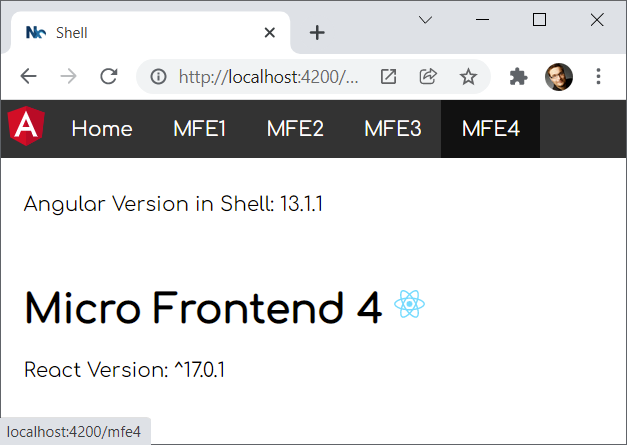
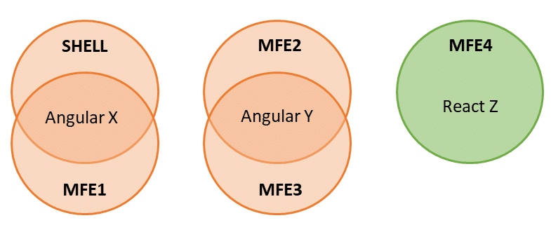
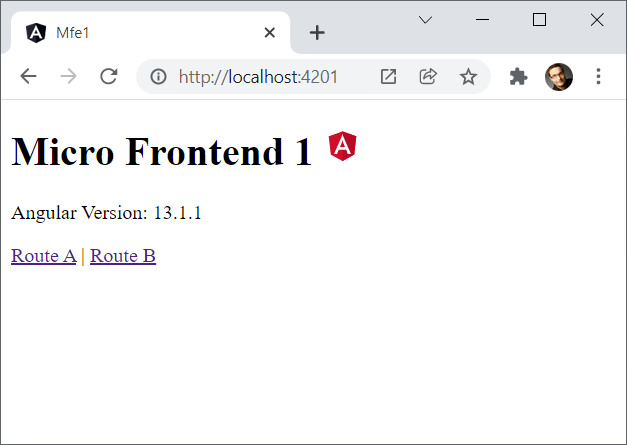

# Multi-Framework and -Version Micro Frontends with Module Federation: The Good, the Bad, the Ugly

Some of my customers need to combine Micro Frontends built with different frameworks and/or framework versions. A quite modern and flexible approach for this is providing Web Components via Module Federation. 

Nevertheless, in general, combining different frameworks and versions is nothing the individual frameworks have been built for. Hence, there are some pitfalls, this chapter shows some workarounds for.

For this, here, I'm using an Angular-based shell that loads several Micro Frontends. They've been developed with two different Angular versions and React: 





The shell and _Micro Frontend 1_ use the same Angular version. Hence, they shall share it. The same is true for _Micro Frontend 2_ and _Micro Frontend 3_. _Micro Frontend 4_, however, uses React:



The [source code](https://github.com/manfredsteyer/multi-framework-micro-frontend
) for this case study can be found [here](https://github.com/manfredsteyer/multi-framework-micro-frontend).

## The 1st Rule for Multi Framework(version) MFEs

Let's start with the 1st rule for multi framework and multi version micro frontend architectures: Don't do it ;-).

Seriously, while wrapping applications into web components and loading them with Module Federation is not that difficult, there are several pitfalls along the way. Hence, I want to start with two alternatives:


### Alternative 1: Evergreen Version with Module Federation

The Angular team is heavily investing in seamless upgrades. The Angular CLI command `ng update` is providing the results of this by the push of a button. It executes several migration scripts lifting your source code to the newest version. This and respective processes at Google allow them to always use the newest Angular version for all of their more than 2600 Angular applications.

Also, if all parts of your system use the same major version, using Module Federation for integrating them is straightforward. We **don't need** Web Components to bridge the gap between different versions and from our framework's perspective, everything we do is using lazy loading. Underneath the covers, Module Federation takes care of loading separately compiled code at runtime. 

### Alternative 2: Relaxing Version Requirements + Heavy Testing

Another approach is to relax the requirements for needed versions. For instance, we could tell Module Federation that an application built with Angular 10 also works with Angular 11. For this, Module Federation provides the configuration property `requiredVersion` described [here](https://www.angulararchitects.io/aktuelles/getting-out-of-version-mismatch-hell-with-module-federation/). 

This might work because, normally, Angular's core didn't recently change much between major versions. However, this is not officially supported and hence you need a huge amount of E2E tests to make sure everything works seamlessly together. On the other side, you need E2E tests anyway as micro frontends are runtime dependencies not known upfront at compilation time.

## A Good Message Before We Start

Most of the tricks and tweks I'm presenting here are meanwhile automated by my library [@angular-architects/module-federation-tools](https://www.npmjs.com/package/@angular-architects/module-federation-tools) which is an add-on for @angular-architects/module-federation. Here you even find a [live demo](https://red-ocean-0fe4c4610.azurestaticapps.net/).

Nethertheless, this chapter can be vital for you because it helps you to understand both, the underlying ideas and also how to use them -- automated via a library or hand-written -- in an Angular application.

## The Good

Okay, let's go on with finding out how the combination of Module Federation and Web Components allows building multi framework(version) Micro Frontends. Before we look into the pitfalls, I'm going to tell you about the good aspects of this.

### Sharing Libraries

As mentioned before, our case study is sharing two versions of Angular:


For this, the shell and each Micro Frontend just needs to mention the libraries to share in their Module Federation config:

```javascript
new ModuleFederationPlugin({
  [...],          
  shared: ["@angular/core", "@angular/common", "@angular/router"]
})
```

By default, Module Federation is using semantic versioning to find out the highest compatible version available. Let's say, we have the following constellation:

- Shell: @angular/core@^**12.0**.0
- MFE1: @angular/core@^**12.1**.0
- MFE2: @angular/core@^**13.1**.0
- MFE3: @angular/core@^**13.0**.0

In this case, Module Federation decides to go with the following versions:

- Shell and MFE1: @angular/core@^**12.1**.0
- MFE2 and MFE3: @angular/core@^**13.1**.0

In both cases, the respective highest compatible version is used. [More details about this clever mechanism and configuration options to influence this behavior](https://www.angulararchitects.io/aktuelles/getting-out-of-version-mismatch-hell-with-module-federation/) can be found [here](https://www.angulararchitects.io/aktuelles/getting-out-of-version-mismatch-hell-with-module-federation/). 


### Exporting Web Components

Using Module Federation, a Micro Frontend (officially called *remote*) can expose all possible code fragments. In cases where all parts of the system use the same framework version, this could be an Angular modules or a component.

If we have different framework versions, we can expose web components:

```javascript
new ModuleFederationPlugin({
  [...],
  exposes: {
    './web-components': './src/bootstrap.ts',
  },
  [...]
})
```    

The `bootstrap.ts` file is bootstrapping an Angular application providing an Angular component as a Web Component with Angular Elements. To add Angular Elements to your project, use the following CLI command:

```javascript
ng add @angular/elements
```

The file `bootstrap.ts` uses the same source code the CLI normally generates for your `main.ts`. This includes calling the platform's `bootstrapModule` method with our `AppModule`.

The `main.ts` file only contains the following dynamic `import`:

```typescript
import('./bootstrap');
```

As mentioned in one of the previous chapters of this series, this is a typical pattern for Module Federation. It gives the application the time necessary for negotiating the library versions to use and for loading them.

In order to provide a web component, the Micro Frontend's `AppModule` uses Angular Elements:

```typescript
[...]
import { createCustomElement } from '@angular/elements';
[...]

@NgModule({
  imports: [
    BrowserModule,
    RouterModule.forRoot([...])
  ],
  declarations: [
    [...]
    AppComponent
  ],
  providers: [],
  bootstrap: []
})
export class AppModule {
  constructor(private injector: Injector) {
  }

  ngDoBootstrap() {
    const ce = createCustomElement(AppComponent, {injector: this.injector});
    customElements.define('mfe1-element', ce);
  }

}
```

Please note that this `AppModule` doesn't have a bootstrap component. The `bootstrap` array is empty. Hence, Angular calls the module's `ngDoBootstrap` method. Here, `createCustomElement` wraps an Angular component as a web component (a custom element to be more precise). 

Also, it registers this Web Component with the browser using `customElements.define`. This method assigns the tag name `mfe1-element` to it. 

### Loading Micro Frontends

Also, loading a separately compiled micro frontend on demand is straightforward with Module Federation. For this, the shell (officially called *host*) can leverage the helper method `loadRemoteModule` provided by the package `@angular-architects/module-federation`.

```typescript
import { loadRemoteModule } from '@angular-architects/module-federation';

export const registry = {
    mfe1: () => loadRemoteModule({
        type: 'module',
        remoteEntry: 'http://localhost:4201/remoteEntry.js',
        exposedModule: './web-components'
    }),
    mfe2: () => loadRemoteModule({
        type: 'script',
        remoteEntry: 'http://localhost:4202/remoteEntry.js',
        remoteName: 'mfe2',
        exposedModule: './web-components'
    }),
    mfe3: () => loadRemoteModule({
        type: 'script',
        remoteEntry: 'http://localhost:4203/remoteEntry.js',
        remoteName: 'mfe3',
        exposedModule: './web-components'
    }),
    mfe4: () => loadRemoteModule({
        type: 'script',
        remoteEntry: 'http://localhost:4204/remoteEntry.js',
        remoteName: 'mfe4',
        exposedModule: './web-components'
    }),
};
```

The calls needed for this example have been placed in the registry object shown. Please note that the first call is using `type: 'module'` while the others are going with `type: 'script'`. The reason is that the first one uses Angular 13.1 or higher. Beginning with Angular 13, the CLI emits EcmaScript modules instead of just "plain old" JavaScript files.

As mfe2 and mfe3 are based on Angular 2 and mfe4 on a classical webpack build for React, we need to go with `type: 'script'` here. In this case, we also have to specify the `remoteName` property which is defined in the remotes' webpack configurations.

More about working with these methods can be found in the chapter on Dynamic Federation.

To load the micro frontends, we just need to call the methods in the registry object:

```typescript
const element = document.createElement('mfe1-element');
document.body.appendChild(element);

await registry.mfe1();
```

After loading the web component, we can immediately use it. For this, we just need to add an element with the registered name.

### Routing to Web Components

Of course, just loading our Micro Frontends and using them as dynamic web components is not enough. Our shell also needs to be able of routing to it.

For routing to such a Web Component, the case study at hand uses a `WrapperComponent`:

```typescript
@NgModule({
  imports: [
    BrowserModule,
    RouterModule.forRoot([
      { path: '', component: HomeComponent, pathMatch: 'full' },
      { [...], component: WrapperComponent, data: { importName: 'mfe1', elementName: 'mfe1-element' }},
      { [...], component: WrapperComponent, data: { importName: 'mfe2', elementName: 'mfe2-element' }},
      { [...], component: WrapperComponent, data: { importName: 'mfe3', elementName: 'mfe3-element' }},
      { [...], component: WrapperComponent, data: { importName: 'mfe4', elementName: 'mfe4-element' }},

    ])
  ],
  declarations: [
    AppComponent,
    WrapperComponent
  ],
  providers: [],
  bootstrap: [AppComponent]
})
export class AppModule { }
```

To configure this wrapper, the router config's `data` property is used. It points to the remote's name mapped in the Module Federation config (`importName`) and to the respective Web Component's element name (`elementName`).

The wrapper's implementation just loads the web component and adds it to a placeholder referenced with a `ViewChild`:

```typescript
import { AfterContentInit, Component, ElementRef, OnInit, ViewChild, ViewContainerRef } from '@angular/core';
import { ActivatedRoute } from '@angular/router';
import { registry } from '../registry';

@Component({
  template: '<div #vc></div>',
})
export class WrapperComponent implements AfterContentInit {

  @ViewChild('vc', {read: ElementRef, static: true})
  vc: ElementRef;

  constructor(private route: ActivatedRoute) { }

  ngAfterContentInit(): void {

    const elementName = this.route.snapshot.data['elementName'];
    const importName = this.route.snapshot.data['importName'];

    const importFn = registry[importName];
    importFn()
      .then(_ => console.debug(`element ${elementName} loaded!`))
      .catch(err => console.error(`error loading ${elementName}:`, err));

    const element = document.createElement(elementName);
    this.vc.nativeElement.appendChild(element);

  }

}
```

As an **alternative**, we could make this example more dynamic by skipping the registry and passing the key data for loading the remote and creating its root element **directly** to the wrapper component.

### No Need for a Separate Meta Framework

One of the best things of using Module Federation in general is that your framework -- in this case Angular -- does not even recognize that we are loading a separately compiled Micro Frontend. From Angular's perspective, this is just traditional lazy loading. Webpack Module Federation takes care of the heavy lifting underneath the covers. Hence, we don't need a separate meta framework and hence our scenario becomes easier.

### Standalone Mode

All the Micro Frontends can also be started in standalone mode:



This is important because we want to develop, test, and deploy our Micro Frontends separately. 

### Lazy Loading within Micro Frontends

Another advantage of this approach is that we can use traditional lazy loading within each Micro Frontend. In cases where we load Micro Frontends directly without Module Federation this can cause issues because the Micro Frontend does not remember from which URL it was loaded and hence doesn't know where to find its lazy chunks.

## The Bad

Now, let's proceed with some of the challenges this architecture comes with.

### Bundle Size

Obviously, using several versions of the same framework but also using several frameworks together increases the bundle size. More stuff needs to be downloaded into the browser. However, if you have a lot of returning users, they will benefit from cache hits. 

Nevertheless, you need to respect the impact of increased bundles sizes when deciding for or against this architecture. While in some cases, this can for sure be neglected, e. g. in intranet scenarios, there are cases where this trade-off is not acceptable, e. g. in mobile scenarios or when the conversion rate is critical. Being able to run individual Micro Frontends in standalone mode, can help here for sure.

### Several Routers must Work Together

In cases where the loaded Micro Frontends also use routing, we need to coordinate several routers: The shell's router and the router found in the individual Micro Frontends. 

Let's say, we have the URL `mfe1/a`. In this case, the shell should only care about the first part, `mfe1` and route to the Web Component provided by Micro Frontend 1. The Micro Frontend in turn, should only respect the ending, `/a` and activate the respective route. 

To achieve this, we could use `UrlMatcher` instead of concrete paths in the router configs. For instance, our shell is using the custom `UrlMather` `startsWith`:

```typescript
@NgModule({
  imports: [
    BrowserModule,
    RouterModule.forRoot([
      { path: '', component: HomeComponent, pathMatch: 'full' },
      { matcher: startsWith('mfe1'), component: WrapperComponent, data: { importName: 'mfe1', elementName: 'mfe1-element' }},
      { matcher: startsWith('mfe2'), component: WrapperComponent, data: { importName: 'mfe2', elementName: 'mfe2-element' }},
      { matcher: startsWith('mfe3'), component: WrapperComponent, data: { importName: 'mfe3', elementName: 'mfe3-element' }},
      { matcher: startsWith('mfe4'), component: WrapperComponent, data: { importName: 'mfe4', elementName: 'mfe4-element' }},
    ])
  ],
  declarations: [
    AppComponent,
    WrapperComponent
  ],
  providers: [],
  bootstrap: [AppComponent]
})
export class AppModule { }
```

All routes starting with `mfe1` will make the `WrapperComponent` loading _Micro Frontend 1_, for instance. The rest of the path is ignored by the shell and can be utilized by the Micro Frontend itself.

This is what the implementation of `startsWith` looks like:

```typescript
import { UrlMatcher, UrlSegment } from '@angular/router';

export function startsWith(prefix: string): UrlMatcher {
    return (url: UrlSegment[]) => {
        const fullUrl = url.map(u => u.path).join('/');
        if (fullUrl.startsWith(prefix)) {
            return ({ consumed: url});
        }
        return null;
    };
}
```

In the Micro Frontends, however, our case study only analyzes the end of the route with a respective `endsWith` function: 

```typescript
@NgModule({
  imports: [
    BrowserModule,
    RouterModule.forRoot([
      { matcher: endsWith('a'), component: AComponent},
      { matcher: endsWith('b'), component: BComponent},
    ])
  ],
  declarations: [
    AComponent,
    BComponent,
    AppComponent
  ],
  providers: [],
  bootstrap: []
})
export class AppModule {
 [...]
}
```

Here is its implementation:

```typescript
export function endsWith(prefix: string): UrlMatcher {
    return (url: UrlSegment[]) => {
        const fullUrl = url.map(u => u.path).join('/');
        if (fullUrl.endsWith(prefix)) {
            return ({ consumed: url});
        }
        return null;
    };
}
```


## The Ugly

As all these frameworks are not designed to work side-by-side with different versions of itself or other frameworks, we also need some "special" workarounds. This section discusses them.

### Bypassing Routing Issues

One issue that arises when using several Angular routers together, is that the inner routers don't recognize a route change. Hence, we need to "invite them for routing" manually every time the URL changes:

```typescript
@Component([...])
export class AppComponent implements OnInit {

  [...]

  constructor(private router: Router) { }

  ngOnInit(): void {
    this.router.navigateByUrl(location.pathname.substr(1));
    window.addEventListener('popstate', () => {
      this.router.navigateByUrl(location.pathname.substr(1));
    });
  }
}
```

For hash-based routing, we'd use `location.hash` and the `hashchanged` event.


### Reuse Angular Platform

Per shared Angular version, we are only allowed to create one platform. To remember that there is already a shared platform for our version, we could put it into a global dictionary mapping the version number to the platform instance:

```typescript
declare const require: any;
const ngVersion = require('../package.json').dependencies['@angular/core']; // perhaps just take the major version 

(window as any).plattform = (window as any).plattform || {};
let platform = (window as any).plattform[ngVersion];
if (!platform) {
  platform = platformBrowser();
  (window as any).plattform[ngVersion] = platform; 
}
platform.bootstrapModule(AppModule)
  .catch(err => console.error(err));
```


### Angular Elements and Zone.js

The last one is a general one regarding Angular Elements: Even if we just load Zone.js once, we get several Zone.js instances: One for the shell and one per each Micro Frontend. This can lead to issues with change detection when data crosses the border of micro frontends. 

Of course, we could turn off Zone.js when bootstrapping the Micro Frontends:

```typescript
platformBrowser()
  .bootstrapModule(AppModule, { ngZone: 'noop' }) 
```

However, this also means we need to do change detection by hand. My GDE colleague, [Tomas Trajan](https://twitter.com/tomastrajan) came up with another idea: Sharing one Zone.js instance. For this, the shell is grabbing the current `NgZone` instance and puts it into the global namespace:

```typescript
export class AppModule {
  constructor(private ngZone: NgZone) {
    (window as any).ngZone = this.ngZone; 
  }
}
```

All the Micro Frontends take it from there and reuse it when bootstrapping:

```typescript
platformBrowser().bootstrapModule(AppModule, { ngZone: (window as any).ngZone }) 
```

If this global `ngZone` property is undefined, the micro frontend's Angular instance uses a `ngZone` instance of its own. This is also the default behavior.  

## Conclusion

Using Module Federation together with Web Components/ Angular Elements leads to a huge amount of advantages: We can easily share libraries, provide and dynamically load Web Components and route to web components using a wrapper. Also, our main framework -- e. g. Angular -- also becomes our meta framework so that we don't need to deal with additional technologies. The loaded Web Components can even make use of lazy loading.

However, this comes with costs: Bundle Sizes increase and we need several tricks and workarounds to make everything work seamlessly. 

In the past years I've helped numerous companies building Micro Frontend architectures using Web Components. Adding Module Federation to the game makes this by far simpler. Nevertheless, if you can somehow manage to just use one framework and version in your whole software system, using Module Federation is even more straightforward. 

## What's next? More on Architecture!

So far, we've seen that Module Federation is a strightforward solution for creating Micro Frontends on top of Angular. However, when dealing with it, several additional questions come in mind:

- According to which criteria can we sub-divide a huge application into micro frontends?
- Which access restrictions make sense?
- Which proven patterns should we use?
- How can we avoid pitfalls when working with Module Federation?
- Which advanced scenarios are possible?

Our free eBook (about 100 pages) covers all these questions and more:

<a href="https://www.angulararchitects.io/book"></a>

Feel free to [download it here](https://www.angulararchitects.io/book) now!
