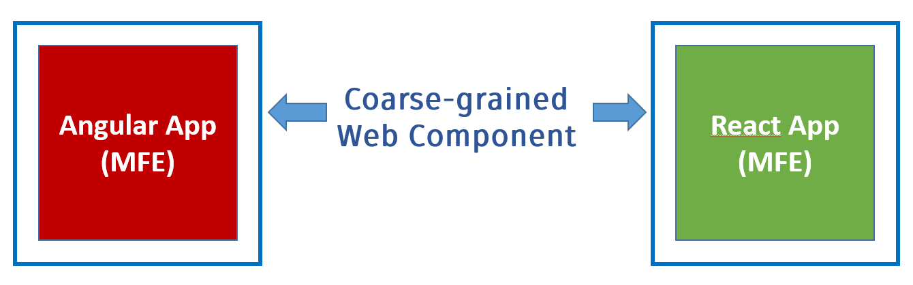

# Multi-Framework and -Version Micro Frontends with Module Federation: The Good, the Bad, the Ugly

Most articles on Module Federation assume, you have just one version of your major Framework, e. g. Angular. However, what to do if you have to mix and match different versions or different frameworks? No worries, we got you covered. This chapter uses an example to explain how to develop such a scenario in 4 steps. 


Please find the live demo and the source code here:

- [Live Example](https://red-ocean-0fe4c4610.azurestaticapps.net)
- [Source Code Shell](https://github.com/manfredsteyer/multi-framework-version)
- [Source Code for Micro Frontend](https://github.com/manfredsteyer/angular-app1)
- [Source Code for Micro Frontend with Routing](https://github.com/manfredsteyer/angular3-app)
- [Source Code for Micro Frontend with Vue](https://github.com/manfredsteyer/vue-js)
- [Source Code for Micro Frontend with React](https://github.com/manfredsteyer/react-app)
- [Source Code for Micro Frontend with AngularJS](https://github.com/manfredsteyer/angularjs-app)

## Pattern or Anti-Pattern?

In his recent talk on [Micro Frontend Anti Patterns](https://www.youtube.com/watch?v=asXPRrg6M2Y), my friend [Luca Mezzalira](https://twitter.com/lucamezzalira) mentions using several frontend frameworks in one application. He calls this anti pattern the [Hydra of Lerna](https://en.wikipedia.org/wiki/Lernaean_Hydra). This name comes from a water monster in Greek and Roman mythology having several heads. 

There's a good reason for considering this an anti pattern: Current frameworks are not prepared to be bootstrapped in the same browser tab together with other frameworks or other versions of themselves. Besides leading to bigger bundles, this also increases the complexity and calls for some workarounds.  

However, Luca also explains that there are some situations where such an approach **might be needed**. He brings up the following examples:

1. Dealing with legacy systems
2. Migration to a new UI framework/ library
3. After merging companies with different tech stacks

This all speaks right from my heart and perfectly correlates with my "story" I'm telling a lot at conferences and at our company workshops: Try to avoid mixing frameworks and versions in the browser. However, if you have a good reason for doing it after ruling out the alternatives, there are ways for making Multi-Framework/ Multi-Version Micro Frontends work.

As always in the area of software architecture -- and probably in life as general -- it's all about **trade-offs**. So if you find out that this approach comes with less drawbacks than alternatives with respect to your very **architecture goals**, lets go for it.

## Micro Frontends as Web Components? 

While not 100% necessary, it can be a good idea to wrap your Micro Frontends in Web Components.



This brings several advantages:

* Abstracting differences between frameworks
* Mounting/ Unmounting Web Components is easy
* Shadow DOM helps with isolating CSS styles
* Custom Events and Properties allow to communicate

The first two options correlate with each other. We need to display and hide our Micro Frontends on demand, e. g. when activating a specific menu item. As each Micro Frontend is a self-contained frontend, this also means we have to bootstrap it on demand in the middle of our page. For this, different frameworks provide different methods or functions. When wrapped into Web Components, all we need to do is to add or remove the respective HTML element registered with the Web Component.

Isolating CSS styles via Shadow DOM helps to make teams more self-sufficient. However, I've seen that quite often teams trade in a bit of independence for some global CSS rules provided by the shell. In this case, the Shadow DOM emulation provided by Angular (with and without Web Components) is a good choice: While it prevents styles from other components bleeding into yours, it allows to share global styles too. 

Also, Custom Events and Properties seem to be a good choice for communicating at first glance. However, for the sake of simplicity, meanwhile, I prefer a simple object acting as a mediator or "mini message bus" in the global namespace.

In general, we have to see that such Web Components wrapping whole Micro Frontends are no typical Web Components. I'm stressing this out because sometimes people confuse the idea of a (Web) Component with the idea of a Micro Frontend or use these terms synonymously. This leads to far too fine-grained Micro Frontends causing lots of issues with integration. 

## Do we also need Module Federation?

Module Federation makes it easy to load parts of other applications into a host. In our case, the host is the Micro Frontend shell. Also, Module Federation allows for sharing libraries between the shell and the micro frontends. 

It even comes with several strategies for dealing with versions mismatches. For instance, we could configure it to reuse an existing library if the versions match exactly. Otherwise, we could instruct it to load the version is has been built with. 

Loading the discussed Micro Frontends with Module Federation hence gives us the best of both worlds. We can share libraries when possible and load our own when not:


## Implementation in 4 steps

Now, after discussing the implementation strategy, let's look at the promised 4 steps for building such a solution.

### Step 1: Wrap your Micro Frontend in a Web Component

For wrapping Angular-based Micro Frontends in a Web Component, you can go with Angular Elements provided by the Angular team. Install it via npm:

```bash
npm i @angular/elements
```

After installing it, adjust your `AppModule` as follows:

```typescript
import { createCustomElement } from '@angular/elements';
[...]

@NgModule({
  [...]
  declarations: [
    AppComponent
  ],
  bootstrap: [] // No bootstrap components!
})
export class AppModule implements DoBoostrap {
  constructor(private injector: Injector) {
  }

  ngDoBootstrap() {
    const ce = createCustomElement(AppComponent, {injector: this.injector});
    customElements.define('angular1-element', ce);
  }

}
```

This does several things:

* By going with an empty bootstrap array, Angular won't directly bootstrap any component on startup. However, in such cases, Angular demands us of placing a custom bootstrap logic in the method `ngDoBootstrap` described by the `DoBoostrap` interface.
* `ngDoBootstrap` uses Angular Elements' `createCustomElement` to wrap your `AppComponent` in a Web Component. To make it work with DI, you also need to pass the current `Injector`.
* The method `customElements.define` registers the Web Component under the name `angular1-element` with the browser. 

The result of this is that the browser will mount the Application in every `angular1-element` tag that occurs in your application.

If your framework doesn't directly support web components, you can also hand-wrap your application. For instance, a React component could be wrapped as follows:

```typescript
// app.js
import React from 'react'
import ReactDOM from 'react-dom'

class App extends React.Component {

  render() {
    const reactVersion = require('./package.json').dependencies['react'];

    return ([
        <h1>
          React
        </h1>,
        <p>
          React Version: {reactVersion}
        </p>
    ])
  }
}

class Mfe4Element extends HTMLElement {
  connectedCallback() {
    ReactDOM.render(<App/>, this);
  }
}

customElements.define('react-element', Mfe4Element);
```

### Step 2: Expose your Web Component via Module Federation

To be able to load the Micro Frontends into the shell, we need to expose the Web Components wrapping them via Module Federation. For this, add the package `@angular-architects/module-federation` to your Angular-based Micro Frontend:

```bash
ng add @angular-architects/module-federation
```

This installs and initializes the package. If you go with Nx and Angular, its more usual to do both steps separately:

```bash
npm i @angular-architects/module-federation -D

ng g @angular-architects/module-federation:init 
```

In the case of other frameworks like React or Vue, this all is just about adding the `ModuleFederationPlugin` to the webpack configuration. Please remember that you need to bootstrap your application asynchronously in most cases. Hence, your entry file will more or less just contain a dynamic `import` loading the rest of the application. 

For this reason, the above discussed React-based Micro Frontend uses the following `index.js` as the entry point:

```typescript
// index.js
import('./app');
```

Similarly, `@angular-architects/module-federation` is moving the bootstrap code from `main.ts` into a newly created `bootstrap.ts` and imports it:

```typescript
// main.ts
import('./bootstrap');
```

This common pattern gives Module Federation the necessary time for loading the shared dependencies.

After setting up Module Federation, expose the Web Component-based wrapper via the webpack configuration:

```typescript
// webpack.config.js
[...]
module.exports = {
  [...]
  plugins: [
    new ModuleFederationPlugin({

      name: "angular1",
      filename: "remoteEntry.js",

      exposes: {
        './web-components': './src/bootstrap.ts',
      },

      shared: share({
        "@angular/core": { requiredVersion: "auto" },
        "@angular/common": { requiredVersion: "auto" },
        "@angular/router": { requiredVersion: "auto" },
        "rxjs": { requiredVersion: "auto" },

        ...sharedMappings.getDescriptors()
      }),
      [...]
    })
  ],
};
```

> As the goal is to show how to mix different versions of Angular, this Micro Frontend uses Angular 12 while the shell shown below uses a more recent Angular version. Hence, also an older version of @angular-architects/module-federation and the original more verbose configuration is used. Please find [details on different versions](https://github.com/angular-architects/module-federation-plugin/blob/main/migration-guide.md) here.

The settings in the section `shared` make sure we can mix several versions of a framework but also reuse an already loaded one if the version numbers fit exactly. For this, `requiredVersion` should point to the installed version -- the one, you also find in your `package.json`. The helper method `share` that comes with `@angular-architects/module-federation` takes care of this when setting `requiredVersion` to `auto`.

>While according to semantic versioning an Angular library with a higher minor or patch version is backwards compatible, there are no such guarantees for already compiled code. The reason is that the code emitted by the Angular compiler uses Angular's internal APIs semantic does not apply for. Hence, you should use an exact version number (without any `^` or `~`).

### Step 3: Perform Workaround for Angular

To make several Angular application work together in one browser window, we need [some workarounds](https://www.angulararchitects.io/aktuelles/multi-framework-and-version-micro-frontends-with-module-federation-the-good-the-bad-the-ugly/). The good message is, we've implemented them in a very slim add-on to `@angular-architects/module-federation` called [@angular-architects/module-federation-tools](https://www.npmjs.com/package/@angular-architects/module-federation-tools). 

Just install it (`npm i @angular-architects/module-federation-tools -D`) into **both, your Micro Frontends and your shell**. Then, bootstrap your shell and your Micro Frontends with its `bootstrap` method instead of with Angular's one:

```typescript
// main.ts
import { AppModule } from './app/app.module';
import { environment } from './environments/environment';
import { bootstrap } from '@angular-architects/module-federation-tools';

bootstrap(AppModule, {
  production: environment.production,
  appType: 'microfrontend'  // for micro frontend
  // appType: 'shell',      // for shell
});
```

### Step 4: Load Micro Frontends into the Shell

Also, enable Module Federation in your shell. If it is an Angular-based shell, add the `@angular-architects/module-federation` plugin:

```bash
ng add @angular-architects/module-federation
```

As mentioned above, in the case of Nx and Angular, perform the installation and initialization separately:

```bash
npm i @angular-architects/module-federation -D
ng g @angular-architects/module-federation:init --type host
```

> The switch --type host generates a typical host configuration. It is available since plugin version 14.3 and hence since Angular 14.

For this example, we don't need to adjust the generated ``webpack.config.js``:

```typescript
// webpack.config.js
const { shareAll, withModuleFederationPlugin } = require('@angular-architects/module-federation/webpack');

module.exports = withModuleFederationPlugin({

    shared: {
        ...shareAll({ singleton: true, strictVersion: true, requiredVersion: 'auto' }),
    },

});
```

Other settings provided by the `ModuleFederationPlugin` aren't needed here. 

After this, all you need is a lazy route, loading the Micro Frontends in question:

```javascript
import { WebComponentWrapper, WebComponentWrapperOptions } from '@angular-architects/module-federation-tools';

export const APP_ROUTES: Routes = [
    [...]
    {
        path: 'react',
        component: WebComponentWrapper,
        data: {
            remoteEntry: 'https://witty-wave-0a695f710.azurestaticapps.net/remoteEntry.js',
            remoteName: 'react',
            exposedModule: './web-components',
            
            elementName: 'react-element'
        } as WebComponentWrapperOptions
    },
    [...]
]
```

The `WebComponentWrapper` used here is provided by `@angular-architects/module-federation-tools`. It just loads the Web Component via Module Federation using the given key data. In the shown case, this react application is deployed as an Azure Static Web App. The values for `remoteName` and `exposedModule` can be found in the Micro Frontend's webpack configuration.

The wrapper component also creates an HTML element with the name `react-element` the Web Component is mounted in.

If you load a Micro Frontend compiled with Angular 13 or higher, you need to set the property `type` to `module`:

```typescript
export const APP_ROUTES: Routes = [
    [...]
    {
        path: 'angular1',
        component: WebComponentWrapper,
        data: {
          type: 'module',
          remoteEntry: 'https://your-path/remoteEntry.js',
          exposedModule: './web-components',

          elementName: 'angular1-element'
        } as WebComponentWrapperOptions
    },
    [...]
}
```

Also, in the case of Angular 13+ you don't need the `remoteName` property. The reason for these two differences is that Angular CLI 13+ don't emit "old-style JavaScript" files anymore but JavaScript modules. Their handling in Module Federation is a bit different.

If your Micro Frontend brings its own router, you need to tell your shell that the Micro Frontend will append further segments to the URL. For this, you can go with the `startsWith` matcher also provided by `@angular-architects/module-federation-tools`:

```typescript
import { 
    startsWith, 
    WebComponentWrapper, 
    WebComponentWrapperOptions 
} 
from '@angular-architects/module-federation-tools';

[...]

export const APP_ROUTES: Routes = [
    [...]
    {
        matcher: startsWith('angular3'),
        component: WebComponentWrapper,
        data: {
            [...]
        } as WebComponentWrapperOptions
    },
    [...]
}
```

To make this work, the path prefix `angular3` used here needs to be used by the Micro Frontend too. As the routing config is just a data structure, you will find ways to add it dynamically. 

### Result

The result of this endeavor is an application that consists of different frameworks respective framework-versions:


Whenever possible, the framework is shared. Otherwise, a new framework (version) is loaded by Module Federation. Another advantage of this approach is that it works without any additional meta framework. We just need some thin helper functions. 

The drawbacks are increased complexity and bundle sizes. Also, we are leaving the path of the supported use cases: None of the frameworks has been officially tested together with other frameworks or other versions of itself in the same browser tab.