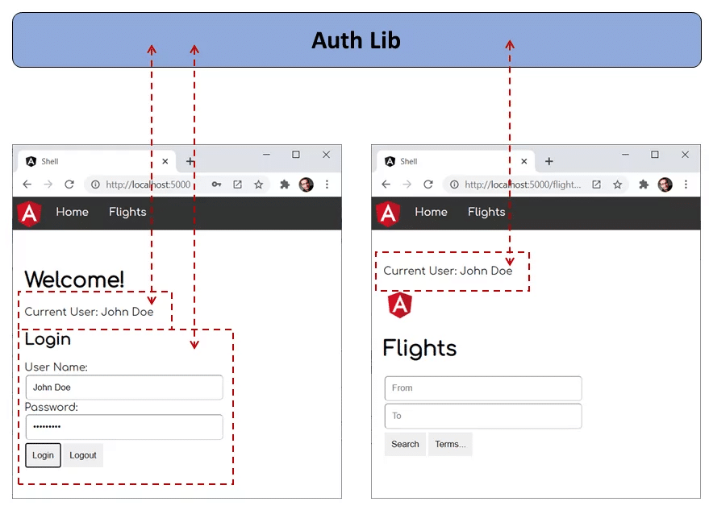
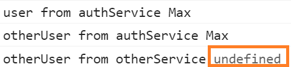
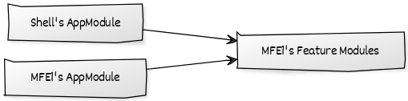
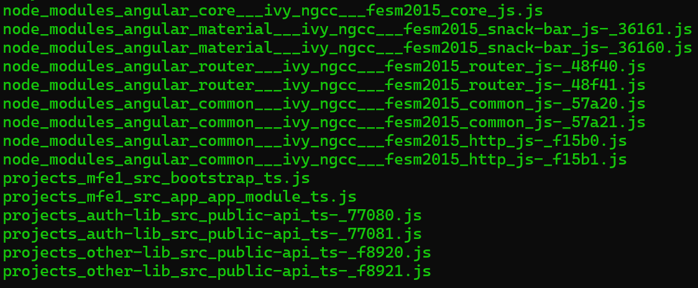

# Pitfalls with Module Federation and Angular

In this chapter, I'm going to destroy my Module Federation example! However, you don't need to worry: It's for a very good reason. The goal is to show typical pitfalls that come up when using Module Federation together with Angular. Also, I present some strategies for avoiding these pitfalls. 

While Module Federation is really a straight and thoroughly thought through solution, using Micro Frontends means in general to make runtime dependencies out of compile time dependencies. As a result, the compiler cannot protect you as well as you are used to. 

If you want to try out the examples used here, you can fork this [example](https://github.com/manfredsteyer/module-federation-plugin-example.git). 

## "No required version specified" and Secondary Entry Points

For the first pitfall I want to talk about, let's have a look to our `shell`'s `webpack.config.js`. Also, let's simplify the `shared` node as follows:

```typescript
shared: {
  "@angular/core": { singleton: true, strictVersion: true },
  "@angular/common": { singleton: true, strictVersion: true },
  "@angular/router": { singleton: true, strictVersion: true },
  "@angular/common/http": { singleton: true, strictVersion: true }, 
},
```

As you see, we don't specify a `requiredVersion` anymore. Normally this is not required because webpack Module Federation is very smart with finding out which version you use.

However, now, when compiling the shell  (`ng build shell`), we get the following error:


> shared module @angular/common - Warning: No required version specified and unable to automatically determine one. Unable to find required version for "@angular/common" in description file (C:\Users\Manfred\Documents\artikel\ModuleFederation-Pitfalls\example\node_modules\@angular\common\package.json). It need to be in dependencies, devDependencies or peerDependencies.

The reason for this is the secondary entry point `@angular/common/http` which is a bit like an npm package within an npm package. Technically, it's just another file exposed by the npm package `@angular/common`. 

Unsurprisingly, `@angular/common/http` uses `@angular/common` and webpack recognizes this. For this reason, webpack wants to find out which version of `@angular/common` is used. For this, it looks into the npm package's `package.json` (`@angular/common/package.json`) and browses the dependencies there. However, `@angular/common` itself is not a dependency of `@angular/common` and hence, the version cannot be found.

You will have the same challenge with other packages using secondary entry points, e. g. `@angular/material`.

To avoid this situation, you can assign versions to all shared libraries by hand:

```typescript
shared: {
  "@angular/core": { singleton: true, strictVersion: true, requiredVersion: '12.0.0' },
  "@angular/common": { singleton: true, strictVersion: true, requiredVersion: '12.0.0' },
  "@angular/router": { singleton: true, strictVersion: true, requiredVersion: '12.0.0' },
  "@angular/common/http": { singleton: true, strictVersion: true, requiredVersion: '12.0.0' }, 
},
```

Obviously, this is cumbersome and so we came up with another solution. Since version 12.3, [@angular-architects/module-federation](https://www.npmjs.com/package/@angular-architects/module-federation) comes with an unspectacular looking helper function called `shared`. If your `webpack.config.js` was generated with this or a newer version, it already uses this helper function.


```typescript
[...]

const mf = require("@angular-architects/module-federation/webpack");
[...]
const share = mf.share;

[...]

shared: share({
  "@angular/core": { singleton: true, strictVersion: true, requiredVersion: 'auto' },
  "@angular/common": { singleton: true, strictVersion: true, requiredVersion: 'auto' },
  "@angular/router": { singleton: true, strictVersion: true, requiredVersion: 'auto' },
  "@angular/common/http": { singleton: true, strictVersion: true, requiredVersion: 'auto' }, 
  "@angular/material/snack-bar": { singleton: true, strictVersion: true, requiredVersion:'auto' }, 

})
```

As you see here, the `share` function wraps the object with the shared libraries. It allows to use `requiredVersion: 'auto'` and converts the value `auto` to the value found in your shell's (or micro frontend's) `package.json`.


## Unobvious Version Mismatches: Issues with Peer Dependencies 

Have you ever just ignored a peer dependency warning? Honestly, I think we all know such situations. And ignoring them is often okay-ish as we know, at runtime everything will be fine. Unfortunately, such a situation can confuses webpack Module Federation when trying to auto-detect the needed versions of peer dependencies. 

To demonstrate this situation, let's install `@angular/material` and `@angular/cdk` in a version that is at least 2 versions behind our Angular version. In this case, we should get a peer dependency warnings.

In my case this is done as follows:

```bash
npm i @angular/material@10
npm i @angular/cdk@10 
```

Now, let's switch to the Micro Frontend's (`mfe1`) `FlightModule` to import the `MatSnackBarModule`:

```typescript
[...]
import { MatSnackBarModule  } from '@angular/material/snack-bar';
[...]

@NgModule({
  imports: [
    [...]
    // Add this line
    MatSnackBarModule,
  ],
  declarations: [
    [...]  
  ]
})
export class FlightsModule { }
```

To make use of the snack bar in the `FlightsSearchComponent`, inject it into its constructor and call its `open` method:

```typescript
[...]
import { MatSnackBar } from '@angular/material/snack-bar';

@Component({
  selector: 'app-flights-search',
  templateUrl: './flights-search.component.html'
})
export class FlightsSearchComponent {
  constructor(snackBar: MatSnackBar) {
    snackBar.open('Hallo Welt!');
  }
}
```

Also, for this experiment, make sure the `webpack.config.js` in the project `mfe1` does **not** define the versions of the dependencies shared:

```typescript
shared: {
  "@angular/core": { singleton: true, strictVersion: true },
  "@angular/common": { singleton: true, strictVersion: true },
  "@angular/router": { singleton: true, strictVersion: true },
  "@angular/common/http": { singleton: true, strictVersion: true }, 
},
```

Not defining these versions by hand forces Module Federation into trying to detect them automatically. However, the peer dependency conflict gives Module Federation a hard time and so it brings up the following error:  

> Unsatisfied version 12.0.0 of shared singleton module @angular/core (required ^10.0.0 || ^11.0.0-0) ; Zone: <root> ; Task: Promise.then ; Value: Error: Unsatisfied version 12.0.0 of shared singleton module @angular/core (required ^10.0.0 || ^11.0.0-0)

While `@angular/material` and `@angular/cdk` officially need `@angular/core` 10, the rest of the application already uses `@angular/core` 12. This shows that webpack looks into the `package.json` files of all the shared dependencies for determining the needed versions.

In order to resolve this, you can set the versions by hand or by using the helper function `share` that uses the version found in your project's `package.json`:

```typescript
[...]

const mf = require("@angular-architects/module-federation/webpack");
[...]
const share = mf.share;

[...]

shared: share({
  "@angular/core": { singleton: true, strictVersion: true, requiredVersion: 'auto' },
  "@angular/common": { singleton: true, strictVersion: true, requiredVersion: 'auto' },
  "@angular/router": { singleton: true, strictVersion: true, requiredVersion: 'auto' },
  "@angular/common/http": { singleton: true, strictVersion: true, requiredVersion: 'auto' }, 
  "@angular/material/snack-bar": { singleton: true, strictVersion: true, requiredVersion:'auto' }, 
})
```

## Issues with Sharing Code and Data

In our example, the `shell` and the micro frontend `mfe1` share the `auth-lib`. Its `AuthService` stores the current user name. Hence, the `shell` can set the user name and the lazy loaded `mfe1` can access it:



If `auth-lib` was a traditional npm package, we could just register it as a shared library with module federation. However, in our case, the `auth-lib` is just a library in our monorepo. And libraries in that sense are just folders with source code. 

To make this folder look like a npm package, there is a path mapping for it in the `tsconfig.json`:

```json
"paths": {
  "auth-lib": [
    "projects/auth-lib/src/public-api.ts"
  ]
}
```

Please note that we are directly pointing to the `src` folder of the `auth-lib`. Nx does this by default. If you go with a traditional CLI project, you need to adjust this by hand.

Fortunately, Module Federation got us covered with such scenarios. To make configuring such cases a bit easier as well as to prevent issues with the Angular compiler, `@angular-architects/module-federation` provides a configuration property called:

```typescript
module.exports = withModuleFederationPlugin({

    // Shared packages:
    shared: [...],

    // Explicitly share mono-repo libs:
    sharedMappings: ['auth-lib'],

});
```

> **Important:** Since Version 14.3, the withModuleFederationPlugin helper automatically shares **all** mapped paths if you don't use the property `sharedMappings` at all. Hence, the issue described here, will not happen.

Obviously, if you don't opt-in into sharing the library in one of the projects, these project will get their own copy of the `auth-lib` and hence sharing the user name isn't possible anymore. 

However, there is a constellation with the same underlying issue that is everything but obvious. To construct this situation, let's add another library to our monorepo:

```bash
ng g lib other-lib
```

Also, make sure we have a path mapping for it pointing to its source code:

```json
"paths": {
  "other-lib": [
    "projects/other-lib/src/public-api.ts"
  ],
}
```

Let's assume we also want to store the current user name in this library:

```typescript
import { Injectable } from '@angular/core';

@Injectable({
  providedIn: 'root'
})
export class OtherLibService {

  // Add this:
  userName: string;

  constructor() { }

}
```

And let's also assume, the `AuthLibService` delegates to this property:

```typescript
import { Injectable } from '@angular/core';
import { OtherLibService } from 'other-lib';

@Injectable({
  providedIn: 'root'
})
export class AuthLibService {

  private userName: string;

  public get user(): string {
    return this.userName;
  }

  public get otherUser(): string {
    // DELEGATION!
    return this.otherService.userName;
  }

  constructor(private otherService: OtherLibService) { }

  public login(userName: string, password: string): void {
    // Authentication for **honest** users TM. (c) Manfred Steyer
    this.userName = userName;

    // DELEGATION!
    this.otherService.userName = userName;
  }

}
```

The shell's `AppComponent` is just calling the `login` method:

```typescript
import { Component } from '@angular/core';
import { AuthLibService } from 'auth-lib';

@Component({
  selector: 'app-root',
  templateUrl: './app.component.html'
})
export class AppComponent {
  title = 'shell';

  constructor(
    private service: AuthLibService
    ) {
      
    this.service.login('Max', null);
  }

}
```

However, now the Micro Frontend has three ways of getting the defined user name:

```typescript
import { HttpClient } from '@angular/common/http';
import {Component} from '@angular/core';
import { AuthLibService } from 'auth-lib';
import { OtherLibService } from 'other-lib';

@Component({
  selector: 'app-flights-search',
  templateUrl: './flights-search.component.html'
})
export class FlightsSearchComponent {
  constructor(
    authService: AuthLibService,
    otherService: OtherLibService) {

    // Three options for getting the user name:
    console.log('user from authService', authService.user);
    console.log('otherUser from authService', authService.otherUser);
    console.log('otherUser from otherService', otherService.userName);

  }
}
```

At first sight, all these three options should bring up the same value. However, if we only share `auth-lib` **but not** `other-lib`, we get the following result:



As `other-lib` is not shared, both, `auth-lib` but also the micro frontend get their very own version of it. Hence, we have two instances of it in place here. While the first one knows the user name, the second one doesn't.

What can we learn from this? Well, it would be a good idea to also share the dependencies of our shared libraries (regardless of sharing libraries in a monorepo or traditional npm packages!).

This also holds true for secondary entry points our shared libraries belong to.

*Hint:* `@angular-architects/module-federation` comes with a helper function `shareAll` for sharing all dependencies defined in your project's `package.json`:

```typescript
shared: {
  ...shareAll({ 
      singleton: true, 
      strictVersion: true, 
      requiredVersion: 'auto' 
  }),
}
```

This can at least lower the pain in such cases for prototyping. Also, you can make `share` and `shareAll` to include all secondary entry points by using the property `includeSecondaries`:

```typescript
shared: share({
    "@angular/common": { 
        singleton: true, 
        strictVersion: true,
        requiredVersion: 'auto',
        includeSecondaries: {
            skip: ['@angular/http/testing']
        }
    },
    [...]
})
```

## NullInjectorError: Service expected in Parent Scope (Root Scope)

Okay, the last section was a bit difficult. Hence, let's proceed with an easier one. Perhaps you've seen an error like this here:

```json
ERROR Error: Uncaught (in promise): NullInjectorError: R3InjectorError(FlightsModule)[HttpClient -> HttpClient -> HttpClient -> HttpClient]: 
  NullInjectorError: No provider for HttpClient!
NullInjectorError: R3InjectorError(FlightsModule)[HttpClient -> HttpClient -> HttpClient -> HttpClient]: 
  NullInjectorError: No provider for HttpClient!
```

It seems like, the loaded Micro Frontend `mfe1` cannot get hold of the `HttpClient`. Perhaps it even works when running `mfe1` in standalone mode.

The reason for this is very likely that we are not exposing the whole Micro Frontend via Module Federation but only selected parts, e. g. some Features Modules with Child Routes:



Or to put it in another way: **DO NOT** expose the Micro Frontend's `AppModule`. However, if we expect the `AppModule` to provide some global services like the `HttpClient`, we also need to do this in the shell's `AppModule`:

```typescript
// Shell's AppModule
@NgModule({
  imports: [
    [...]
    // Provide global services your micro frontends expect:
    HttpClientModule,
  ],
  [...]
})
export class AppModule { }
```


## Several Root Scopes

In a very simple scenario you might try to just expose the Micro Frontend's `AppModule`.


As you see here, now, the shell's `AppModule` uses the Micro Frontend's `AppModule`. If you use the router, you will get some initial issues because you need to call `RouterModule.forRoot` for each `AppModule` (Root Module) on the one side while you are only allowed to call it once on the other side.

But if you just shared components or services, this might work at first sight. However, the actual issue here is that Angular creates a root scope for each root module. Hence, we have two root scopes now. This is something no one expects. 

Also, this duplicates all shared services registered for the root scope, e. g. with `providedIn: 'root'`. Hence, both, the shell and the Micro Frontend have their very own copy of these services and this is something, no one is expecting.

A **simple but also non preferable solutions** is to put your shared services into the `platform` scope:

```typescript
// Don't do this at home!
@Injectable({
  providedIn: 'platform'
})
export class AuthLibService {
}
```

However, normally, this scope is intended to be used by Angular-internal stuff. Hence, the only clean solution here is to not share your `AppModule` but only lazy feature modules. By using this practice, you assure (more or less) that these feature modules work the same when loaded into the shell as when used in standalone-mode.

## Different Versions of Angular 

Another, less obvious pitfall you can run into is this one here:

```json
node_modules_angular_core___ivy_ngcc___fesm2015_core_js.js:6850 ERROR Error: Uncaught (in promise): Error: inject() must be called from an injection context
Error: inject() must be called from an injection context
    at pr (node_modules_angular_core___ivy_ngcc___fesm2015_core_js.2fc3951af86e4bae0c59.js:1)
    at gr (node_modules_angular_core___ivy_ngcc___fesm2015_core_js.2fc3951af86e4bae0c59.js:1)
    at Object.e.ɵfac [as factory] (node_modules_angular_core___ivy_ngcc___fesm2015_core_js.2fc3951af86e4bae0c59.js:1)
    at R3Injector.hydrate (node_modules_angular_core___ivy_ngcc___fesm2015_core_js.js:11780)
    at R3Injector.get (node_modules_angular_core___ivy_ngcc___fesm2015_core_js.js:11600)
    at node_modules_angular_core___ivy_ngcc___fesm2015_core_js.js:11637
    at Set.forEach (<anonymous>)
    at R3Injector._resolveInjectorDefTypes (node_modules_angular_core___ivy_ngcc___fesm2015_core_js.js:11637)
    at new NgModuleRef$1 (node_modules_angular_core___ivy_ngcc___fesm2015_core_js.js:25462)
    at NgModuleFactory$1.create (node_modules_angular_core___ivy_ngcc___fesm2015_core_js.js:25516)
    at resolvePromise (polyfills.js:10658)
    at resolvePromise (polyfills.js:10610)
    at polyfills.js:10720
    at ZoneDelegate.invokeTask (polyfills.js:10247)
    at Object.onInvokeTask (node_modules_angular_core___ivy_ngcc___fesm2015_core_js.js:28753)
    at ZoneDelegate.invokeTask (polyfills.js:10246)
    at Zone.runTask (polyfills.js:10014)
    at drainMicroTaskQueue (polyfills.js:10427)
```

With `inject() must be called from an injection context` Angular tells us that there are several Angular versions loaded at once.

To provoke this error, adjust your shell's `webpack.config.js` as follows:

```typescript
shared: share({
  "@angular/core": { requiredVersion: 'auto' },
  "@angular/common": { requiredVersion: 'auto' },
  "@angular/router": { requiredVersion: 'auto' },
  "@angular/common/http": { requiredVersion: 'auto' }, 
})
```

Please note, that these libraries are not configured to be singletons anymore. Hence, Module Federation allows loading several versions of them if there is no highest compatible version. 

Also, you have to know that the shell's `package.json` points to Angular 12.0.0 *without* ^ or ~, hence we exactly need this very version. 

If we load a Micro Frontend that uses a different Angular version, Module Federation falls back to loading Angular twice, once the version for the shell and once the version for the Micro Frontend. You can try this out by updating the shell's `app.routes.ts` as follows:

```typescript
{
  path: 'flights',
  loadChildren: () => loadRemoteModule({
      remoteEntry: 'https://brave-plant-03ca65b10.azurestaticapps.net/remoteEntry.js',
      remoteName: 'mfe1',
      exposedModule: './Module'
    })
    .then(m => m.AppModule) 
},
```

To make exploring this a bit easier, I've provided this Micro Frontend via a Azure Static Web App found at the shown URL.

If you start your shell and load the Micro Frontend, you will see this error.

What can we learn here? Well, when it comes to your leading, stateful framework -- e. g. Angular -- it's a good idea to define it as a singleton. I've written down some details on this in the chapter on version mismatches.

If you really want to mix and match different versions of Angular, I've got you covered with with another chapter of this book. However, you know what they say: Beware of your wishes.

## Bonus: Multiple Bundles

Let's finish this tour with something, that just looks like an issue but is totally fine. Perhaps you've already seen that sometimes Module Federation generated duplicate bundles with slights different names:



The reason for this duplication is that Module Federation generates a bundle **per shared library per consumer**. The consumer in this sense is the federated project (shell or Micro Frontend) or a shared library. This is done to have a fall back bundle for resolving version conflicts. In general this makes sense while in such a very specific case, it doesn't bring any advantages. 

However, if everything is configured in the right way, only one of these duplicates should be loaded at runtime. As long as this is the case, you don't need to worry about duplicates. 

## Conclusion

Module Federation is really clever when it comes to auto-detecting details and compensating for version mismatches. However, it can only be as good as the meta data it gets. To avoid getting off the rails, you should remember the following:

- **requiredVersion**: Assign the `requiredVersion` by hand, esp. when working with secondary entrypoints and when having peer dependency warnings. The plugin `@angular-architects/module-federation` get's you covered with its `share` helper function allowing the option `requiredVersion: 'auto'` that takes the version number from your project's `package.json`.
- **Share dependencies of shared libraries** too, esp. if they are also used somewhere else. Also think on secondary entry points.
- Make the **shell provide global services** the loaded Micro Frontends need, e. g. the `HttpClient` via the `HttpClientModule`.
- Never expose the `AppModule` via Module Federation. Prefer to expose lazy Feature modules.  
- Use `singleton:true` for Angular and other stateful framework respective libraries.
- Don't worry about **duplicated bundles** as long as only one of them is loaded at runtime.

