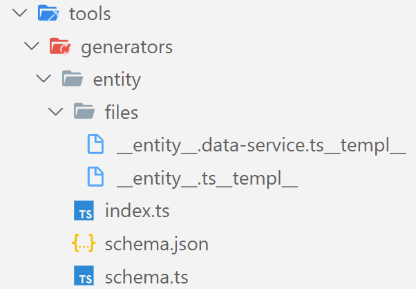
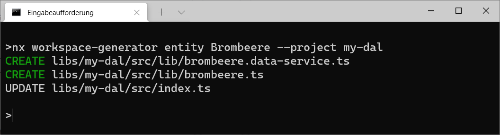

# Bonus Chapter: Automate Your Architectures with Nx Workspace Generators

In the first part of the book, I've used the [@angular-architects/ddd](https://www.npmjs.com/package/@angular-architects/ddd) plugin for automating the creation of domains and layers. I really want to encourage you to check this plugin out as it makes dealing with huge applications easier. However, sometimes you need your own tasks to be automated. Hence, this chapter shows how to do this with Nx Generators.

## Schematics vs Generators

Both, Angular beginners and experts appreciate the CLI command ``ng generate``. It generates recurring structures, such as the basic structure of components or modules, and thus automates monotonous tasks. Behind this instruction are code generators called schematics. Everyone can leverage the CLI's Schematics API to automate their own tasks. Unfortunately, this API is not always intuitive and often uses unneeded indirections.

Exactly this impassability is solved by Nx which provides a simplified version of the Schematics API called Generators. In this chapter, I'll cover the Generators API. The [source code](https://github.com/manfredsteyer/nx-workspace-generators) can be found [here](https://github.com/manfredsteyer/nx-workspace-generators).

## Workspace Generators

The easiest way to try out the Generator API are so-called workspace generators. These are generators that are not distributed via npm, but are placed directly in an Nx workspace (monorepo). Such a workspace generator can be created with the following command:

```bash
ng generate @nrwl/workspace: workspace-generator entity
```

The generator created here has the task of setting up an entity and data access service within a data access library. The example is deliberately chosen so that it contains as many generator concepts as possible.

The command places some boilerplate code for the generator in the file ``tools/generators/entity/index.ts``. Even if we are going to replace this boilerplate with our own code, it is worth taking a look to get to know generators:

```typescript
export default async function (host: Tree, schema: any) {

  await libraryGenerator(host, { name: schema.name });

  await formatFiles (host);

  return () => {
    installPackagesTask (host);
  };

}
```

The generator itself is just a function that takes two parameters. The first parameter of type ``Tree`` represents the file system that the generator changes. Strictly speaking, this is just a staging environment: the generator only writes the changes made to the disk at the end, when everything has worked. This prevents a generator that crashes in the middle of execution from leaving an inconsistent state.

If you want to initiate further commands after writing them back to the disk, you can place them within an anonymous function and return this function. An example of this is the call to ``installPackagesTask``, which triggers commands like ``npm install``, ``yarn``, etc. For these instructions to make sense, the generator must first write the desired package names into the ``package.json`` file.

The second parameter with the name ``schema`` is an object with the command line parameters used when calling the generator. We'll take a closer look at it below.

Calling ``libraryGenerator`` to generate a new library is also interesting here . It is actually a further generator - the one that is used with ``ng generate library``. With the classic Schematics API, calling other Schematics was a lot more complicated.

To be fully honest, the call to ``libraryGenerator`` found in the generated boiler plate only does a subset of ``ng generate library`` when calling it in an Angular project. It's taken from the package ``@nrwl/workspace/generators`` that works in a framework-agnostic way. To also perform the tasks specific for Angular, take the ``libraryGenerator`` function from the ``@nrwl/angular/generators`` package. This package also contains other Angular-specific generators you very likely use on a regular basis. Examples are generators for generating an angular application (``ng generate application``) but also for generating components or services (``ng generate component``, ``ng generate service``).

The instruction ``formatFiles`` which formats the entire source code, is useful at the end of generators to bring the generated code segments into shape. Nx uses the popular open source project Prettier for this. 

## Templates

In general, you could create new files using the passed ``Tree`` object's ``write`` method. However, using templates are in most cases more fitting. These are source code files with placeholders which the generator replaces with concrete values. While templates can be placed everywhere, it has become common practice to put them in a subfolder called ``files``:


 
The file names themselves can have placeholders. For example, the generator replaces the expression __entity__ in the file name with the content of a variable entity. Also, our generator replaces the __templ__ attached to the file with an empty string. With this trick, the template file does not end with ``.ts`` but in ``.ts__templ__``. Thus the TypeScript compiler ignores them. That is a good thing, especially since it does not know the placeholders and would report them as errors.

The templates themselves are similar to classic ASP, PHP, or JSP files:

```typescript
export class <%=classify(entity)%> {
    id: number;
    title: string;
    description: string;
}
```

Expressions within ``<%`` and ``%>`` evaluate generators and the combination of ``<%=`` and ``%>`` results in an output. This way, the example shown here outputs the name of the entity. The ``classify`` function formats this name so that it conforms to the rules and conventions of names for TypeScript classes.

>> The helper function ``names`` from ``@nrwl/devkit`` provides similar possibilities as the ``strings`` object. The expression ``names('someName').className``, for instance, returns a class name like ``string.classifiy`` does.

## Defining parameters

Generators can be controlled via command line parameters. You define the permitted parameters in the ``schema.json`` file that is generated in the same folder as the above shown ``index.ts``:

```json
{
  "cli": "nx" , 
  "id": "entity" , 
  "type": "object" , 
  "properties": { 
    "entity": { 
      "type": "string" , 
      "description": "Entity name" ,  
      "x-prompt": "Entity name" ,  
      "$default": { 
        "$source": "argv" , 
        "index": 0 
      }
    },
    "project": { 
      "type": "string" , 
      "description": "Project name"  
    }   
  },
  "required": [ "entity" ] 
}
``` 

It is a JSON scheme with the names, data types and descriptions of the parameters. Generators also use extensions introduced by Schematics. For example, the ``$default`` property defines that the value for the ``entity`` parameter can be found in the first command line argument (``"index": 0``) if the caller does not explicitly define it using ``--entity``.

With ``x-prompt``, the example specifies a question to be asked to the caller if there is no value for ``entity``. The generator uses the response received for this parameter.

In order to be able to use these parameters in a type-safe manner in the generator, it is recommended to provide a corresponding interface:

```typescript 
export interface EntitySchema {   
    entity : string; 
    project?: string; 
}
```

This interface is normally put into a ``schema.ts`` file. To avoid inconsistencies, it can be generated from the schema file using tools such as [json-schema-to-typescript](https://www.npmjs.com/package/json-schema-to-typescript).

## Implementing the Generator

Now we can turn to the implementation of the generator. For getting the command line parameters in a types way, the second parameter called ``schema`` is typed with the ``EntitySchema`` interface we've just been introduced:

```typescript
import { 
  Tree, 
  formatFiles, 
  readProjectConfiguration, 
  generateFiles, 
  joinPathFragments 
} from '@nrwl/devkit';
import { EntitySchema } from './schema';
import { strings } from '@angular-devkit/core';
[...]

export default async function (host: Tree , schema: EntitySchema) {        

  const workspaceConf = readWorkspaceConfiguration(host);

  if (!schema.project) {
    schema.project = workspaceConf.defaultProject;
  }

  [...]
  
  const projConf = readProjectConfiguration(host, schema.project);    
  
  [...]

  await libraryGenerator(host, { name: schema.name });

  generateFiles(
    host,
    path.join(__dirname , 'files'), 
    path.join(projConf.SourceRoot, 'lib'), 
    {
      entity: strings.dasherize(schema.entity), 
      templ: '' , 
      ... strings
    });

  addLibExport(host, projConf, schema.entity);  

  await formatFiles (host); 
}
```

The ``readWorkspaceConfiguration`` helper function reads the workspace configuration that can be found in files like ``nx.json`` or ``angular.json``. It contains the name of the default project to use if a specific project has not been specified or the npm scope used by the monorepo like ``@my-project``. 

The ``readProjectConfiguration`` helper function, however, reads a project configuration. For Angular projects, this data can be found in the ``angular.json`` file in the main project directory. Both functions can be found in the  ``@nrwl/devkit`` namespace.

The ``generateFiles`` function, which comes from ``@nrwl/devkit`` too, takes care of generating files based on the stored templates. In addition to the ``Tree`` object (``host``), which grants access to the staging environment, this function accepts the source directory with the templates as well as the target directory in which the generated files are to be placed.

The last parameter is an object with variables. In this way the desired entity name gets into the templates. The ``dasherize`` function transforms this name into a form that corresponds to the custom of filenames. The empty variable ``templ`` is necessary for the trick mentioned above and the object strings from the territory of the CLI (``@angular-devkit/core``) contains the ``classify`` function discussed above.

The function ``addLibExport`` is a self-written utility function. The next section goes into this in more detail.

## Update Existing Source Code

So that the generated entity and the data access service are not only visible in their own libraries, they must be exported via their library's ``index.ts``. This means that our generator has to expand these files. The ``addLibExport`` function takes care of this:

```typescript
import { Tree, ProjectConfiguration } from '@nrwl/devkit';
import * as path from 'path';
import { strings } from '@angular-devkit/core';

export function addLibExport(
  host: Tree, 
  projConfig: ProjectConfiguration, 
  entity: string): void {
    const indexTsPath = path.join(projConfig.sourceRoot, 'index.ts');
    const indexTs = host.read(indexTsPath).toString();
  
    const entityFileName = `./lib/${strings.dasherize(entity)}`;
    const entityName = strings.classify(entity);
    const dataServiceFileName = `./lib/${strings.dasherize(entity)}.data-service`;
    const dataServiceName = strings.classify(entity) + 'DataService';
  
    const updatedIndexTs = indexTs + `
  export { ${entityName} } from '${entityFileName}';
  export { ${dataServiceName} } from '${dataServiceFileName}';
  `;
  
    host.write(indexTsPath, updatedIndexTs);
}
```

This implementation just reads the ``index.ts`` file, adds some export statements and write it back. In very simple cases this straightforward approach is fine. For more advanced scenarios, one can leverage the ``applyChangesToString`` helper function:

```typescript
import { 
  Tree, 
  ProjectConfiguration, 
  applyChangesToString, 
  ChangeType 
} from '@nrwl/devkit';
import * as path from 'path';
import { strings } from '@angular-devkit/core';

export function addLibExport(
  host: Tree, 
  projConfig: ProjectConfiguration, 
  entity: string): void {
    const indexTsPath = path.join(projConfig.sourceRoot, 'index.ts');
    const indexTs = host.read(indexTsPath).toString();
  
    const entityFileName = `./lib/${strings.dasherize(entity)}`;
    const entityName = strings.classify(entity);
    const dataServiceFileName = `./lib/${strings.dasherize(entity)}.data-service`;
    const dataServiceName = strings.classify(entity) + 'DataService';
  
    const updatedIndexTs = applyChangesToString(
      indexTs,
      [
        {
          type: ChangeType.Insert,
          index: indexTs.length,
          text: `export { ${entityName} } from '${entityFileName}';\n`
        },
        {
          type: ChangeType.Insert,
          index: indexTs.length,  
          text: `export { ${dataServiceName} } from '${dataServiceFileName}';\n`
        },
        // Just for demonstration:
        // {
        //   type: ChangeType.Delete,
        //   start: 0,
        //   length: indexTs.indexOf('\n') + 1
        // }        
      ]
    )

    host.write(indexTsPath, updatedIndexTs);
}
```

The function ``applyChangesToString`` takes care of modifying existing source code. In addition to the current content, it receives an array with objects that describe the desired changes. These objects contain the index positions at which new code is to be inserted or deleted.

Any modification naturally changes the index positions of subsequent lines. Fortunately, we don't have to worry about that -- ``applyChangesToString`` takes this into account.

In this specific case, determining the index positions is very simple: We add the additional ``export`` instructions at the end of the file. In more complex cases, the ``TypeScript API`` can be used to parse existing source code files. 

>> The project [ts-query](https://www.npmjs.com/package/@phenomnomnominal/tsquery) helps to make the usage of the ``TypeScript API`` easier by providing a query language for searching for specific constructs in existing code files.

## Running the Generator

As our Generator is part of our monorepo, we can directly call it via the Nx CLI:

```
nx workspace-generator entity pumpkin-seed-oil --project my-dal
```

This call assumes that the new entity shall be created within a ``my-dal`` library in your monorepo.



## Additional Hints

While the example shown here contains most concepts provided by Generators, here I want to give you some additional hints out of my project experience. 

### Finding Helper Functions

The ``@nrwl/devkit`` package used above turns out to be a pure gold mine. It contains lots of helper functions that come in handy for your generators. For instance, they allow to read configuration files, read and write json files, or to add dependencies to your ``package.json``. Hence, taking some time to investigate functions exported by this package will be worth it.

Besides them, the generators provided by Nx have some additional one. Hence, you can benefit from looking up their implementations at GitHub. Here, I want to present some of them that helped me in my projects. 

For instance, the package ``@nrwl/workspace/src/utilities/ast-utils`` contains helper functions for dealing with TypeScript code like adding methods or checking for imports. The following example shows a function using this package for adding another import statement to a typescript file:

```TypeScript
import { Tree } from '@nrwl/devkit';
import * as ts from 'typescript';
import { insertImport } from '@nrwl/workspace/src/utilities/ast-utils';

export function addImportToTsModule(tree: Tree, filePath: string, importClassName: string, importPath: string) {
  const moduleSource = tree.read(filePath, 'utf-8');

  let sourceFile = ts.createSourceFile(
    filePath,
    moduleSource,
    ts.ScriptTarget.Latest,
    true
  );

  // Adds sth like: import { importClassName } from 'importPath'
  insertImport(
    tree,
    sourceFile,
    filePath,
    importClassName,
    importPath);
}
```

The ``sourceFile`` variable represents the source code file with a type provided by the TypeScript API.  

Another convenient helper function can be found in the ``@nrwl/angular/src/generators/utils`` namespace. Its called ``insertNgModuleProperty`` and allows adding metadata like ``imports`` or ``declarations`` to an ``NgModule``:

```typescript
import { Tree } from '@nrwl/devkit';
import { insertNgModuleProperty } from '@nrwl/angular/src/generators/utils';

[...]
const filePath = '[...]/app.module.ts';
const importClassName = 'MyOtherModule';

insertNgModuleProperty(tree, filePath, importClassName, 'imports');
```

### Using Existing Schematics

Sometimes, you need to reuse an Schematic provided by another package. Fortunately, the simplified Generators API is quite similar to the Schematic API. There are even bridges for converting between these two worlds. For instance, the ``wrapAngularDevkitSchematic`` helper wraps a Schematic into a Generator at runtime:

```TypeScript
import { wrapAngularDevkitSchematic } from '@nrwl/devkit/ngcli-adapter';

const generateStore = wrapAngularDevkitSchematic('@ngrx/schematics', 'store');

await generateStore(tree, {
  project: appNameAndDirectoryDasherized,
  root: true,
  minimal: true,
  module: 'app.module.ts',
  name: 'state',
});
```

In this case, the ``store`` schematic from the ``@ngrx/schematics`` package is wrapped and invoked. Of course, to make this work, you also need to install the ``@ngrx/schematics`` package.

### Using Existing Generators

Unlike schematics, existing generators are just functions that can be directly called within your generators. We already saw this when we looked at the generated boilerplate for our generator. It contained a call to ``libraryGenerator`` that was the implementation of ``ng g lib``.

Let's assume you have already installed the [@angular-architects/ddd](https://www.npmjs.com/package/@angular-architects/ddd) plugin that automates some of the stuff described in the first chapters of this book. Let's further assume, you need a bit more to be automated like referencing your design system or creating some default components. In this case, your generator could directly call this plugin's generators:

```typescript
import { Tree } from '@nrwl/devkit';
import generateFeature from '@angular-architects/ddd/src/generators/feature';

export default async function (tree: Tree, schema: any) {
  
  generateFeature(tree, { name:'my-feature', domain: 'my-domain' });

  // Do additional stuff with generated feature
  
}
```

## Conclusion

Even if Nx Generators look like classic Schematics at first glance, they simplify development enormously. They get by with fewer indirections and are therefore more straightforward. An example of this is the possibility of using other generators directly as functions.

In addition, the Nrwl DevKit offers some auxiliary functions that make working with generators much easier. This includes functions for reading the project configuration or for updating existing source code files. Further helper functions can be found in the Generators Nx ships with.

