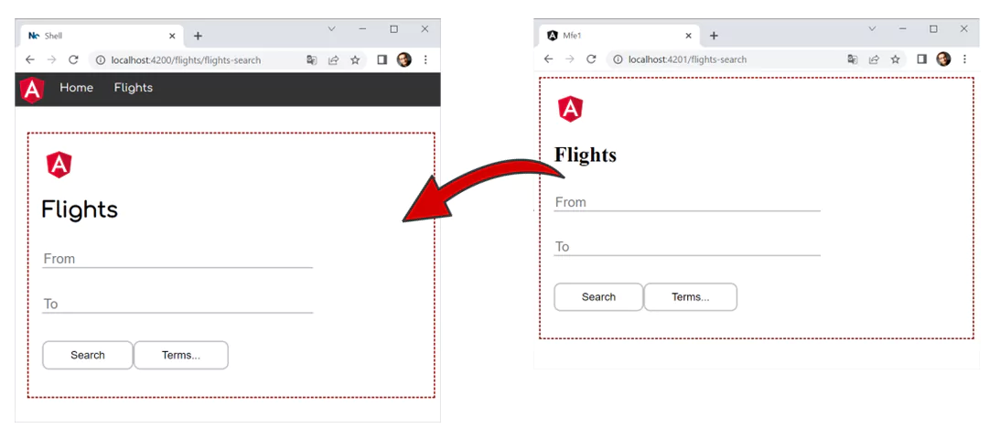

# Module Federation with Angular's Standalone Components

Most tutorials on Module Federation and Angular expose Micro Frontends in the form of NgModules. However, with the introduction of Standalone Components we will have lightweight Angular solutions not leveraging NgModules anymore. This leads to the question: How to use Module Federation in a world without NgModules?

In this chapter, I give answers. We see both, how to expose a bunch of routes pointing to Standalone Components and how to load an individual Standalone Component. For this, I've updated my example to fully work without NgModules:



> [Source code](https://github.com/manfredsteyer/module-federation-plugin-example/tree/standalone-solution) (branch: standalone-solution).

## Router Configs vs. Standalone Components

In general, we could directly load Standalone Components via Module Federation. While such a fine-grained integration seems to be fine for plugin-systems, Micro Frontends are normally more coarse-grained. It's usual that they represent a whole business domain which in general contains several use cases belonging together.

Interestingly, Standalone Components belonging together can be grouped using a router config. Hence, we can expose and lazy load such router configurations.

## Initial Situation: Our Micro Frontend

The Micro Frontend used here is a simple Angular application bootstrapping a Standalone Component:

```typescript
// projects/mfe1/src/main.ts

import { environment } from './environments/environment';
import { enableProdMode, importProvidersFrom } from '@angular/core';
import { bootstrapApplication } from '@angular/platform-browser';
import { AppComponent } from './app/app.component';
import { RouterModule } from '@angular/router';
import { MFE1_ROUTES } from './app/mfe1.routes';


if (environment.production) {
  enableProdMode();
}

bootstrapApplication(AppComponent, {
  providers: [
    importProvidersFrom(RouterModule.forRoot(MFE1_ROUTES))
  ]
});
```

When bootstrapping, the application registers its router config `MFE1_ROUTES` via services providers. This router config points to several Standalone Components:

```typescript
// projects/mfe1/src/app/mfe1.routes.ts

import { Routes } from '@angular/router';
import { FlightSearchComponent } 
    from './booking/flight-search/flight-search.component';
import { PassengerSearchComponent } 
    from './booking/passenger-search/passenger-search.component';
import { HomeComponent } from './home/home.component';

export const MFE1_ROUTES: Routes = [
    {
        path: '',
        component: HomeComponent,
        pathMatch: 'full'
    },
    {
        path: 'flight-search',
        component: FlightSearchComponent
    },
    {
        path: 'passenger-search',
        component: PassengerSearchComponent
    }
];
```

Here, `importProvidersFrom` bridges the gap between the existing `RouterModule` and the world of Standalone Components. As a replacement for this, future versions of the router will expose a function for setting up the router's providers. According to the underlying CFP, this function will be called `configureRouter`.

The shell used here is just an ordinary Angular application. Using lazy loading, we are going to make it reference the Micro Frontend at runtime.

## Activating Module Federation

To get started, let's install the Module Federation plugin and activate Module Federation for the Micro Frontend:

```bash
npm i @angular-architects/module-federation

ng g @angular-architects/module-federation:init 
    --project mfe1 --port 4201 --type remote
```

This command generates a `webpack.config.js`. For our purpose, we have to modify the `exposes` section as follows:

```javascript
const { shareAll, withModuleFederationPlugin } = 
    require("@angular-architects/module-federation/webpack");

module.exports = withModuleFederationPlugin({
  name: "mfe1",

  exposes: {
    // Preferred way: expose corse-grained routes
    "./routes": "./projects/mfe1/src/app/mfe1.routes.ts",

    // Technically possible, but not preferred for Micro Frontends:
    // Exposing fine-grained components
    "./Component": 
        "./projects/mfe1/src/app/my-tickets/my-tickets.component.ts",
  },

  shared: {
    ...shareAll({ 
        singleton: true, 
        strictVersion: true, 
        requiredVersion: "auto" 
    }),
  }

});
```

This configuration exposes both, the Micro Frontend's router configuration (pointing to Standalone Components) and a Standalone Component.

## Static Shell

Now, let's also activate Module Federation for the shell. In this section, I focus on Static Federation. This means, we are going to map the paths pointing to our Micro Frontends in the webpack.config.js. 

> The next section shows how to switch to Dynamic Federation, where we can define the key data for loading a Micro Frontend at runtime.

To enable Module Federation for the shell, let's execute this command:

```bash
ng g @angular-architects/module-federation:init 
    --project shell --port 4200 --type host
```

The `webpack.config.js` generated for the shell needs to point to the Micro Frontend:

```javascript
const { shareAll, withModuleFederationPlugin } = 
    require("@angular-architects/module-federation/webpack");

module.exports = withModuleFederationPlugin({

  remotes: {
    "mfe1": "http://localhost:4201/remoteEntry.js",
  },

  shared: {
    ...shareAll({ 
        singleton: true, 
        strictVersion: true, 
        requiredVersion: "auto" 
    }),
  }

});
```

As we are going with static federation, we also need typings for all configured paths (EcmaScript modules) referencing Micro Frontends:

```typescript
// projects/shell/src/decl.d.ts

declare module 'mfe1/*';
```

Now, all it takes is a lazy route in the shell, pointing to the routes and the Standalone Component exposed by the Micro Frontend:

```javascript
// projects/shell/src/app/app.routes.ts

import { Routes } from '@angular/router';
import { HomeComponent } 
    from './home/home.component';
import { NotFoundComponent } 
    from './not-found/not-found.component';
import { ProgrammaticLoadingComponent } 
    from './programmatic-loading/programmatic-loading.component';

export const APP_ROUTES: Routes = [
    {
      path: '',
      component: HomeComponent,
      pathMatch: 'full'
    },

    {
      path: 'booking',
      loadChildren: () => import('mfe1/routes').then(m => m.BOOKING_ROUTES)
    },

    {
      path: 'my-tickets',
      loadComponent: () => 
          import('mfe1/Component').then(m => m.MyTicketsComponent)
    },

    [...]

    {
      path: '**',
      component: NotFoundComponent
    }
];
```

## Alternative: Dynamic Shell

Now, let's move to dynamic federation. Dynamic Federation means, we don't want to define our remote upfront in the shell's `webpack.config.js`. Hence, let's comment out the remote section there:

```javascript
const { shareAll, withModuleFederationPlugin } = 
    require("@angular-architects/module-federation/webpack");

module.exports = withModuleFederationPlugin({

  // remotes: {
  //   "mfe1": "http://localhost:4201/remoteEntry.js",
  // },

  shared: {
    ...shareAll({ 
        singleton: true, 
        strictVersion: true, 
        requiredVersion: "auto" 
    }),
  }

});
```

Also, in the shell's router config, we need to switch out the dynamic `imports` used before by calls to `loadRemoteModule`:

```typescript
// projects/shell/src/app/app.routes.ts

import { Routes } from '@angular/router';
import { HomeComponent } from './home/home.component';
import { NotFoundComponent } from './not-found/not-found.component';
import { ProgrammaticLoadingComponent } 
    from './programmatic-loading/programmatic-loading.component';
import { loadRemoteModule } from '@angular-architects/module-federation';

export const APP_ROUTES: Routes = [
    {
      path: '',
      component: HomeComponent,
      pathMatch: 'full'
    },
    {
      path: 'booking',
      loadChildren: () => 
        loadRemoteModule({
          type: 'module',
          remoteEntry: 'http://localhost:4201/remoteEntry.js',
          exposedModule: './routes'
        })
        .then(m => m.MFE1_ROUTES)
    },
    {
      path: 'my-tickets',
      loadComponent: () => 
        loadRemoteModule({
          type: 'module',
          remoteEntry: 'http://localhost:4201/remoteEntry.js',
          exposedModule: './Component'
        })
        .then(m => m.MyTicketsComponent)
    },
    [...]
    {
      path: '**',
      component: NotFoundComponent
    }
];
```

The `loadRemoteModule` function takes all the key data, Module Federation needs for loading the remote. This key data is just several strings, hence you can load it from literally everywhere.

## Bonus: Programmatic Loading

While most of the times, we will load Micro Frontends (remotes) via the router, we can also load exposed components programmatically. For this, we need a placeholder marked with a template variable for the component in question:

```html
<h1>Programmatic Loading</h1>

<div>
    <button (click)="load()">Load!</button>
</div>

<div #placeHolder></div>
```

We get hold of this placeholder's `ViewContainer` via the `ViewChild` decorator:

```typescript
// projects/shell/src/app/programmatic-loading/programmatic-loading.component.ts

import { 
    Component, 
    OnInit, 
    ViewChild, 
    ViewContainerRef 
} from '@angular/core';

@Component({
  selector: 'app-programmatic-loading',
  standalone: true,
  templateUrl: './programmatic-loading.component.html',
  styleUrls: ['./programmatic-loading.component.css']
})
export class ProgrammaticLoadingComponent implements OnInit {

  @ViewChild('placeHolder', { read: ViewContainerRef })
  viewContainer!: ViewContainerRef;

  constructor() { }

  ngOnInit(): void {
  }

  async load(): Promise<void> {

      const m = await import('mfe1/Component');
      const ref = this.viewContainer.createComponent(m.MyTicketsComponent);
      // const compInstance = ref.instance;
      // compInstance.ngOnInit()
  }

}
```

This example shows a solution for Static Federation. Hence a dynamic ``import`` is used for getting hold of the Micro Frontend.

After importing the remote component, we can instantiate it using the `ViewContainer`'s `createComponent` method. The returned reference (ref) points to the component instance with it's `instance` property. The instance allows to interact with the component, e. g. to call methods, set property, or setup event handlers.

If we wanted to switch to Dynamic Federation, we would again use ``loadRemoteModule`` instead of the dynamic ``import``: 

```typescript
async load(): Promise<void> {

    const m = await loadRemoteModule({
      type: 'module',
      remoteEntry: 'http://localhost:4201/remoteEntry.js',
      exposedModule: './Component'
    });
    
    const ref = this.viewContainer.createComponent(m.MyTicketsComponent);
    // const compInstance = ref.instance;
}
```
