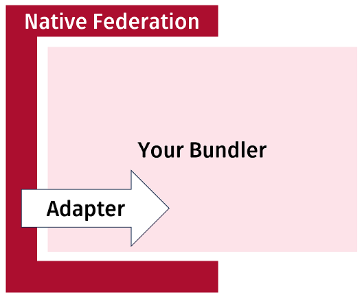
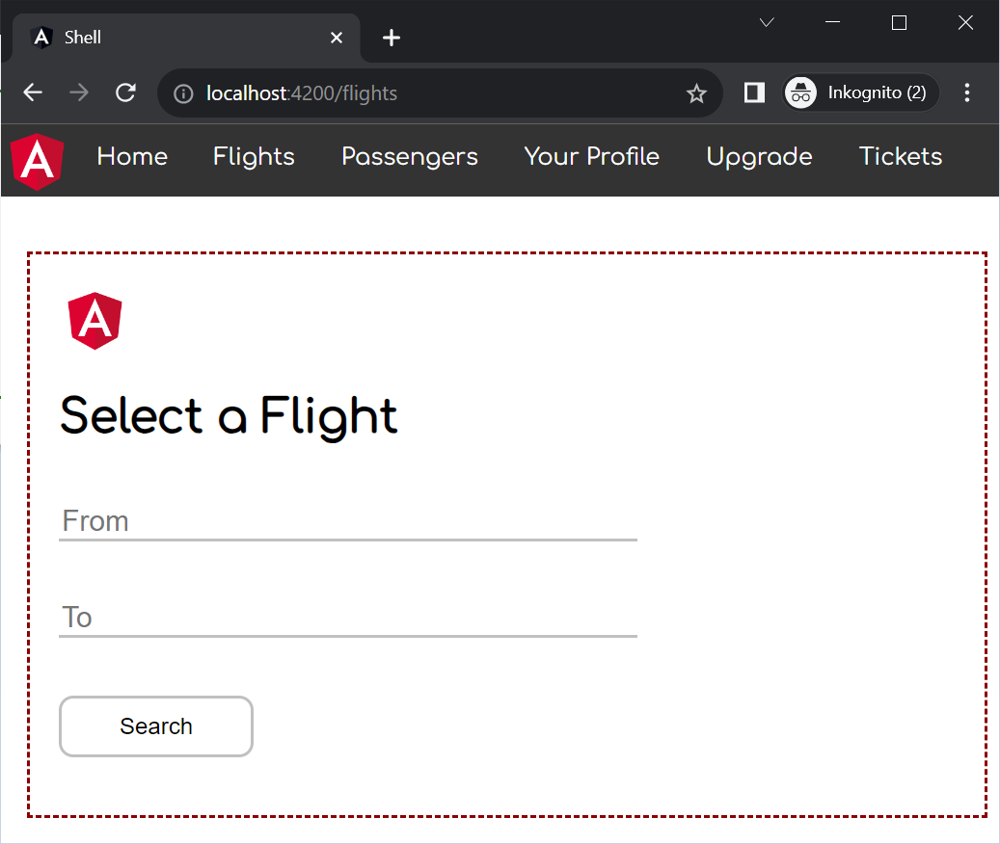
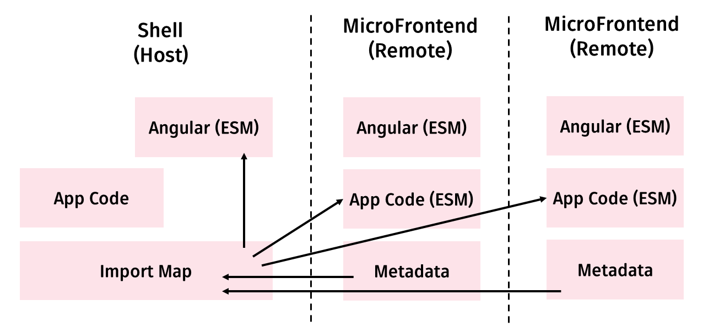

# From Module Federation to esbuild and Native Federation

Beginning with version 17, the Angular CLI uses `esbuild` instead of `webpack` for new projects. As a result, both `ng serve` and `ng build` run noticeably faster.

However, switching to `esbuild` brings a challenge for Micro Frontends: The popular Module Federation comes with webpack and is not available for `esbuild`. To preserve the proven mindset of webpack, we started the Native Federation project. It consequently uses web standards and hence is a solution for the long-term. While it can be used with any bundler, the reference implementation currently delegates to the CLI's esbuild bundler.

It's API surface and configuration files looks like the ones in Module Federation. Hence, everything you read in the previous chapters works the same with Native Federation.

📂 [Source Code](https://github.com/manfredsteyer/module-federation-plugin-example.git) 
(see branches `nf-standalone-solution` and `nf-standalone-router-config`)

## Native Federation with esbuild

In order to be able to use the proven mental model of Module Federation independently of webpack, the [Native Federation](https://www.npmjs.com/package/@angular-architects/native-federation) project was created. It offers the same options and configuration as Module Federation, but works with all possible build tools. It also uses browser-native technologies such as EcmaScript modules and [Import Maps](https://developer.mozilla.org/en-US/docs/Web/HTML/Element/script/type/importmap). This measure is intended to ensure long-term support from browsers and also allow alternative implementations.

Native Federation is called before and after the actual bundler in the build process. That's why it doesn't matter which bundler is actually used:



Since Native Federation also needs to create a few bundles, it delegates to the bundler of choice. The individual bundlers are connected via interchangeable adapters.

The following image shows an example built with Angular, esbuild, and Native Federation:

{width=66%}


The shell shown here has loaded a separately developed and deployed Micro Frontend into its workspace using Native Federation.

Although both the shell and the micro frontend are based on Angular, Native Federation **only loaded Angular once.** To make this possible, Native Federation, following the ideas of Module Federation, places the remotes and the libraries to be shared in their own bundles. For this, it uses standards-compliant EcmaScript bundles that could also be created by other tools. Information about these bundles is placed in metadata files:



These metadata files are the basis for a standard-compliant Import Map that informs the browser from where which bundles are to be loaded.

## Native Federation: Setting up a Micro Frontend 

For use with Angular and the CLI, Native Federation offers an `ng-add` schematic. The following statement adds Native Federation to the Angular project `mfe1` and configures it as a `remote` acting as a Micro Frontend:

```bash
ng add @angular-architects/native-federation --project mfe1 --port 4201 --type remote
```

The `ng-add`-Schematic also creates a `federation.config.js` controlling Native Federation's behavior:

```javascript
const { withNativeFederation, shareAll } = 
  require('@angular-architects/native-federation/config');

module.exports = withNativeFederation({

  name: 'mfe1',

  exposes: {
    './Component': './projects/mfe1/src/app/app.component.ts',
  },

  shared: {
    ...shareAll({ singleton: true, strictVersion: true, requiredVersion: 'auto' }),
  },

  skip: [
    'rxjs/ajax',
    'rxjs/fetch',
    'rxjs/testing',
    'rxjs/webSocket',
    // Add further packages you don't need at runtime
  ]
  
});
```

The property `name` defines a unique name for the remote. The `exposes` section specifies which files the remote should expose to the host. Although these files are built and deployed together with the remote, they can be loaded into the host at runtime. Since the host doesn't care about the full file paths, `exposes` maps them to shorter names.

In the case shown, the remote just publishes its `AppComponent` for simplicity. However, any system component could be published instead, e.g. lazy routing configurations that reference multiple components of a feature.

Under `shared`, the configuration lists all dependencies that the remote wants to share with other remotes and the host. In order to avoid an exhaustive list of all required npm packages, the `shareAll` helper function is used. It includes all packages that are in the `package.json` under `dependencies`. Details about the parameters passed to _shareAll_ can be found in one of the previous chapters about Module Federation.

Packages `shareAll` should not share are entered under `skip`. This can improve the build and startup performance of the application slightly. In addition, packages that are intended for use with **NodeJS must be added to `skip`**, since they cannot be compiled for use in the browser.

## Native Federation: Setting up a Shell

The host acting as a Micro Frontend Shell can also be set up with `ng add`:

```bash
ng add @angular-architects/native-federation --project shell --port 4200 --type dynamic-host
```

The type `dynamic-host` indicates that the remotes to be loaded are defined in a configuration file:

```json
{
    "mfe1" : "http://localhost:4201/remoteEntry.json"
}
```

This `federation.manifest.json` is generated in the host's `assets` folder by default. By treating it as an asset, the manifest can be exchanged during deployment. The application can therefore be adapted to the respective environment.

The manifest maps the names of the remotes to their metadata, which Native Federation places in the `remoteEntry.json` file during build. Even if `ng add` generates the manifest, it should be checked in order to adjust ports if necessary or to remove applications that are not remotes.

The `ng add`-command also generates a `federation.config.js` for hosts:

```javascript
const { withNativeFederation, shareAll } = 
  require('@angular-architects/native-federation/config');

module.exports = withNativeFederation({

  shared: {
    ...shareAll({ singleton: true, strictVersion: true, requiredVersion: 'auto' }),
  },

  skip: [
    'rxjs/ajax',
    'rxjs/fetch',
    'rxjs/testing',
    'rxjs/webSocket',
    // Add further packages you don't need at runtime
  ]
  
});
```

The `exposes` entry known from the remote's config is not generated for hosts because hosts typically do not publish files for other hosts. However, if you want to set up a host that also acts as a remote for other hosts, there is nothing wrong with adding this entry.

The `main.ts` file, also modified by `ng add`, initializes Native Federation using the manifest:

```typescript
import { initFederation } from '@angular-architects/native-federation';

initFederation('/assets/federation.manifest.json')
  .catch(err => console.error(err))
  .then(_ => import('./bootstrap'))
  .catch(err => console.error(err));
```

The `initFederation` function reads the metadata of each remote and generates an Import Map used by the browser to load shared packages and exposed modules. The program flow then delegates to the `bootstrap.ts`, which starts the Angular solution with the usual instructions (`bootstrapApplication` or `bootstrapModule`).

All files considered so far were set up using `ng add`. In order to load a program part published by a remote, the host must be expanded to include lazy loading:

```typescript
[…]
import { loadRemoteModule } from '@angular-architects/native-federation';

export const APP_ROUTES: Routes = [
  […],
  {
    path: 'flights',
    loadComponent: () =>
      loadRemoteModule('mfe1', './Component').then((m) => m.AppComponent),
  },
  […]
];
```

The lazy route uses the `loadRemoteModule` helper function to load the `AppComponent` from the remote. It takes the name of the remote from the manifest (`mfe1`) and the name under which the remote publishes the desired file (`./Component`).


## Exposing a Router Config

Just exposing one component via Native Federation is a bit fine-grained. Quite often, you want to expose a whole feature that consists of several components. Fortunately, we can expose all kinds of TypeScript/EcmaScript constructs. In the case of coarse-grained features, we could expose an NgModule with subroutes or -- if we go with Standalone Components -- just a routing config. Here, the latter one is the case:

```typescript
import { Routes } from "@angular/router";
import { FlightComponent } from "./flight/flight.component";
import { HolidayPackagesComponent } 
  from "./holiday-packages/holiday-packages.component";

export const APP_ROUTES: Routes = [
    {
        path: '',
        redirectTo: 'flights',
        pathMatch: 'full'
    },
    {
        path: 'flight-search',
        component: FlightComponent
    },
    {
        path: 'holiday-packages',
        component: HolidayPackagesComponent
    }
];
```

This routing config needs to be added to the `exposes` section in the Micro Frontend's `federation.config.js`:

```typescript
const { withNativeFederation, shareAll } = 
  require('@angular-architects/native-federation/config');

module.exports = withNativeFederation({

  name: 'mfe1',

  exposes: {
    './Component': './projects/mfe1/src/app/app.component.ts',

     // Add this line:
    './routes': '././projects/mfe1/src/app/app.routes.ts',
  },

  shared: {
    ...shareAll({ singleton: true, strictVersion: true, requiredVersion: 'auto' }),
  },

  skip: [
    'rxjs/ajax',
    'rxjs/fetch',
    'rxjs/testing',
    'rxjs/webSocket',
    // Add further packages you don't need at runtime
  ]
  
});
```

In the shell, you can directly route to this routing configuration:

```typescript
[...]
import { loadRemoteModule } from '@angular-architects/native-federation';

export const APP_ROUTES: Routes = [
  [...]

  {
    path: 'flights',
    // loadChildreas instead of loadComponent !!!
    loadChildren: () =>
      loadRemoteModule('mfe1', './routes').then((m) => m.APP_ROUTES),
  },

  [...]
];
```

Also, we need to adjust the routes in the shell's navigation:

```html
<ul>
    <li></li>
    <li><a routerLink="/">Home</a></li>
    <li><a routerLink="/flights/flight-search">Flights</a></li>
    <li><a routerLink="/flights/holiday-packages">Holidays</a></li>
</ul>

<router-outlet></router-outlet>
```

## Communication between Micro Frontends

Communication between Micro Frontends can also be enabled via shared libraries. I'd like to say in advance that this option should only be used with caution: Micro Frontend architectures are intended to decouple individual frontends from each other. However, if a frontend expects information from other frontends, exactly the opposite is achieved. Most solutions I've seen only share a handful of contextual information. Examples include the current username, the current client and a few global filters.

To share information, we first need a shared library. This library can be a separately developed npm package or a library within the current Angular project. The latter can be generated with

```bash
ng g lib auth
```

The name of the library in this case is set as `auth`. To share data, this library receives a stateful service. For the sake of brevity, I'm using the simplest stateful service I can think about:

```typescript
@Injectable({
  providedIn: 'root'
})
export class AuthService {
  userName = '';
}
```

In this very simple scenario, the service is used as a black board: A Micro Frontend writes information into the service and another one reads the information. However, a somewhat more convenient way to share information would be to use a publish/subscribe mechanism through which interested parties can be informed about value changes. This idea can be realized, for example, by using RxJS subjects.

If Monorepo-internal libraries are used, they should be made accessible via path mapping in the `tsconfig.json`:

```json
"compilerOptions": {
    "paths": {
      "@demo/auth": [
        "projects/auth/src/public-api.ts"
      ]
     },
     […]
}
```

Please note that I'm pointing to `public-api.ts` in the **lib's source code.** This strategy is also used by Nx, but the CLI points to the `dist` folder by default. Hence, in the latter case, you need to update this entry by hand.

It must also be ensured that all communication partners use the same path mapping. 

## Conclusion

The new esbuild builder provides tremendous improvements in build performance. However, the popular Module Federation is currently bound to webpack. Native Federation provides the same mental model and is implemented in a tooling-agnostic way. Hence, it works with all possible bundlers. Also, it uses web standards like EcmaScript modules and Import Maps. This also allows for different implementation and makes it a reliable solution in the long run. 
