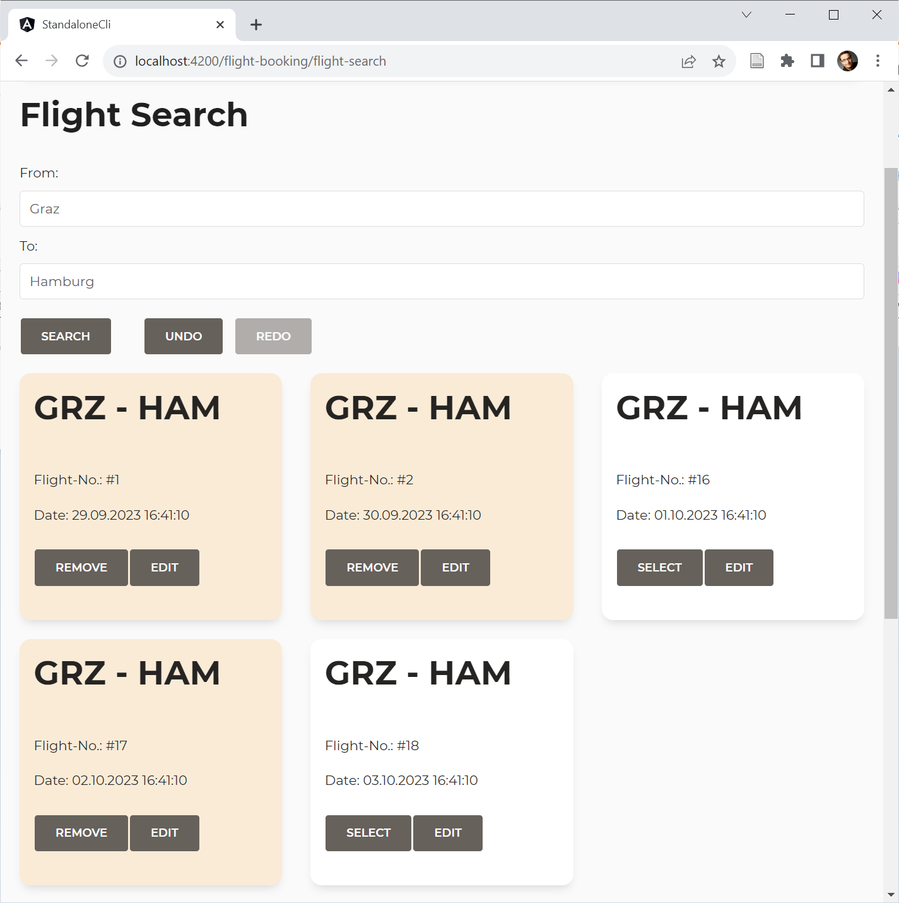

# Smarter, Not Harder: Simplifying your Application With NGRX Signal Store and Custom Features

What would you say if you could implement a Signal Store for a (repeating) **CRUD use case** including **Undo/Redo** in **just 7 (!) lines of code?**

To make this possible, we need some custom features for the Signal Store. In this chapter, I show how this all works.

As always, my work is highly inspired by the implementation of the NGRX Signal and the examples provided by [Marko Stanimirović](https://twitter.com/MarkoStDev), the NGRX core team member who envisioned and implemented the Signal Store.

📂 [Source Code](https://github.com/manfredsteyer/standalone-example-cli/tree/arc-signal-store-custom-examples) (Branch: arc-signal-store-custom-examples)

## Goal

The goal of this chapter is to show how to implement custom features for the Signal Store that allow for the following:

* Searching for entities
* Selecting several entities
* Displaying the selected entities
* Undo/Redo

This is how the demo application I've built on top of these custom features looks like:



And this is the whole code we need to set up the store, including Undo/Redo and connecting it to a Data Service fetching the entities from the backend:

```typescript
export const FlightBookingStore = signalStore(
  { providedIn: 'root' },
  withEntities<Flight>(),
  withCallState(),
  withDataService(FlightService, { from: 'Graz', to: 'Hamburg'} ),
  withUndoRedo(),
);
```

As you can see, I'm using the `@ngrx/signals/entities` package for managing entities. Besides this, I moved the remaining logic into three reusable custom features: `withCallState` was already discussed in a previous chapter. This chapter discusses `withDataService` and provides the code for `withUndoRedo`. 

## DataService Custom Feature 

The idea behind the `DataService` feature is to set up state for a search filter and to connect an Angular Service that uses this filter to search for entities. In a further development stage, the feature could also call the `DataService` for saving and deleting entities. However, as these implementations would not add additional insights here, I decided to skip them for the sake of brevity. 

To make the `DataService` feature generic, we need some general types describing everything the feature interacts with:

```typescript
import { EntityId } from "@ngrx/signals/entities";
[...]

export type Filter = Record<string, unknown>;
export type Entity = { id: EntityId };

export interface DataService<E extends Entity, F extends Filter> {
    load(filter: F): Promise<E[]>;
}
```

These types describe how our search filter is structured, what we mean when referring to an entity, and how a `DataService` should look like. The type `EntityId` comes from `@ngrx/signals/entities` and accepts a `string` or a `number`.

Expecting that an entity is an arbitrary object with an `id` property is one of the conventions `@ngrx/signals/entities` provides for shorten your code. If your primary key is called otherwise, you can tell `@ngrx/signals/entities` accordingly. However, to keep the presented example small, I've decided to stick with this convention.

## Implementing A Generic Custom Feature

The function `withDataService` returns the `DataService` feature:

```typescript
export function withDataService<E extends Entity, F extends Filter, S extends DataService<E, F>>(dataServiceType: Type<S>, filter: F) {
    [...]
}
```

Its type parameter describes the Entity to manage, the corresponding search filter, and the `DataService`. When calling this generic method we just need to pass in the `DataService` and an initial filter. TypeScript infers the rest:

```typescript
withDataService(FlightService, { from: 'Graz', to: 'Hamburg'} ),
```

The `withDataService` function calls `signalStoreFeature` to setup our custom feature:

```typescript
export function withDataService<E extends Entity, F extends Filter, S extends DataService<E, F>>(dataServiceType: Type<S>, filter: F) {
    return signalStoreFeature(
        // Our expectations to the store:
        {
            state: type<{
                callState: CallState,
                entityMap: Record<EntityId, E>,
                ids: EntityId[]
            }>(),
            signals: type<{
                entities: Signal<Entity[]>
            }>(),
            methods: type<{}>()
        },

        // Composing several features:
        withState( [...] ),
        withComputed( [...] ),
        withMethods( [...] )
    );
}
```

As shown in the previous chapter, the `signalStoreFeature` function basically composes existing features into a new one. For instance, we can introduce new state properties with `withState`, computed Signals with `withComputed`, or methods with `withMethods`. 

However, one little thing is a bit different this time: Our feature has some **expectations** for the Signal Store it is used with. It expects the `callState` feature and the `entity` feature to be in place. The former one sets up a `callState` property we need; the latter one sets up an `entityMap` and an `ids` property as well as a calculated Signal `entities`.

These expectations are defined by the first parameter passed to `signalStoreFeature`. It describes the expected state properties (`state`), computed signals (`signals`), and methods. As we don't expect any methods, we can also omit the key `methods` instead of pointing to `type<{}>()`.

To avoid naming conflicts, the `entity` feature allows using different property names. To keep things simple, I'm sticking with the default names here. However, in a following chapter, you learn how to deal with dynamic property names in a type-safe way. 

The remaining parts of this custom feature are just about adding state properties, computed Signals, and methods on top of the expected features:

```typescript
export function withDataService<E extends Entity, F extends Filter, S extends DataService<E, F>>(dataServiceType: Type<S>, filter: F) {
    return signalStoreFeature(
        // First parameter contains 
        // Our expectations to the store:
        // If they are not fulfilled, TypeScript
        // will prevent adding this feature!
        {
            state: type<{
                callState: CallState,
                entityMap: Record<EntityId, E>,
                ids: EntityId[]
            }>(),
            signals: type<{
                entities: Signal<Entity[]>
            }>(),
            methods: type<{}>()
        },
        withState({
            filter,
            selectedIds: {} as Record<EntityId, boolean>,
        }),
        withComputed(({ selectedIds, entities }) => ({
            selectedEntities: computed(() => entities().filter(e => selectedIds()[e.id]))
        })),
        withMethods((store) => {
            const dataService = inject(dataServiceType)
            return {
                updateFilter(filter: F): void {
                    patchState(store, { filter });
                },
                updateSelected(id: EntityId, selected: boolean): void {
                    patchState(store, ({ selectedIds }) => ({
                        selectedIds: {
                            ...selectedIds,
                            [id]: selected,
                        }
                    }));
                },
                async load(): Promise<void> {
                    patchState(store, setLoading());
                    const result = await dataService.load(store.filter());
                    patchState(store, setAllEntities(result));
                    patchState(store, setLoaded());
                }
            };
        })
    );
}
```

## Providing a Fitting Data Service

To make our data services work with our custom feature, they need to implement the above-mentioned `DataService` interface that is to be typed with the Entity in question and a search filter expected by the `load` method:

```typescript
export type FlightFilter = { 
    from: string; 
    to: string; 
}

@Injectable({
  providedIn: 'root'
})
export class FlightService implements DataService<Flight, FlightFilter> {
  baseUrl = `https://demo.angulararchitects.io/api`;

  constructor(private http: HttpClient) {}

  load(filter: FlightFilter): Promise<Flight[]> {
    [...]
  }

  [...]
}
```

## Undo/Redo-Feature

The Undo/Redo feature is implemented in a very similar way. Internally, it managed two stacks: an undo stack and a redo stack. The stacks are basically arrays with `StackItem`s:

```typescript
export type StackItem = {
    filter: Filter;
    entityMap: Record<EntityId, Entity>,
    ids: EntityId[]
};
```

Each `StackItem` represents a snapshot of the current search filter and the information the entity feature uses (`entityMap`, `ids`). 

For configuring the feature, a `UndoRedoOptions` type is used:

```typescript
export type UndoRedoOptions = {
    maxStackSize: number;
}

export const defaultUndoRedoOptions: UndoRedoOptions = {
    maxStackSize: 100
}
```

The options object allows us to limit the stack size. Older items are removed according to the First In, First Out rule if the stack grows to large.

The `withUndoRedo` function adds the feature. It is structured as follows:

```typescript
export function withUndoRedo(options = defaultUndoRedoOptions) {

    let previous: StackItem | null = null;
    let skipOnce = false;

    const undoStack: StackItem[] = [];
    const redoStack: StackItem[] = [];

    [...]

    return signalStoreFeature(
        // Expectations to the store:
        {
            state: type<{
                filter: Filter,
                entityMap: Record<EntityId, Entity>,
                ids: EntityId[]
            }>(),
        },
        [...]
        withMethods((store) => ({
            undo(): void { [...] },
            redo(): void { [...] }
        })),
        withHooks({
            onInit(store) {
                effect(() => {
                    const filter = store.filter();
                    const entityMap = store.entityMap();
                    const ids = store.ids();

                    [...]
                });
            }
        })

    )
}
```

Similar to the `withDataService` function discussed above, it calls `signalStoreFeature` and defines its expectations for the store using the first argument. It introduces an `undo` and a `redo` method, restoring the state from the respective stacks. To observe the state, the `onInit` hook at the end creates an effect. After each change, this effect stores the original state on the undo stack. 

One thing is a bit special about this implementation of the Undo/Redo feature: The feature itself holds some internal state -- like the `undoStack` and the `redoStack` -- that is not part of the Signal Store. 

Please find the full implementation of this feature in my 📂 [GitHub repository](https://github.com/manfredsteyer/standalone-example-cli/tree/arc-signal-store-custom-examples) (🔀 Branch: arc-signal-store-custom-examples). If you want to see a different implementation that also stores the feature-internal state in the Signal Store, please look at the 🔀 `arc-signal-custom-examples-undoredo-alternative` branch.

## Using the Store in a Component

To use our 7-lines-of-code-signal-store in a component, just inject it and delegate to its signals and methods:

```typescript
@Component( [...] )
export class FlightSearchComponent {
  private store = inject(FlightBookingStore);

  // Delegate to signals
  from = this.store.filter.from;
  to = this.store.filter.to;
  flights = this.store.entities;
  selected = this.store.selectedEntities;
  selectedIds = this.store.selectedIds;

  // Delegate to methods
  async search() {
    this.store.load();
  }

  undo(): void {
    this.store.undo();
  }

  redo(): void {
    this.store.redo();
  }

  updateCriteria(from: string, to: string): void {
    this.store.updateFilter({ from, to });
  }

  updateBasket(id: number, selected: boolean): void {
    this.store.updateSelected(id, selected);
  }

}
```

## Conclusion and Outlook

Implementing repeating tasks with generic custom features allows you to shrink down your source code dramatically. In this chapter, we implemented a Signal Store for a simple use case with just 7 lines of code. While implementing such features in a generic way adds some overhead in the first place, this effort pays off for sure once you have several use cases structured that way. 

To reuse existing custom features, our custom feature delegates to them. The API provided by the NGRX Signal Store allows the custom feature to ensure the other features have been configured. It defines which state properties, computed signals, and methods it expects. If they are not present, TypeScript brings up a compilation error.

For the sake of simplicity, we just went with the default property names introduced by the orchestrated features. However, to avoid naming conflicts, it is also possible to configure these names. For instance, the `entity` feature that ships with the Signal Store supports such dynamic properties without compromising type safety. In the next chapter, I show how to use this idea for our custom features, too.
