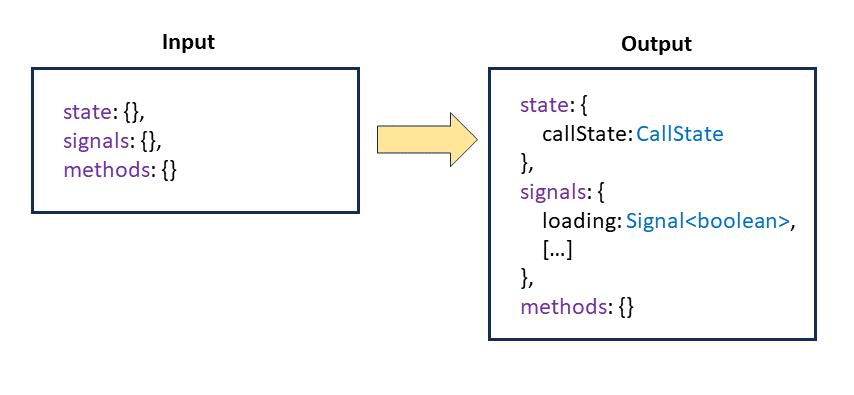
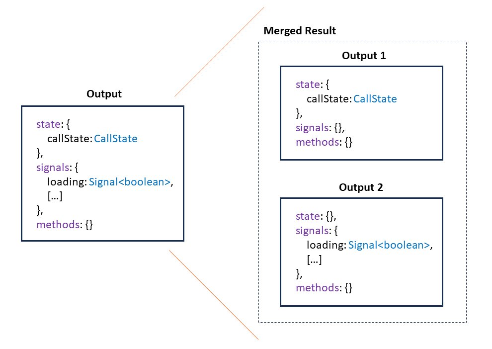

# NGRX Signal Store Deep Dive: Flexible and Type-Safe Custom Extensions

The NGRX Signal Store, released shortly after Angular 17, offers a very lightweight solution for state management. With no direct dependencies on RxJS, it relies entirely on Signals. However, its greatest strength is undoubtedly its high degree of expandability. With so-called custom features, recurring tasks can be implemented very easily in a central way.

The first example of custom features presented here is very straightforward. After that, things get a little more challenging: The consumer of a feature must be able to determine the names of the signals and methods set up by the feature. Otherwise, naming conflicts will arise quickly. As the following examples show, this does not contradict strict typing in TypeScript.

The examples shown here are inspired by an example from [Marko Stanimirović](https://twitter.com/MarkoStDev), the NGRX core team member behind the Signal Store, and the Entity management solution `@ngrx/signals/entity` shipped with the Signal Store.


📂 [Source Code](https://github.com/manfredsteyer/standalone-example-cli/tree/arc-signal-store-custom-typed) (Branch: arc-signal-store-custom-typed)

## A Simple First Extension

Let's use the `CallState` feature from the last chapter as our starting point:

```typescript
import {
  SignalStoreFeature,
  signalStoreFeature,
  withComputed,
  withState,
} from '@ngrx/signals';

[…]

export type CallState = 'init' | 'loading' | 'loaded' | { error: string };

export function withCallState() {
  return signalStoreFeature(
    withState<{ callState: CallState }>({ callState: 'init' }),
    withComputed(({ callState }) => ({
      loading: computed(() => callState() === 'loading'),
      loaded: computed(() => callState() === 'loaded'),
      error: computed(() => {
        const state = callState();
        return typeof state === 'object' ? state.error : null
      }),
    }))
  );
}
```

This is a function that returns the result of `signalStoreFeature`. The `signalStoreFeature` function, in turn, simply groups existing features: `withState` introduces the `callState` property, and `withComputed` defines the previously discussed calculated signals based on it.

The Updaters provided by the feature only return a partial state object with the property to be updated:

```typescript
export function setLoading(): { callState: CallState } {
  return { callState: 'loading' };
}

export function setLoaded(): { callState: CallState } {
  return { callState: 'loaded' };
}	

export function setError(error: string): { callState: CallState } {
  return { callState: { error } };
}
```

## Now it Really Starts: Typing

The `CallState` implementation in the last section briefly summarizes the solution to a recurring requirement. Once implemented, individual applications can integrate the feature into their stores.

A drawback of this implementation, however, is that the signals introduced have fixed names: `callState`, `loading`, `loaded,` and `error`. This quickly leads to naming conflicts, especially if the same store requires the feature more than once. An example of this is a store that wants to manage several `callStates` for different entities, e.g. for flights and passengers.

In this case, the consumer should be able to specify the names of the signals introduced. That's precisely what we'll take care of below. To make this extension type-safe, we first have to think a little about the typing of the `withCallState` function.

Our `withCallState` function does not currently have an explicit return type. Therefore, TypeScript infers this type by looking at the return value in the function. The compiler realizes that a `callState` property is available.

The type determined here by inference is a `SignalStoreFeature<Input, Output>`. The type parameter `Input` defines which signals and methods the feature expects from the store, and `Output` specifies which additional signals and methods the feature provides. Our feature does not place any expectations on the store, but provides a `callState` signal as well as several calculated signals such as `loading`. Respectively, our `Input` and `Output` types looks as follows:



It should be noted that `state` describes the signal to be introduced, and the `signals` property represents the signals calculated from it. This representation at least corresponds to the simplified external view.

The internal view is a little more complex, especially since `withState` first introduces the `callState` signal and only then `withComputed` adds the calculated signals. That's why the inside view has two outputs, which are combined using a helper type.



For the sake of simplicity, the previous image calls the helper type `Merged Result`. However, the truth is that the Signal Store has several internal types for this.

On a logical level, the the internal view und the external one are equivalent. TypeScript may need a little nudge in the form of a type assertion to recognize this. However, explicitly defining the internal view is a bit annoying and currently not really possible because the required helper types are not part of the Signal Store's public API. That's why I 'm using a pattern here that can also be found several times in the Signal Store code: A combination of a function overload with the external view and a function implementation that uses `SignalStoreFeature` instead of `SignalStoreFeature<Input, Output>` for the internal view:

```typescript
// Overloading with External View
export function withCallState()
  : SignalStoreFeature<
    {
      state: {},
      signals: {},
      methods: {}
    },
    {
      state: {
        callState: CallState
      },
      signals: {
        loading: Signal<boolean>,
        loaded: Signal<boolean>,
        error: Signal<{ error: string } | null>
      },
      methods: {}
    }>;
// Implementation with Internal View
export function withCallState(): SignalStoreFeature {
  return signalStoreFeature(
    withState<{ callState: CallState }>({ callState: 'init' }),
    withComputed(({ callState }) => ({
      loading: computed(() => callState() === 'loading'),
      loaded: computed(() => callState() === 'loaded'),
      error: computed(() => {
        const state = callState();
        return typeof state === 'object' ? state.error : null
      }),
    }))
  );
}
```

The `SignalStoreFeature` type without type parameters uses more general types for `Input` and `Output` that do not assume specific names or data types.


## Typing and Dynamic Properties – How do They Work Together?

Now that the basic structure of the typing is in place, we can extend it with configurable property names. Following the example of `@ngrx/signals/entity`, consumers should have the option to define a prefix when activating the feature:

```typescript
export const FlightBookingStore = signalStore(
  { providedIn: 'root' },

  withState({ … }),
  withComputed(( … ) => ({ … })),

  withCallState({ prop: 'flights' }),	
  withCallState({ prop: 'passengers'}),

  […]
);
```

This prefix should now be included in the property names defined by the feature. For example, the first call to `withCallState` should produce the following properties:

- `flightsCallState` (state)
- `flightsLoading` (computed)
- `flightsLoaded` (computed)
- `flightsError` (computed)

The second call analogously leads to these properties:

- `passengersCallState` (state)
- `passengersLoading` (computed)
- `passengersLoaded` (computed)
- `passengersError` (computed)

Setting up these properties at runtime isn't a big problem in the world of TypeScript, especially since the underlying JavaScript is a dynamic language anyway. The challenge, however, is to also inform the type system about these properties.

For this task, you first need to find a way to express the prefix in a type declaration. At this point, we benefit from the fact that literals can also be used as data types:

```typescript
export type BoxStatus = 'open' | 'closed';
const candyBox: BoxStatus = 'open';
```

Such String Literal Union Types are often used in TypeScript applications to express enums. This is even closer to EcmaScript than using TypeScript's `enum` keyword. Funnily, nobody is forcing us to offer multiple options. That's why this variant is completely ok:

```typescript
export type BoxStatusAfterHolidays = 'closed';
```

So here we have a type that can hold exactly a single string value. We use this exact pattern to inform the type system about our prefix. First, we create a type that defines the name of the signal to be introduced based on the prefix:

```typescript
export type NamedCallState<Prop extends string> = {
  [K in Prop as `${K}CallState`]: CallState;
};
```

This is a so-called mapped type, which maps one type to a new one. The type parameter `Prop extends string` describes the original type. It can be any string used as a type. String must also be written in lowercase because, at this point, we are referring to a specific string and not the `String object type.` The notation `K in Prop` also reduces to this string. In more complex cases, one could use the keyword `in`, for instance, to loop through the properties of the original type.

We can proceed analogously for the calculated signals to be introduced:

```typescript
export type NamedCallStateComputed<Prop extends string> = {
  [K in Prop as `${K}Loading`]: Signal<boolean>;
} & {
    [K in Prop as `${K}Loaded`]: Signal<boolean>;
} & {
    [K in Prop as `${K}Error`]: Signal<string | null>;
};
```

Since a mapped type can only have a single mapping, several mapped types are used here. They are combined with the `&`-operator (intersection operator). With these two types we can now specify the typing of our `withCallState` function:

```typescript
export function withCallState<Prop extends string>(config: {
  prop: Prop;
}): SignalStoreFeature<
  { state: {}, signals: {}, methods: {} },
  {
    state: NamedCallState<Prop>,
    signals: NamedCallStateComputed<Prop>,
    methods: {}
  }
>;
export function withCallState<Prop extends string>(config: {
  prop: Prop;
}): SignalStoreFeature {
[…]
}
```

Now, the type system knows about our configured properties. In addition, it is now important to set up these properties at runtime. An auxiliary function `getCallStateKeys` is used for this purpose:

```typescript
function getCallStateKeys(config: { prop: string }) {
  return {
    callStateKey: `${config.prop}CallState`,
    loadingKey: `${config.prop}Loading`,
    loadedKey: `${config.prop}Loaded`,
    errorKey: `${config.prop}Error`,
  };
}
```

This helper function returns the same mappings at runtime as the previously introduced types during compile time. The updated implementation of `withCallState` picks up these names and sets up corresponding properties:

```typescript
[…]
export function withCallState<Prop extends string>(config: {
  prop: Prop;
}): SignalStoreFeature {
  const { callStateKey, errorKey, loadedKey, loadingKey } =
    getCallStateKeys(config);

  return signalStoreFeature(
    withState({ [callStateKey]: 'init' }),
    withComputed((state: Record<string, Signal<unknown>>) => {

      const callState = state[callStateKey] as Signal<CallState>;

      return {
        [loadingKey]: computed(() => callState() === 'loading'),
        [loadedKey]: computed(() => callState() === 'loaded'),
        [errorKey]: computed(() => {
          const v = callState();
          return typeof v === 'object' ? v.error : null;
        })
      }
    })
  );
}
```

So that the updaters can cope with the dynamic properties, they also receive a corresponding parameter:

```typescript
export function setLoading<Prop extends string>(
  prop: Prop
): NamedCallState<Prop> {
  return { [`${prop}CallState`]: 'loading' } as NamedCallState<Prop>;
}
```

This idea can also be found in `@ngrx/signals/entity`. The updater is then used as follows:

```typescript
load: async () => {
  patchState(state, setLoading('flights'));
  […]
}
```

## More Examples: CRUD and Undo/Redo

In the previous chapter, I demonstrated features for implementing CRUD and Undo/Redo. The following repo contains a version of these custom features using dynamic properties as shown here.

📂 [Source Code](https://github.com/manfredsteyer/standalone-example-cli/tree/arc-signal-store-custom-examples-typed) (see 🔀 branch `arc-signal-store-custom-examples-typed`)

## Out of the Box Extensions

Knowing how to write such custom features gives you a lot of possibilities. However, quite often you just want to focus on what you are really paid for and this might be writing application code and not writing infrastructure code. That's why we have put several extensions for the Signal Store into the npm package [@angular-architects/ngrx-toolkit](https://www.npmjs.com/package/@angular-architects/ngrx-toolkit). Out of the box, it provides several custom features:

- Redux Dev Tools support 
- Using the Redux pattern with the Signal Store
- Connecting Data Services to the Signal Store as shown in the previous chapter but with dynamic properties and full CRUD support
- Undo/Redo support 

## Conclusion

The NGRX team is known for being exceptionally skilled at leveraging the possibilities of the TypeScript type system. The result is an extremely easy-to-use and type-safe API. 

In this chapter, we switched perspectives and discussed how you can leverage the patterns used by the NGRX team for your custom Signal Store features. This enables to configure property names and thus avoid naming conflicts without compromising type safety.

To do this, we have to deal with aspects of TypeScript that application developers usually don't get in contact that often. That's why the patterns used may sometimes seem a bit complicated. The good news is that we only need these patterns if we are developing highly reusable solutions. As soon as we switch back to the role of application developer, we have a type-safe solution that is comfortable to use.
