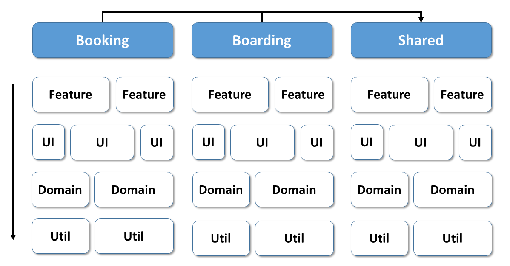

# The NGRX Signal Store and Your Architecture

The NGRX Signal Store is a modern and lightweight state management solution. However, when adding it to your application, several architectural questions come up: Where to put it? How large should it be? Is a store allowed to access other stores? Can it be used for global state? Can it be used together with or instead of the traditional Redux-based NGRX Store?

This chapter provides answers and shows that **lightweight stores change some of the rules** known from the world of Redux-oriented stores.

## Where to Put it?

Inspired by Strategic Design (DDD) and Nrwl's work on Nx, our reference architecture slices a larger frontend into several decoupled domains (bounded contexts) consisting of several technical layers:



This architecture, which often acts as the starting point and can be tailored to individual requirements, is described in this book's first chapters.

When going with the **traditional Redux-based NGRX Store,** we subdivide the state into feature slices. While they can be associated with the feature layer, we often push them down to the domain level, as the same state is often needed in several features of the same domain.

> When talking about this reference architecture, we should also keep in mind there are several flavors. For instance, some teams have a data layer or state layer where they put feature slices needed by several features. These layers can be an alternative but also an addition to the domain layer.

When we incorporate a **lightweight store like the NGRX Signals Store,** we encounter **different rules:** In general, lightweight stores can be found in all technical layers:

{width=300}


- **Feature Layer:** We can use a store on the component level for managing component state or on the feature level so that several components of the same feature can access it. In the latter case, an example is a wizard delegating to different components.
- **UI:** UI components for sure have state. Some of them have quite extensive ones that need to be shared with child components. An example is a sophisticated scheduler with different views demanding several child components. Such a state can be managed by a lightweight store directly connected to the component.
- **Domain:** State that is needed by several features in the same domain is defined here. A lightweight store used for this is exposed by this layer so that the feature layer can access it.
- **Util**: Quite often, utilities are stateless: Think about functions validating inputs or calculating dates. However, there are also some stateful utility libs where a store can be helpful. An example is a generic authentication library managing some data about the current user or a translation library holding translation texts.

A Store used on the component level is directly provided by the component in question:

```typescript
@Component({
    [...],
    providers: [MySignalStore]
})
export class MyComp {
    [...]
}
```

This also makes the Store available to child components. However, this also means that the store is destroyed when the component is destroyed.

For the other use cases, we can provide the Store via the root injector:

```typescript
export const MySignalStore = signalStore(
    { providedIn: 'root'},
    withState([...]),
    [...]
)
```

The Angular team told the community several times this is the way to go in most cases. In general, we could also provide such stores on the level of (lazy) routes. However, this does not add much value, as ``forRoot`` services also work with lazy loading: If only used in a lazy application part, the bundler puts them into the respective chunk. More information about when to use so-called Environment providers on the route level can be found [here](https://www.angulararchitects.io/en/blog/routing-and-lazy-loading-with-standalone-components/).

## Combining the Signal Store With the Traditional NGRX Store

You might wonder, why not stick with the traditional NGRX Store for the feature and domain level? You can totally do this: This Store was mainly developed for global state we find in these layers, and it also perfectly supports Signals. Also, if you have already added the traditional NGRX Store to your app and you are happy with it, I would not change this. 

However, I also think more and more people will reconsider using "Redux by default". If you feel that you don't benefit from the strength of this approach in your very case, you might want to go with a more lightweight alternative like the NGRX Signal Store instead. This can also be observed in other communities where lightweight stores have been popular for years.

To be clear, the Redux pattern should be a part of your toolbox. However, if you find a more lightweight solution that fits better, go with it.

## The Best of Both Worlds via Custom Features

As the NGRX Signal Store is highly extensible, you can even use the best concepts of both worlds. Let's say you miss the indirections or the eventing provided by Redux: No one prevents you from writing a custom feature adding this to the Signal Store. 

If you look for an out of the box solution for Redux on top of the Signal Store, you find one in our npm package [@angular-architects/ngrx-toolkit](https://www.npmjs.com/package/@angular-architects/ngrx-toolkit).


## How Large Should a Signal Store be?

When coming from the traditional NGRX Store, as a rule of thumb, a Signal Store can have the granularity of a feature slice. However, since a Signal Store is just a service, we should also align with the single responsibility principle. Hence, splitting a feature slice into more fine-grained ones can be a good idea. 

## May a Signal Store Access Other Signal Stores?

When we spread our state to several lightweight stores in different layers, it's not unusual that a use case might need a state from more than one Store. In general, I would avoid stores accessing other stores. Each Store should just focus on its task, which is managing its state properties. Also, we want to prevent cycles. 

Fortunately, there is an alternative. Go with a (feature) service orchestrating the stores:  

{width=600}


Such a service is similar to facades often used for state management. But as it's part of the feature and doesn't abstract a sub-system, I prefer the name feature service. 

## Preventing Cycles, Redundancies, and Inconsistencies

The layering introduced with our reference architecture and the rule that stores are not allowed to access each other prevents cycles. In general, our different stores can become redundant and hence inconsistent if we don't take care. However, the same risk exists with different independent feature slices when going with the traditional NGRX Store. 

Having a way to visualize the state seems to be vital in both cases, as it helps with detecting such issues early. For the traditional NGRX Store, we use the Redux Dev Tools. However, the Signal Store does not come with out-of-the-box support for them. Instead, the Angular Dev Tools might eventually support a general visualization of the Signals used in an application. Nevertheless, having Redux Dev Tools support seems to be extremely helpful because they provide a history and allow for time travel debugging. Fortunately, implementing such support with custom features should be straightforward. So, like with the NGRX Component Store, it's likely the community will come up with such an implementation.

Another way to prevent inconsistencies is making use of eventing. This allows us to inform other system parts about changes so that they can update their state accordingly. In Redux, eventing is part of the game. For the Signal Store, we could add eventing using custom features.  

## Conclusion

Lightweight stores like the NGRX Signal Store change some of the rules known from Redux-based: Such stores can be defined on different technical layers, and they can be provided within the root provider, a (lazy) route, or on the component level.

Redux is not going away, and it belongs to our toolbox. However, if you feel a more lightweight approach is more fitting for your needs, the NGRX Signal Store is quite tempting. Also, you can have the best of both worlds by combining both stores or by extending the Signal Store with custom features that provide missing Redux features.

In view of the single responsibility principle, I would not allow lightweight stores to access each other; instead, you can introduce a feature service orchestrating the needed stores. 
