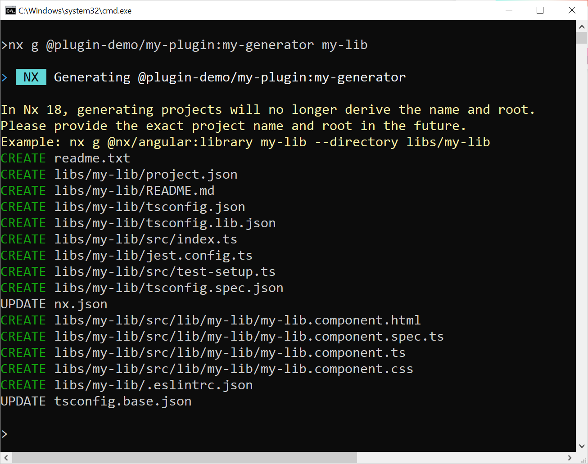

# Automate your Architecture with Nx Workspace Plugins

Nx is quite popular when it comes to large Angular-based business applications. Thanks to its plugin concept, Nx can also be expanded very flexibly. The Nx [plugin registry](https://nx.dev/plugin-registry) lists numerous such plugins that take care of recurring tasks and integrate proven tools.

In addition to community plugins for the general public, project-internal plugins can also make sense to automate highly project-related tasks. This includes generating code sections and implementing patterns that the target architecture specifies: repositories, facades, entities or CRUD forms are just a few examples.

Unfortunately, implementing plugins was not trivial in the past: Each plugin had to be published as a package via npm and installed in your own Nx workspace. This procedure had to be repeated for each new plugin version.

This back and forth is a thing of the past thanks to workspace plugins. These are plugins that Nx sets up in the form of a library in the current workspace. This means that changes can be made quickly and tested immediately. If necessary, proven workspace plugins can also be exported via npm for other projects.

In this chapter I show how workspace plugins with generators automating repeating tasks can be implemented and used. 

📂 [Source Code](https://github.com/manfredsteyer/nx-workspace-plugins-demo)


## Creating a Workspace Plugin With a Generator

The `@nrwl/nx-plugin` package can be used to generate new plugins. It also comes with numerous helper methods that support the development of plugins. To illustrate, the following instructions create a new Nx workspace with a plugin:

```bash
npx create-nx-workspace@latest plugin-demo

cd my plugin-demo

npm i @nrwl/nx-plugin

nx generate @nrwl/nx-plugin:plugin libs/my-plugin
```

When asked, Select Angular and Integrated Monorepo; for the remaining options you can go with the defaults.

After that, add a generator to your plugin:

```bash
nx generate @nx/plugin:generator my-generator --directory libs\my-plugin\src\generators\my-generator
```

## Templates for Generators

Generators often use templates that they usually expect to find in the _files subfolder_ . These are files with placeholders that the generator copies into the target project. For example, the following template uses a placeholder _projectName_ and generates ten constants:

```typescript
<% /* Filename: libs\my-plugin\src\generators\my-generator\files\src\index.ts.template */ %>

<% for (let i=0; i<10; i++) { %>
const constant<%=i%> = '<%= projectName %>';
<% } %>
```

If you follow the instructions here step by step, please copy the contents of this listing into the generated file `libs\my-plugin\src\generators\my-generator\files\src\index.ts.template`.

Wildcards can be found not only in the files, but also in the file names. For example, Nx would replace  _\_\_projectName\_\__ in a file name with the value of _projectName_. 

## Implementing a Generator

Technically speaking, a generator is just an asynchronous function that receives a tree object. The second parameter called options is an object with the parameters passed when calling the generator at the command line:

```typescript
// libs/my-plugin/src/generators/my-generator/generator.ts

import {
  formatFiles,
  generateFiles,
  getWorkspaceLayout,
  Tree,
} from '@nrwl/devkit';

import {
  libraryGenerator
} from '@nrwl/angular/generators';

import * as path from 'path';
import { MyGeneratorGeneratorSchema } from './schema';

export default async function (tree: Tree, options: MyGeneratorGeneratorSchema) {

  tree.write('readme.txt', 'Manfres was here!');

  await libraryGenerator(tree, options);

  const libsDir = getWorkspaceLayout(tree).libsDir;
  const projectRoot = `${libsDir}/${options.name}`;
  
  const templateOptions = {
    projectName: options.name,
    template: ''
  };

  generateFiles(
    tree,
    path.join(__dirname, 'files'),
    projectRoot,
    templateOptions
  );

  await formatFiles(tree);
}
```

The `Tree` object gives the generator access to the project's file system. For example, it offers methods for reading and writing files. The example shown here illustrates some typical tasks that generators perform:

- The `tree.write` method creates a new file

- The `libraryGenerator` method from the `@nrwl/angular/generators` package represents the generator that the `ng g lib` statement triggers. The call shown thus generates a new library in the current workspace.

- With `generateFiles`, the generator copies all templates from the `files` folder into the root directory of the new project. The values for the placeholders are in the `templateOptions` object.

- The call to `formatFiles` formats the generated files with Prettier. This simplifies the structure of the templates.

What is particularly useful is the fact that generators are simply functions that can be called in other generators. This means that existing generators can be combined to create new ones.

To add additional parameters passed via the options object, the interface in the file `schema.d.ts` as well as the JSON schema in `schema.json` need to be extended accordingly. The former one is used in the TypeScript code and the latter one is used by Nx to validate the parameters passed at command line.

## True Treasures: Helper Methods for Generators in Nx

In addition to the methods used here, the `@nrwl/devkit` package offers some other useful auxiliary constructs for developing generators. Here is a selection of methods that are often used in practice:

- `readJson` and `updateJson`: Reading and updating a JSON file

- `readNxJson`: Reads the file `nx.json`, the control file of Nx

- `readWorkspaceConfiguration`: Reads the workspace configuration (originally part of `angular.json`, now part of `nx.json`).

- `readProjectConfiguration` and `updateProjectConfiguration`: Reads or updates the configuration of a specific project from the respective `project.json`.

- `applyChangesToString`: Performs multiple inserts and deletes on a file.

- `names`: Formats strings to conform to conventions for file names (kebab case) or class names (pascal case).

If it is actually necessary to change an existing TypeScript file manually, the [TypeScript Compiler API](https://github.com/microsoft/TypeScript/wiki/Using-the-Compiler-API) can help. This API is included with TypeScript and represents code files as syntax trees.

The [tsquery](https://www.npmjs.com/package/@phenomnomnominal/tsquery) package, which is very popular in the community, supports searching these data structures. It allows you to formulate queries that are based on CSS selectors. Such queries, for example, can determine functions, classes or methods that are located in a file.

## Trying out Generators

The shown generator can now be run on the console with `nx generate`:

```bash
nx g @plugin-demo/my-plugin:my-generator my-lib
```

Here, `@my-workspace` is the name of the current workspace and `my-plugin` is the name of the library with our workspace plugin. The name `my-generator` refers to the generator we've added to the plugin. `my-lib` is the value for the `name` parameter. Actually this should be specified with `--name mylib`. However, the generator's `schema.json` by default specifies that this value can alternatively be taken from the first command line argument.

If everything goes as planned, the generator creates a new library and a file based on the template shown. It also generates a `readme.txt`:



## Testing Generators

Nx also simplifies the automated testing of generators. It also offers auxiliary constructs, such as a _Tree_ object, which only simulates a file system in main memory and does not write it to disk. In addition, Nx also generates the basic framework for a unit test per generator. To make it fit our implementation shown above, let's update it as follows:

```typescript
// libs/my-plugin/src/generators/my-generator/generator.spec.ts

import { createTreeWithEmptyWorkspace } from '@nrwl/devkit/testing';
import { Tree, readProjectConfiguration } from '@nrwl/devkit';

import generator from './generator';
import { MyGeneratorGeneratorSchema } from './schema';

describe('my-plugin generator', () => {
  let appTree: Tree;
  const options: MyGeneratorGeneratorSchema = { name: 'test-lib' };

  beforeEach(() => {
    appTree = createTreeWithEmptyWorkspace();
  });

  it('should export constant0', async () => {
    await generator(appTree, options);
    const config = readProjectConfiguration(appTree, 'test-lib');
    expect(config).toBeDefined();

    const generated = `${config.sourceRoot}/index.ts`;
    const content = appTree.read(generated, 'utf-8');
    expect(content).toContain(`const constant0 = 'test-lib';`);
  });
});
```

The unit test shown here creates a memory-based `Tree` object using `createTreeWithEmptyWorkspace` and calls our generator. It then checks whether there is a configuration for the generated library and whether it has the generated file.

To run this unit test, call

```bash
nx test my-plugin
```

## Exporting Plugins via NPM

If you want to use your plugin not only in the current Nx workspace, but also in other projects, all you have to do is build it and deploy it via npm:

```
nx build my plugin

npm publish dist\libs\my-plugin --registry http://localhost:4873
```

Here, we assume that verdaccio is used as the npm registry and that it's started locally on port 4873. Without specifying the `--registry` switch, npm uses the public registry at `registry.npmjs.org`.

The npm package simply needs to be installed in the consuming workspace. After that, you can then use your generator as usual:

```bash
npm i my-plugin --registry http://localhost:4873

nx g @my-workspace/my-plugin:my-generator my-lib
```

## Conclusion

Workspace plugins significantly simplify the development of plugins to automate project-internal tasks. This is not only due to the numerous helper methods, but above all to the tooling: Nx generates the basic structure of a plugin and generators including unit tests and changes can be tried out immediately in the current workspace. If necessary, these libraries can also be exported via npm and used in other projects.

Another plus point is the straightforward API that Nx provides us: Both generators and executors are just functions that can easily be called each other. This means that existing functionalities can be orchestrated into new ones.
