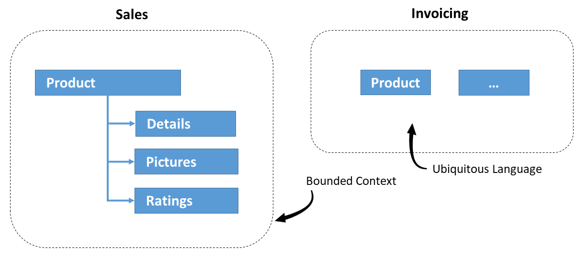
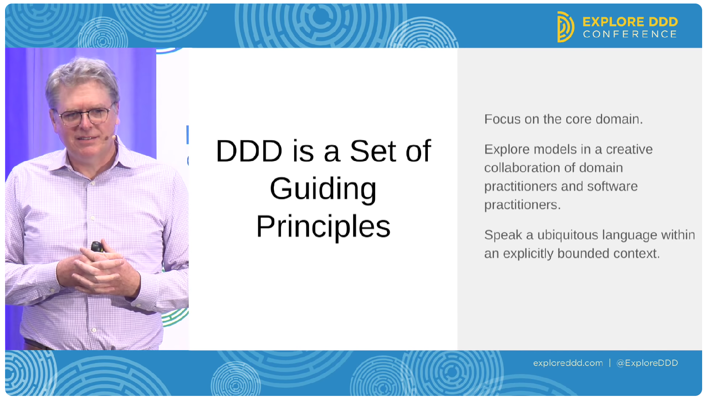

# Bonus: The Core of Domain-Driven Design

It's been a bit more than 20 years since the publication of Eric Evans' groundbreaking book [Domain-Driven Design: Tackling Complexity in the Heart of Software](https://www.youtube.com/watch?v=7yUONWp-CxM) that established the DDD movement. This book is still a best-seller, and a vivid community has extended DDD since then: There are dedicated international conferences, books, courses, and new concepts that practitioners have added.

While there are several perspectives on DDD, I want to reflect on the core of this approach here. 

My goal is to
- shed some light on the focus of DDD, 
- why there are wrong impressions about it, 
- its relationship to object-orientation, 
- and whether it can be adapted to fit other paradigms.

For this, I'm primarily citing interviews with and presentations of Eric Evans. To provide additional examples, I also cite further sources. Before, I start with a quick overview of DDD to get everyone into the boat.

## DDD in a Nutshell

Domain-driven Design focuses on a deep understanding of the real-world (problem) domain a software system is written for. Domain experts (e.g., experts for invoicing) work closely together with software experts to create a models of that domain. A model represents aspects of the real world (concepts, relationships, processes) that are interesting for the software in question and is directly expressed in the source code.

### Strategic Design

DDD consists of two original disciplines: [Strategic Design](https://www.thoughtworks.com/en-cl/insights/blog/evolutionary-architecture/domain-driven-design-in-10-minutes-part-one) is about discovering subdomains that represent individual parts of the problem domain. For subdomains, [bounded contexts](https://martinfowler.com/bliki/BoundedContext.html) are defined. Each bounded context gets an own model that follows an [Ubiquitous Language](https://martinfowler.com/bliki/UbiquitousLanguage.html). This Ubiquitous Language reflects the vocabulary used in real-world and is used by domain experts as well as by software experts -- verbally, in written form, in diagrams, and in code.

Having several individual models instead of one sole overly system-wide model allows for a more meaningful representation of the different sub-domains. This also prevents tight coupling and reduces complexity. 

The following example shows two bounded contexts. Each of them has its own view on the concept of a product and, hence its own representation:

### Tactical Design

While Strategic Design leads to an overarching architecture, [Tactical Design](https://www.thoughtworks.com/en-ca/insights/blog/evolutionary-architecture/domain-driven-design-part-two) provides several building blocks that help to implement the model within the individual contexts. Examples are [Value Objects and Entities](https://martinfowler.com/bliki/EvansClassification.html), [Aggregates](https://martinfowler.com/bliki/DDD_Aggregate.html) defining whole-part relationships (e.g. an Order with Order Lines) with consistency rules (invariants) that create some implications for transaction management, and repositories for persisting and loading aggregates and entities. 

### Recent Developments in DDD

Since its first days, several ideas and concepts have been added to DDD. 

One example for a pattern that is meanwhile part of DDD but was not explicitly mentioned in the original book are Domain Events.

An example of a new discipline added during the years is Collaborative Modelling: It provides approaches and workshop formats such as
[Event Storming](https://www.eventstorming.com) and [Domain Story Telling](https://domainstorytelling.org/) that bring domain experts and software experts together and help them to explore a domain. 

Strategic Design has also been adopted by the [Microservice community](https://www.amazon.de/Building-Microservices-Designing-Fine-Grained-Systems/dp/1492034029) to identify boundaries between services. [Similarly](https://www.amazon.de/Building-Micro-Frontends-Projects-Empowering-Developers/dp/1492082996), the Micro Frontend community is leveraging Strategic Design too. Besides this, it is also used for [monolithic applications](https://www.amazon.de/Strategic-Monoliths-Microservices-Architecture-Addison-Wesley/dp/0137355467/). 

[Team Topologies](https://www.amazon.de/Team-Topologies-Organizing-Business-Technology/dp/1942788819) is another relatively young discipline that favors the Bounded Context for splitting a system into individual parts different teams can work on.

### More on DDD

You find more details on DDD in the blog articles linked above. If you prefer recordings, you find an excellent one about [Strategic Design here](https://www.youtube.com/watch?v=Z3tM0UHhhwI) and a discussion about prioritizing bounded contexts which leads to the idea of a [Core Domain there](https://www.youtube.com/watch?v=84ofg2q14CY).

## How to Define DDD?

In his keynote ["DDD Isn't Done" at Explore DDD 2018](https://www.youtube.com/watch?v=R2IAgnpkBck) in Denver, Eric Evans talked about how to define DDD. He stressed that a good balance needs to be found so that DDD can help write "valuable software." A too rigorous definition would make it a "trivial cookbook," while, on the other hand, just being a "handwavy good advice" is also counterproductive. 

He also adds:

> We need some room to move. Different people need to be able to operate in a space and have different views and innovate.

His definition of DDD mainly focuses on a set of guiding principles:

- Focus on the core domain.
- Explore models in a collaboration of domain practitioners and software practitioners.
- Speak a ubiquitous language within an explicitly bounded context. 

## When Can we Call it DDD? 

The definition outlined in the previous section also fits an answer Eric Evans gave at an [interview with InfoQ](https://www.infoq.com/interviews/domain-driven-design-eric-evans/). Asked about the minimal set of practices a team has to follow to practice DDD effectively, his answer focused on Ubiquitous Language and the Bounded Context:

> [...] the most fundamental pattern of Domain-driven Design is probably the ubiquitous language. [...] 

> [A model] applies within a certain context, and that context has a definitely defined limit, [it's] a bounded context.

> With those two ingredients, I would say, someone is doing Domain-driven Design, and there are a lot of other practices that help solve more specific problems.

## What's the Core of DDD and Why did People get a Wrong Impression About that?

In an [interview with the IEEE Computer Society](https://www.youtube.com/watch?v=GogQor9WG-c) on the occasion of DDD's 10th anniversary, Eric Evans was asked what he would do differently if he rewrote his book on DDD. Interestingly, he thinks his book gave a lot of readers the wrong impression that DDD is mainly about the building blocks associated with Tactical Design, while the core of DDD is Strategic Design:

> [...] all the strategic design stuff is way back at the back. [...] it's so far back that most people never get to it really.

> Another thing I would do is try to change the presentation of the building blocks [...] things like the entities and value objects [...] [People] come away thinking that that's really the core of DDD, whereas, in fact, it's really not.

> I really think that the way I arranged the book gives people the wrong emphasis, so that's the biggest part of what I do is rearrange those things.

However, he adds that Tactical Design is important because it helps to translate the conceptual model into code. 

A similar point of view is expressed in Eric Evans' [keynote at DDD Europe 2016](https://www.youtube.com/watch?v=dnUFEg68ESM), where he criticizes the "over-emphasis on building blocks".

## Is Tacticial Design Object-Oriented? Is There a Place for FP?

In the previously mentioned [keynote](https://www.youtube.com/watch?v=dnUFEg68ESM), Eric Evans stresses that DDD is not bound to a specific paradigm. He also mentions that FP can be a "powerful mechanism for abstraction" and that functional languages can help to express a model in code. 

In general, he points out that nowadays, there are several new languages that are more expressive and, hence, help to implement models in a concise way. Another way to make code more expressive is using libraries like Reactive Extensions. 

When asked about using Functional Programming (FP), while his book clearly focuses on Object-orientation, in the [interview with the IEEE Computer Society](https://www.youtube.com/watch?v=GogQor9WG-c) he said:

> The reason that everything is expressed in terms of objects is because objects were king in 2003-2004, and what else would I have described it as people [...] used objects. 

He explains that there need to be some changes to apply Tactical Design to FP:

> If you are going at it from a functional point of view, then [...] your implementations are going to look quite different.

Also [here](https://www.youtube.com/watch?v=dnUFEg68ESM), he mentions the need for "rethinking [...] building blocks" when switching to FP.

This needed adaption is also slightly addressed in [Vaughn Vernon's book Domain-Driven Design Distilled](https://www.amazon.de/Domain-Driven-Design-Distilled-Vaughn-Vernon/dp/0134434420/) that is considered a standard reference in the DDD community and known for its easy readability. He mentions that in functional DDD, the data structures are Immutables (records), and pure functions implement the business logic:

>Rather than modifying the data that functions receive as arguments, the functions return new values. These new values may be the new state of an Aggregate or a Domain Event that represents a transition in an Aggregate’s state.

More insights on functional DDD can be found in [Functional and Reactive Domain Modeling](https://www.amazon.de/Functional-Reactive-Domain-Modeling-Debasish/dp/1617292249) and [Domain Modeling Made Functional](https://www.amazon.de/Domain-Modeling-Made-Functional-Domain-Driven/dp/1680502549/ref=sr_1_1?dib=eyJ2IjoiMSJ9.lh7eRp45b3q6zBsCJIM6A9pbWVDAtn1NHumx_LEXffyVsOwKnxYYneAoMlkH2uNgkp_HFULSJ-rwTdOFOEarPA.bLt4ucE-6GEo4H-Q2mzBuGdY5ezuSBBo62I6AOzkLLg&dib_tag=se&keywords=ddd+functional&qid=1704980818&sr=8-1).

## Further Adaptions of Tactical Design

On several occasions (e. g. [here](https://www.youtube.com/watch?v=GogQor9WG-c) and [here](https://www.youtube.com/watch?v=R2IAgnpkBck)) when discussing the adaptation of Tactical Design to fit other ideas and paradigms, Eric Evans mentions event sourcing and CQRS. Initially, both were not part of DDD but have been incorporated by the community. Another example of an adaptation of Tactical Design patterns mentioned [here](https://www.youtube.com/watch?v=GogQor9WG-c) is using the actor model for implementing Aggregates:

>[An actor] can maintain that state in a consistent [...] way [...] that respects the invariance of that particular aggregate. [...]

This discussion also fits the recently prominently observed talk ["The Aggregate is dead. Long live the Aggregate!"](https://www.youtube.com/watch?v=Q89patz4lgU) by Milan Savić and Sara Pellegrini. This talk, presented at several conferences, discusses some criticism of the traditional implementation of Aggregates and proposes an alternative implementation using messaging and event sourcing.

More generally, such approaches correlate with Eric Evans's above-cited [keynote from 2018](https://www.youtube.com/watch?v=R2IAgnpkBck), where he emphasizes the need to give people room to innovate DDD.

At [DDD Europe 2016](https://www.youtube.com/watch?v=dnUFEg68ESM), Eric Evans mentioned two further paradigms that can be used for creating models in DDD:

- Relational
- Graphs

Relational modeling might come as a surprise. However, he does not refer to a comprehensive (generalized) normalized schema that is the opposite of thinking in bounded contexts. Instead, having several specialized schemas fits the mindset of DDD. Also, he finds that SQL can be a good way to express how to compare and manipulate big sets.

With Graphs, Eric Evans means more than just using a Graph Database. He sees graph theory as a "classic modeling paradigm that goes back long before computer [science]." For him, graphs are a way to model "a certain kind of problems" using nodes and edges as abstractions.

## Conclusion

In its core, DDD emphasizes that Domain Experts and Software Experts should jointly explore a domain and model individual, prioritized bounded contexts respecting an ubiquitous language. 

Tactical Design as described by the original book on DDD helps to implement these models in an Object-oriented way. In addition, there are alternatives and adaptions (e.g. for Functional Programming).

Some communities just refer to Strategic Design (e.g., Micro Services, Micro Frontends, Team Topologies) and use it to subdivide a system along domain boundaries.