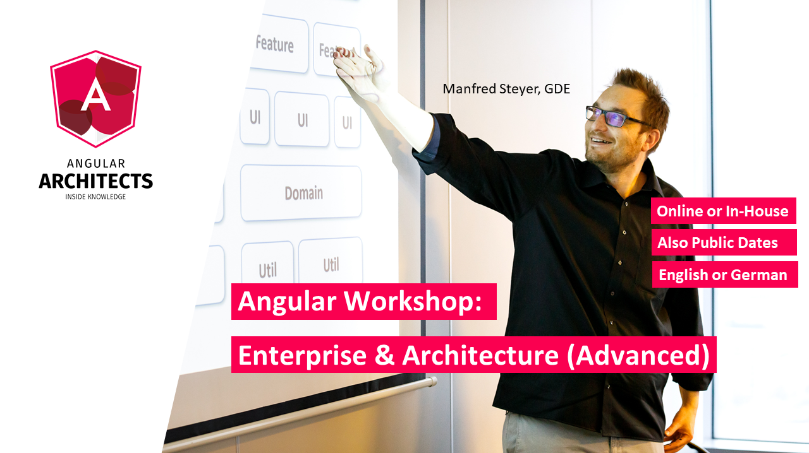

# Trainings and Consulting

Learn more about this and further architecture topics regarding Angular and huge enterprise as well as industrial solution in our [advanced Online Workshop](https://www.angulararchitects.io/en/angular-workshops/advanced-angular-enterprise-architecture-incl-ivy/):

Save your [ticket](https://www.angulararchitects.io/en/angular-workshops/advanced-angular-enterprise-architecture-incl-ivy/) for one of our **remote or on-site** workshops now or [request a company workshop](https://www.angulararchitects.io/en/angular-workshops/) (online or In-House) for you and your team!

Besides this, we provide the following topics as part of our training or consultancy workshops:

- Angular Essentials: Building Blocks and Concepts
- Advanced Angular: Enterprise Solutions and Architecture
- Angular Testing Workshop (Cypress, Just, etc.)
- Reactive Architectures with Angular (RxJS and NGRX)
- Angular Review Workshop
- Angular Upgrade Workshop

Please find [the full list with our offers here](https://www.angulararchitects.io/en/angular-workshops/).

If you like our offer, keep in touch with us so that you don't miss anything.

For this, you can [subscribe to our newsletter](https://www.angulararchitects.io/subscribe/) and/ or follow the book's [author on Twitter](https://twitter.com/ManfredSteyer).

