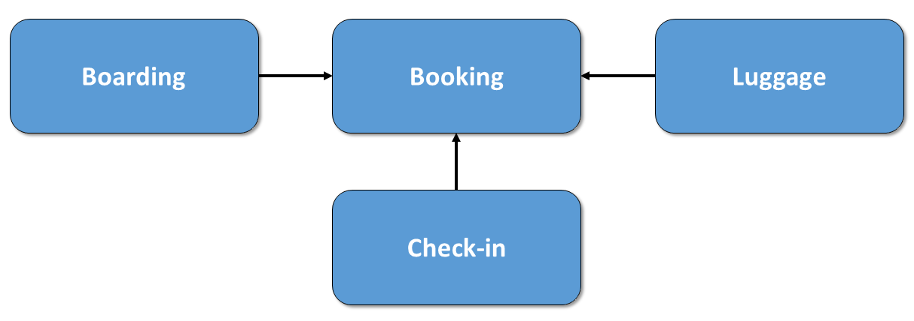
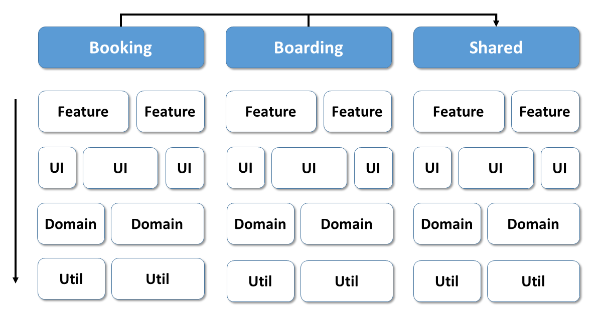
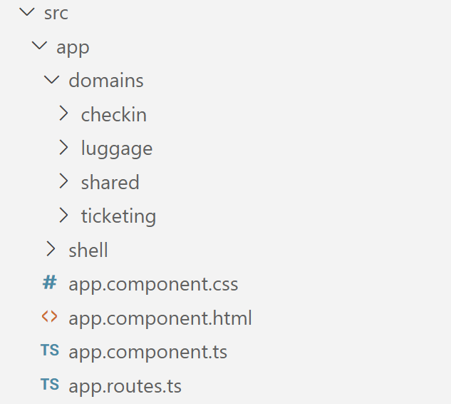
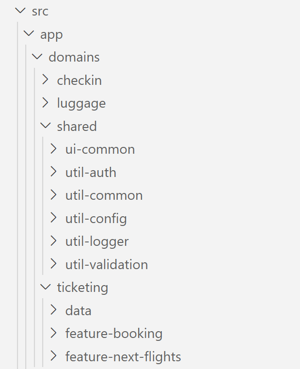
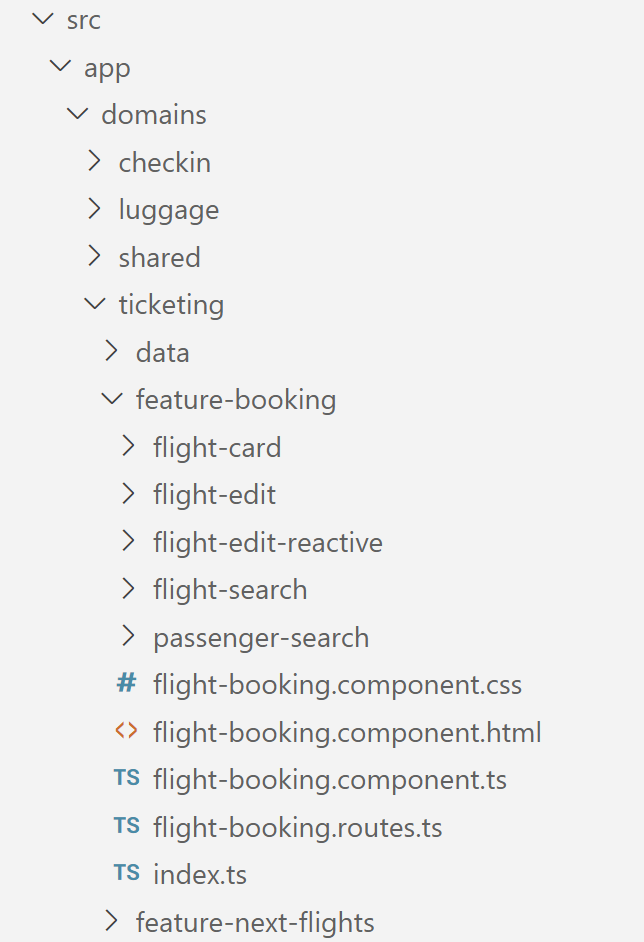
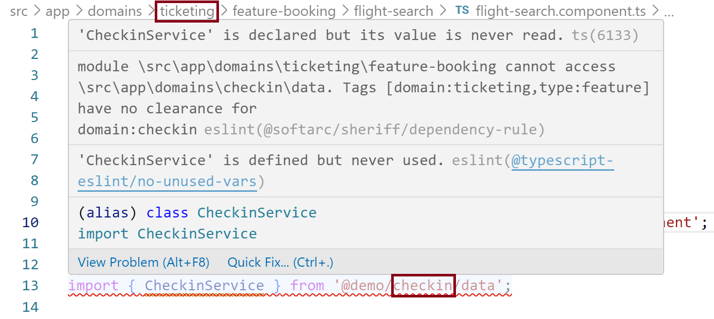
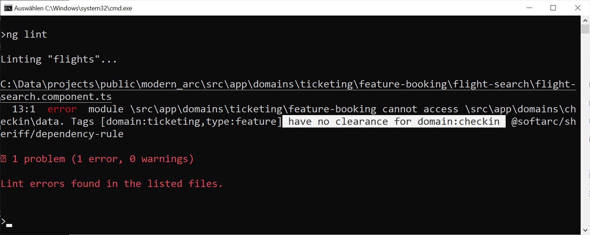

# Lightweight Architectures with Modern Angular

Motivation

## Guiding Theory: Domain Slicing






## Domains in Your Source Code








## Lightweight Modules with Standalone

```typescript
@Component({
  selector: 'app-flight-booking',
  standalone: true,
  imports: [CommonModule, RouterLink, RouterOutlet],
  templateUrl: './flight-booking.component.html',
  styleUrls: ['./flight-booking.component.css'],
})
export class FlightBookingComponent {
}
```

```typescript
export * from './flight-booking.routes';
```

## Lightweight Path Mappings

```typescript
import { FlightBookingFacade } from '../../data';
```

```typescript
import { FlightBookingFacade } from '@demo/ticketing/data';
```

```json
{
  "compileOnSave": false,
  "compilerOptions": {
    "baseUrl": "./",
    [...]
    "paths": {
      "@demo/*": ["src/app/domains/*"],
    }
  },
  [...]
}
```

## Enforcing Architecture with Sheriff





```bash
npm i @softarc/sheriff-core @softarc/eslint-plugin-sheriff -D
```

TODO: Install Sheriff

```json
{
  [...],
  "overrides": [
    [...]
    {
      "files": ["*.ts"],
      "extends": ["plugin:@softarc/sheriff/default"]
    }
  ]
}
```

```typescript
import { noDependencies, sameTag, SheriffConfig } from '@softarc/sheriff-core';

export const sheriffConfig: SheriffConfig = {
  version: 1,

  tagging: {
    'src/app': {
      'domains/<domain>': {
        'feature-<feature>': ['domain:<domain>', 'type:feature'],
        'ui-<ui>': ['domain:<domain>', 'type:ui'],
        data: ['domain:<domain>', 'type:data'],
        'util-<ui>': ['domain:<domain>', 'type:util'],
      },
    },
  },
  depRules: {
    root: ['*'],

    'domain:*': [sameTag, 'domain:shared'],

    'type:feature': ['type:ui', 'type:data', 'type:util'],
    'type:ui': ['type:data', 'type:util'],
    'type:data': ['type:util'],
    'type:util': noDependencies,
  },
};
```

## Standalone APIs

```typescript
bootstrapApplication(AppComponent, {
  providers: [
    provideHttpClient(),
    provideRouter(APP_ROUTES, withPreloading(PreloadAllModules)),

    importProvidersFrom(NextFlightsModule),
    importProvidersFrom(MatDialogModule),

    provideLogger({
        level: LogLevel.DEBUG,
    }),
  ],
});
```

```typescript
export function provideLogger(
  config: Partial<LoggerConfig>
): EnvironmentProviders {
  const merged = { ...defaultConfig, ...config };

  return makeEnvironmentProviders([
    LoggerService,
    {
      provide: LoggerConfig,
      useValue: merged,
    },
    {
      provide: LOG_FORMATTER,
      useValue: merged.formatter,
    },
    merged.appenders.map((a) => ({
      provide: LOG_APPENDERS,
      useClass: a,
      multi: true,
    })),
  ]);
}
```

Link: Blog Artikel

## State Management with Signals


```typescript
@Injectable({ providedIn: 'root' })
export class FlightBookingFacade {
  private flightService = inject(FlightService);

  private state = createStore({
    from: 'Paris',
    to: 'London',
    flights: [] as Flight[],
    basket: {} as Record<number, boolean>,
  });

  readonly from = this.state.select((s) => s.from());
  readonly to = this.state.select((s) => s.to());
  readonly flights = this.state.select((s) => s.flights());
  readonly basket = this.state.select((s) => s.basket());

  readonly flightRoute = this.state.select((s) => s.from() + ' to ' + s.to());

  upateCriteria(from: string, to: string): void {
    this.state.update('from', from);
    this.state.update('to', to);
  }

  [...]

}
```

Link: Signals-Artikel


## Improving Build Times


```json
"architect": {
    "build": {
        "builder": "@angular-devkit/build-angular:browser-esbuild",
        [...]
    }
    [...]
}
```

```json
"scripts": {
  [...]
  "build:flights": "wireit",
},
"wireit": {
  "build:flights": {
    "command": "ng build",
    "files": [
      "src/**",
      "package.json",
      "tsconfig.json",
      "tsconfig.app.json"
    ],
    "output": [
      "dist/flights/**"
    ]
  }
},
```


```json
"scripts": {
  [...]
  "build:all": "wireit",
  [...]
},
"wireit": {
  [...]
  "build:all": {
    "dependencies": [
        "build:flights", 
        "build:checkin", 
        "build:luggage"
    ]
  }
},
```

## Accelerating Test Runs

```json
"scripts": {
  [...]
  "test:flights": "wireit",
  "test:all": "wireit",
  [...]
},
"wireit": {
  [...],
  "test:flights": {
    "command": "ng test --project flights --watch false",
    "files": [
      "src/**",
      "package.json",
      "tsconfig.json",
      "tsconfig.app.json",
      "tsconfig.spec.json"
    ],
    "output": []
  },
  "test:all": {
    "dependencies": [
        "test:flights", 
        "test:checkin", 
        "test:luggage"
    ]  
  }
}
```

## More Features: Nx

Bla

## Conclusion

Bla

